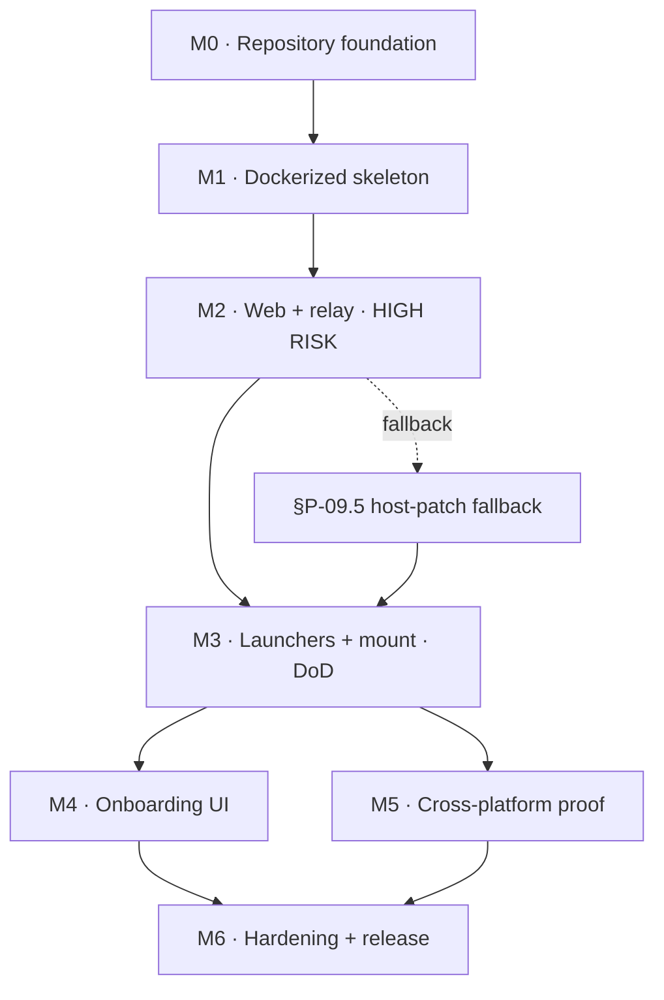

# DeepSeek Harness Router — Architecture Proposal

> **Status:** Draft for review · **Version:** 1.1.0
> **Repository:** <https://github.com/RatioArtificiosa/DeepSeek-Harness-Router>
> **Source document:** [`docs/research/source-conversation.md`](./docs/research/source-conversation.md)
> **Companion document:** [`CHECKLIST.md`](./CHECKLIST.md)

---

## Changelog

| Version | Change |
|---|---|
| **1.0.0** | Initial proposal against the original repository |
| **1.1.0** | **Repository changed** to `DeepSeek-Harness-Router` (§P-41); **Rust chosen** as the Router core language (§P-42); **Docker-first development workflow** formalized (§P-43); **private installer** requirement added (§P-44); README elevated to a primary deliverable (§P-45) |
| **1.2.0** | **M4 UI decision resolved** to a DSH client plugin on ecosystem evidence (§P-46); **vision/image input** documented, including that DeepSeek-V4.1-Flash is already image-capable on the official route (§P-47) |

---

| **2.0.0** | **The product was misunderstood and is restated.** This is not a Docker distribution for the public. It is a **local multi-instance router** that runs several DeepSeek Harness instances on one machine, each on its own port, workspace, and model. Docker is a **build-time laboratory**, not the delivery mechanism. |

---

> # ⚠️ READ §P-48 FIRST
>
> **The current design begins at §P-48.** Sections §P-01 … §P-47 were written for
> a superseded premise: a publicly-distributed Docker package. They are retained
> because they contain verified research about the harness — the storage and
> session survey, the sandbox probes, the streaming-proof tests — that the
> current design still relies on.
>
> **Where an old section conflicts with §P-48 onward, §P-48 onward wins.**
> §P-53.2 names exactly which old conclusions are retired, so no reader mistakes
> a superseded conclusion for a current one.

---
## How to read this document

Every checklist item in `CHECKLIST.md` carries a reference of the form **→ §P-XX.Y**. That reference points at a numbered section of *this* document. Before executing any checklist line, read the referenced section: it contains the rationale, the constraints, the exact commands, and the acceptance criteria for that line.

This document is deliberately long. It is a build specification, not a summary. Sections are ordered so that earlier sections are prerequisites for later ones.

### Document map

| Part | Sections | Purpose |
|---|---|---|
| **I — Foundation** | §P-01 … §P-06 | Mission, constraints, discoveries, decisions |
| **II — Architecture** | §P-07 … §P-16 | System design, DSH integration, data model |
| **III — Security** | §P-17 … §P-21 | Threat model, sandboxing, approval model |
| **IV — Delivery** | §P-22 … §P-30 | Docker, launchers, UX, CI, operations |
| **V — Execution** | §P-31 … §P-40 | Roadmap, risks, QA, definition of done |
| **VI — Decisions of record** | §P-41 … §P-47 | Repository, language, workflow, installer, README, M4 UI, vision |

---

# PART I — FOUNDATION

## §P-01 — Mission and product thesis

### §P-01.1 What we are building

**DeepSeek Harness Router** is a self-hosted, Docker-packaged control plane and web workspace for [DeepSeek Harness](https://github.com/deepseek-ai/deepseek-harness) (`dsh`) — DeepSeek AI's open-source, MIT-licensed agent harness.

It gives a user one command and one URL:

```text
$ ./start.sh          # or  .\start.ps1  on Windows
✓ Docker ready
✓ Workspace validated
✓ Image present
✓ Container healthy
→ http://localhost:3080
```

…and behind that URL: a full agent workspace where they can chat with an agent, point it at a real project directory on their own disk, watch it read and edit real files, run real commands, and see real streaming events. The DSH runtime lives entirely inside a container. The user never installs Node, pnpm, or DSH on their host.

### §P-01.2 The product thesis, stated honestly

The source document is emphatic about one thing, and it is correct:

> **Install Docker → clone → run → choose folder → you're in.**
> — *source document, "One architectural decision I strongly recommend"*

That is the entire adoption thesis, and everything else in this proposal is downstream of it. The competition for this product is not another agent harness; it is the friction of `npx @deepseek-ai/dsh web`. Our value is that we remove a class of friction that `npx` cannot remove:

| Friction | `npx @deepseek-ai/dsh web` | DeepSeek Harness Router |
|---|---|---|
| Host needs Node.js | Yes (22.19+ or 24+) | No |
| Version drift between users | Yes — "developer preview, breaking changes expected" | No — DSH revision pinned in the image |
| Reproducible environment | No | Yes — immutable image digest |
| Filesystem blast radius | Whole host, user's UID | Only the selected workspace, confined mount |
| Uninstall | Manual, scattered | `docker compose down -v` |
| Coexistence with an existing DSH install | Impossible | Designed for it (see §P-05) |

### §P-01.3 The user we are building for

Primary persona — **"The Reluctant Ops Engineer."** A senior developer, data scientist, or technical founder who:

- Is comfortable in a terminal but does not want to become a Docker expert.
- Has an existing DSH install (or has heard of DSH) and wants to try it without disturbing their working setup.
- Works on Windows, macOS, or Linux, and expects the same experience on all three.
- Will abandon the product at the first cryptic error message.

Secondary persona — **"The Team Lead."** Wants to hand a colleague a repo and a one-liner so they get the identical environment. Cares about pinning, reproducibility, and not being asked to debug someone else's Node version.

Tertiary persona — **"The Future Hosted Customer."** Will later deploy this to a cloud VM or a managed service. The architecture must not make that a rewrite (§P-16).

### §P-01.4 What "premium" means here, concretely

"Ultra premium quality" is only meaningful if it maps to falsifiable properties. For this build it means:

1. **Zero-touch first run.** A user with Docker installed and a clone of the repo reaches a working UI without reading documentation beyond the README.
2. **No silent failure.** Every failure mode the launcher can detect is detected, named in plain language, and paired with a remediation step.
3. **Nothing is destroyed.** The product never writes to the host outside the workspace the user explicitly selected and the Docker volumes it owns by name.
4. **Nothing is guessed.** The DSH revision is pinned and documented; the image digest is recorded; the compatibility contract is a file in the repo (§P-15).
5. **Every claim is tested.** No claim of Windows or macOS support is made on the strength of a Linux test (§P-28).

### §P-01.5 Non-goals for v1

Explicitly **out of scope** for the first release, to protect the schedule:

- Kubernetes, Helm, or any cluster orchestration. *(Source document: "Do not introduce Kubernetes.")*
- Multi-container splits (separate frontend/backend/DSH/database/proxy containers). *(Source document: "Do not prematurely split the system.")*
- Cloud hosting, multi-tenancy, user accounts, SSO.
- Automatic DSH upgrade on startup. *(Source document: "Never automatically pull the newest DSH release during application startup.")*
- Running the DSH *host* installation from inside the container (advanced external-runtime mode is deferred — see §P-05.4).

---

## §P-02 — Source document digest

This section establishes the traceability chain. `CHECKLIST.md` references this document; this document references the source conversation. Every requirement below is quoted or closely paraphrased, with its origin section named.

### §P-02.1 Requirements extracted from the source document

| ID | Requirement (verbatim or near-verbatim from source) | Source section |
|---|---|---|
| **R-01** | Must run consistently on Linux, macOS, and Windows; canonical runtime environment is Docker | Cross-Platform Docker Specification → Core requirement |
| **R-02** | Do not require users to install Node.js, pnpm, DSH, or other runtime deps on the host | Core requirement |
| **R-03** | Only required host prerequisites: Docker/Docker Desktop and Git | Core requirement |
| **R-04** | Host provides Docker, browser, selected workspace directory, configuration | Platform model |
| **R-05** | Container provides React app, Node control server, runtime manager, DSH, adapter, plugins | Platform model |
| **R-06** | Application must not depend on the host OS being Linux | Platform model |
| **R-07** | Users explicitly select a workspace directory on the host | Workspace model |
| **R-08** | Mount ONLY the selected workspace into the container | Workspace model |
| **R-09** | Inside the container it must always appear at `/workspace` | Workspace model |
| **R-10** | Application code must never depend on host path format; use `/workspace` internally | Workspace model |
| **R-11** | Never mount the entire host filesystem | Workspace model |
| **R-12** | Never require privileged host filesystem access for normal operation | Workspace model |
| **R-13** | Use a separate persistent Docker volume for application-managed state: `agent-data:/data` | Runtime filesystem |
| **R-14** | `/workspace` for user project files; `/data` for app state. Do not mix them | Runtime filesystem |
| **R-15** | Docker Compose is the canonical orchestration mechanism | Docker Compose |
| **R-16** | Do not introduce Kubernetes or cloud orchestration | Docker Compose |
| **R-17** | Create a reproducible Dockerfile; pin base image versions | Docker image |
| **R-18** | Install all application dependencies inside the image | Docker image |
| **R-19** | Image must be buildable from a clean checkout | Docker image |
| **R-20** | Provide `start.sh` and `start.ps1`, both invoking the same Compose config | Launch scripts |
| **R-21** | Do not duplicate application logic between the scripts | Launch scripts |
| **R-22** | `start.sh` must: verify Docker, verify daemon, determine workspace, validate path, configure env, invoke Compose, wait for health, print URL | Launch scripts → Linux/macOS |
| **R-23** | `start.ps1` performs the exact same logical operations using native PowerShell | Launch scripts → Windows |
| **R-24** | Do not require WSL, Git Bash, or Cygwin on Windows | Launch scripts → Windows |
| **R-25** | Windows PowerShell must be a first-class supported environment | Launch scripts → Windows |
| **R-26** | Workspace selection supports: current directory, explicit directory, configured default | Workspace selection |
| **R-27** | Normalize the host path before passing it to Docker | Workspace selection |
| **R-28** | Do not manipulate Windows paths with POSIX string assumptions; use PowerShell/path APIs | Workspace selection |
| **R-29** | Create `.env.example` with `WORKSPACE_PATH`, `APP_PORT`, `LOG_LEVEL` | Environment configuration |
| **R-30** | Launcher should generate/update effective local env config | Environment configuration |
| **R-31** | Do not commit user-specific absolute paths | Environment configuration |
| **R-32** | Container must expose a health endpoint `GET /health` | Health checks |
| **R-33** | Health reports: application status, runtime status, DSH availability, workspace availability | Health checks |
| **R-34** | Compose should use a healthcheck | Health checks |
| **R-35** | Launcher must wait until healthy before reporting success | Health checks |
| **R-36** | Do not use arbitrary fixed sleeps as the only readiness mechanism | Health checks |
| **R-37** | Default port 3080; clear error if unavailable | Port handling |
| **R-38** | Do not silently bind to a random port; always print the final UI URL | Port handling |
| **R-39** | Optionally open `http://localhost:<PORT>` after startup | Browser launch |
| **R-40** | Implement platform-aware browser launching | Browser launch |
| **R-41** | Support `--no-open` to disable automatic browser launch | Browser launch |
| **R-42** | Do not use privileged containers | Docker isolation |
| **R-43** | Do not use host networking by default | Docker isolation |
| **R-44** | Do not mount the Docker socket by default | Docker isolation |
| **R-45** | No unrestricted host filesystem mounts | Docker isolation |
| **R-46** | DSH runtime must not get Docker daemon access without explicit security review | Docker isolation |
| **R-47** | Support `docker compose up --build` for a complete development launch | Local development |
| **R-48** | Optional developer mode for hot reload, if practical | Local development |
| **R-49** | Do not sacrifice architectural simplicity for hot reload in milestone 1 | Local development |
| **R-50** | DSH must run inside the Docker environment for the standard application | DSH installation |
| **R-51** | Pin the tested DSH version/commit; document in `docs/dsh-compatibility.md` | DSH installation |
| **R-52** | Never auto-pull the newest DSH release at startup | DSH installation |
| **R-53** | App must be completely independent from a host-side DSH installation | Existing host DSH installations |
| **R-54** | Do not connect to or modify a running host DSH instance unless explicitly configured | Existing host DSH installations |
| **R-55** | Dockerized app must be safe to develop and test beside another local DSH install | Existing host DSH installations |
| **R-56** | Start with one application container unless there is a compelling requirement | Container architecture |
| **R-57** | Do not prematurely split into frontend/backend/DSH/database/proxy containers | Container architecture |
| **R-58** | Use clean internal interfaces so components can be separated later without rewriting | Container architecture |
| **R-59** | Inside the app, never use host paths; use a `WorkspaceProvider` with `resolveWorkspace()`, `validateWorkspace()`, `getWorkspaceRoot()` | Cross-platform path abstraction |
| **R-60** | Launcher is responsible for mapping host paths to Docker mounts | Cross-platform path abstraction |
| **R-61** | Account for Linux UID/GID, Docker Desktop sharing, macOS, Windows differences | File permissions |
| **R-62** | Do not assume Linux ownership semantics apply everywhere | File permissions |
| **R-63** | Avoid writing generated files into the user's workspace as root where possible | File permissions |
| **R-64** | Document any unavoidable permission behavior | File permissions |
| **R-65** | Mount only the selected workspace; validate all workspace paths; prevent path traversal | Security |
| **R-66** | Never expose Docker socket by default | Security |
| **R-67** | Never allow HTTP parameters to become arbitrary Docker commands | Security |
| **R-68** | Never allow arbitrary host-path mounting through an unauthenticated API | Security |
| **R-69** | Validate runtime arguments | Security |
| **R-70** | Log security-relevant runtime failures | Security |
| **R-71** | Treat workspace selection as a privileged operation | Security |
| **R-72** | Normal developer experience works from PowerShell, macOS Terminal, Linux shell | CLI compatibility |
| **R-73** | Do not require WSL; do not require Bash on Windows; do not require PowerShell on macOS/Linux | CLI compatibility |
| **R-74** | README has exactly three primary flows: Windows, macOS, Linux — all resulting in the same app | README installation section |
| **R-75** | CI validates: image builds, Compose config validates, health works, DSH starts, runtime healthy, workspace mounted, session executes, events reach UI, shutdown works | Development validation |
| **R-76** | Where practical, validate Docker launch on Ubuntu, Windows, macOS | Development validation |
| **R-77** | Do not claim Windows/macOS support merely because Linux Docker tests pass | Development validation |
| **R-78** | Docker-specific details must not leak into UI or core runtime abstraction | Future hosted compatibility |
| **R-79** | Architecture must remain: UI → Core APIs → Runtime abstraction → DSH adapter → runtime | Future hosted compatibility |
| **R-80** | A later hosted implementation may replace local RuntimeManager with a remote runtime service without a frontend rewrite | Future hosted compatibility |
| **R-81** | Definition of done: 10-step fresh-machine flow must work | Definition of done |

### §P-02.2 The definition of done, restated as our acceptance gate

The source document's ten steps are our release gate. Reproduced verbatim so no paraphrase can dilute them:

> The cross-platform milestone is complete only when a fresh machine can:
> 1. install Docker
> 2. clone the GitHub repository
> 3. run the platform launcher
> 4. choose a workspace
> 5. start the Dockerized application
> 6. open the browser UI
> 7. launch a real DSH session
> 8. read/write the mounted project
> 9. observe real agent events
> 10. shut everything down cleanly
>
> The process must work without installing DSH directly on the host.

This is tracked in `CHECKLIST.md` as the **DoD gate**, and in §P-36 as the release criterion.

### §P-02.3 One strategic recommendation from the source, adopted as our staging plan

> The next thing I would have the coding agent do is **not build the UI yet**. First have it create the Dockerized skeleton and prove this exact flow: **Windows PowerShell + macOS + Linux → Docker → DSH → mounted project → real agent session → real events → browser UI.** Once that works, the impressive UI becomes much safer to build on top.

**Adopted.** This is the rationale for the milestone ordering in §P-31: M0–M3 are skeleton-and-proof; the custom UI work begins only at M4, on a proven substrate.

---

## §P-03 — Research findings: what is actually true about DSH

This section records what was verified **against the live system and upstream sources on 2026-09-14**, not what was assumed. Every claim here is load-bearing for a design decision later in the document.

### §P-03.1 The host environment as found

| Fact | Value | How verified |
|---|---|---|
| Working directory | `G:\DeepSeek Harness Router` | `Get-Location` |
| Repo state | **Not a git repository** — contains only the source `.md` | `git rev-parse` → fatal |
| Docker client/server | 29.6.1 (Docker Desktop 4.81.0) | `docker version` |
| Compose | v5.2.0 | `docker compose version` |
| Engine OS/Arch | `linux/amd64` (via WSL2 backend) | `docker info` |
| Engine kernel | **6.18.33.2-microsoft-standard-WSL2** | `docker run alpine uname -a` |
| Engine security options | `seccomp,profile=builtin`, `cgroupns` | `docker info` |
| Engine resources | 12 CPU, ~31.3 GiB RAM | `docker info` |
| Node (host) | v22.22.0 | `node --version` |
| pnpm (host) | 12.4.1 | `pnpm --version` |
| Git (host) | 2.49.0.windows.1 | `git --version` |
| PowerShell | 7.6.6 | `$PSVersionTable` |
| Host OS | Windows 10, NT 10.0.19045 | `[Environment]::OSVersion` |
| Free space on `G:` | ~872 GB | `Get-PSDrive G` |

### §P-03.2 Ports occupied on this machine — **critical constraint**

| Port | State | Owner | Consequence |
|---|---|---|---|
| **3080** | **LISTENING** | **PID 38368 — `dsh web --no-open`** (the DSH instance I am running inside) | **3080 is unusable as our default.** See §P-04.3. |
| **3081** | **LISTENING** | **PID 51092 — `dsh web --port 3081 --no-open`** (this very session) | Unusable. |
| 55432 | LISTENING (container `unrelated-container`) | postgres:17-alpine | Not ours. Do not touch. |
| 5433 | LISTENING (container an unrelated container) | pgvector/pgvector:pg17 | Not ours. Do not touch. |

> **This is the single most important environmental discovery.** The source document assumes port 3080 is free (it is DSH's own default). On this development machine it is permanently occupied by the harness we are working inside. A naive implementation would fail its very first `start.ps1` run with `EADDRINUSE`.

### §P-03.3 Docker state — must not be disturbed

**Running containers (both pre-existing, both off-limits):**

```text
xxxxxxxxxxxx   unrelated-container           postgres:17-alpine        Up (long-running)   0.0.0.0:55432->5432/tcp
xxxxxxxxxxxx   unrelated-container   pgvector/pgvector:pg17    Up (long-running)     127.0.0.1:5433->5432/tcp
```

**Networks present:** only the three built-ins — `bridge`, `host`, `none`. No project networks exist, so our Compose project network will be created fresh and cannot collide.

**Volumes present:** ~60 anonymous volumes plus two named ones owned by other projects (owned by unrelated projects). **None may be pruned or removed.**

**Images present:** postgres 16/17-alpine, pgvector, mongo, meilisearch, LibreChat, coolify-demo-app, node:18-alpine, plus (pulled during this research) `alpine:latest` and `node:22-bookworm-slim`.

> **Standing rule for the entire project:** never run `docker system prune`, `docker volume prune`, `docker image prune -a`, `docker network prune`, or `docker compose down` outside our own project directory. Never `docker stop`/`rm`/`restart` a container we did not create. See §P-04.5.

### §P-03.4 DSH installation anatomy (host reference — read-only)

The installed `dsh` gives us the reference implementation our container must reproduce.

**Package:** `@deepseek-ai/dsh` v`0.1.5-rc.1` at `your npm global prefix\node_modules\@deepseek-ai\dsh` (213 MB, 239 bundled `@deepseek-ai/*` packages).

**npm registry state (verified):**

| dist-tag | Version |
|---|---|
| `latest` | `0.1.5-rc.1` |
| `next` | `0.1.5-rc.2` |
| `alpha` | `0.1.5-alpha.2` |

> **Pin decision:** pin the image to an **exact version string**, never a dist-tag. Note the host runs `0.1.5-rc.1` while its *profile dependencies* reference `0.1.5-rc.2` — evidence of the version drift the source document warns about.

**CLI entry modes** (`dsh --help`):

| Command | Purpose |
|---|---|
| `dsh --profile <name>` | Boot the named profile under `$DSH_HOME/profiles/<name>` |
| `dsh --from-default-profile <template>` | Create a new profile from a shipped template, then boot |
| `dsh --profile acp` | Serve automation clients over ACP stdio |
| `dsh --profile headless "job"` | Run one fresh persisted session, print final answer, exit |
| `dsh --profile sdk` / `sdk-minimal` | Serve SDK clients over JSON-RPC stdio |
| `dsh web` | Alias of `--profile web` |
| `dsh plugin --profile <name> <pnpm args>` | Manage a profile's plugins via pnpm |

**Key CLI facts for our design:**

- The **invoking directory is the default workspace root**.
- App arguments follow launcher flags: `dsh --profile web --port 8080`.
- `--dump-config` / `--dump-default-config` print the composed tree without booting — **this is our CI composition-validation tool** (§P-28).
- Profiles auto-initialize on first use from shipped templates.

**The `web` profile's own flags** (`dsh web --help`) — this is the surface we package:

```text
--host <host>                  bind host
--no-open                      do not open the Web UI in the default browser
--port <port>                  listen port; pass 0 to let the OS pick a free one
--trusted-host <authority...>  extra authority the /api browser-trust fence accepts
-h, --help
```

### §P-03.5 The two findings that reshape the security model

These were established by direct experiment inside containers on this machine, and they invalidate the most obvious sandboxing assumption.

#### Finding A — `bwrap` does **not** work in a default Docker container

```text
$ docker run --rm alpine sh -c "apk add bubblewrap && bwrap --ro-bind / / --dev /dev --unshare-all echo OK"
bwrap: No permissions to create a new namespace, likely because the kernel does not
allow non-privileged user namespaces.
```

Isolating the variable produced a precise cause:

| Configuration | Result |
|---|---|
| Default container | ❌ **FAIL** — cannot create namespace |
| `--security-opt seccomp=unconfined` **only** | ✅ **OK** |
| `--cap-add SYS_ADMIN` **only** | ❌ FAIL — `bwrap: pivot_root: Operation not permitted` |
| `--security-opt seccomp=unconfined --cap-add SYS_ADMIN` | ✅ OK |
| `unshare --user --map-root-user` (default container) | ❌ `Operation not permitted` |

**Root cause, now confirmed against the authoritative source.** I fetched Docker's canonical default seccomp profile ([`moby/profiles/main/seccomp/default.json`](https://raw.githubusercontent.com/moby/profiles/main/seccomp/default.json)) and parsed it:

- `"defaultAction": "SCMP_ACT_ERRNO"` — an **allowlist** model; anything not listed is denied with `EPERM`.
- **`unshare` and `clone` are capability-gated.** The profile appears to "allow" them, but Docker's own documentation states the mechanism precisely:
  > *"`clone` — Deny cloning new namespaces. **Also gated by `CAP_SYS_ADMIN`** for `CLONE_*` flags, except `CLONE_NEWUSER`."*
  
  A default container holds **14 capabilities**, and `CAP_SYS_ADMIN` is not among them — so namespace creation is denied. Confirmed empirically on this machine:

  | Test | Result |
  |---|---|
  | `unshare --user` (default container) | ❌ **DENIED** — `EPERM` |
  | `unshare --mount` (default container) | ❌ DENIED |
  | `unshare --user` with `--cap-drop=ALL` | ❌ DENIED |
  | `unshare --user` with `--cap-add SYS_ADMIN` | ✅ **ALLOWED** |
  | `unshare --mount` with `--cap-add SYS_ADMIN` | ✅ ALLOWED |

  The profile also carries two `clone` rows using a masked-equality test (mask `0x7E020000`, which **includes** `CLONE_NEWUSER` at bit 28). Those rows are the profile-level expression of the same rule; the effective outcome is the one measured above.

  > **Correction note:** an earlier draft of this section described the mask as *excluding* `CLONE_NEWUSER`. Decoding the value proves the opposite — bit 28 (`0x10000000` = `CLONE_NEWUSER`) **is** in the mask. The measured behaviour above is what the design relies on; the documentation quote is the authoritative statement of intent.

  **Either way, the design conclusion is unchanged and the empirical result is what matters:** `bwrap` cannot create namespaces in a default container, and the only fix is granting `CAP_SYS_ADMIN` or going `seccomp=unconfined` — both of which we reject (§P-18.3).
- `bwrap` needs `unshare`/`clone` with namespace flags. Denied → `wrap` fails closed.

So the cause is **the seccomp profile's capability gating**, not the kernel: `max_user_namespaces` is `128183`, so user namespaces exist. Docker's filter wins first.

**Consequence:** DSH's default Linux sandbox backend (`dsh-sandbox-local` → bubblewrap) **will fail closed inside a default container**. Every confined shell command would return `SANDBOX_UNAVAILABLE`. This is not a bug in DSH; it is the container boundary doing its job.

#### Finding B — Landlock is **unconditionally allowed** by Docker's seccomp, and reports ABI v7 here

I tested Landlock directly inside a container on this machine:

```text
LANDLOCK_ABI_VERSION= 7
```

And I verified against the same canonical profile that all three Landlock syscalls are in the **unconditional allow group** — no capability gate, no argument filter:

| Syscall | Action | Capability gate? | Argument filter? |
|---|---|---|---|
| `landlock_create_ruleset` | `SCMP_ACT_ALLOW` | **No** | **No** |
| `landlock_add_rule` | `SCMP_ACT_ALLOW` | **No** | **No** |
| `landlock_restrict_self` | `SCMP_ACT_ALLOW` | **No** | **No** |

> **This is the single most useful operational fact in the security design.** It means **`cap_drop: [ALL]` does not break Landlock**, and the default seccomp profile needs **no modification whatsoever**. A Landlock-based sandbox works in the most hardened container posture we can construct.

**One requirement to honour:** for an **unprivileged** process, Landlock requires the `no_new_privs` attribute to be set before `landlock_restrict_self` succeeds. Our `security_opt: no-new-privileges:true` satisfies this at container start — so our hardening choice and our sandbox strategy **reinforce each other** rather than conflict.

**Consequence:** a **Landlock-first** sandbox strategy works with **zero** security relaxation. This is the recommended primary path (§P-18.3).

#### Finding C — the wider host-landscape caveat (Ubuntu 24.04+)

Research surfaced a related trap for the *host* side, which matters for the `bwrap` fallback and for any future kernel-level sandboxing:

- Ubuntu introduced restricted unprivileged user namespaces in 23.10 and **24.04+ inherits it**, implemented via AppArmor: an unprivileged process may create a user namespace only if it is confined **and** its AppArmor profile carries the `userns,` rule.
- Canonical states this breaks when an application (a) has **no AppArmor profile** or (b) is **installed at an unexpected path**.

**Why this matters to us:** it is a second, independent reason not to rely on `bwrap` on Linux hosts — even outside Docker. It strengthens the Landlock-first decision, and it is documented in `docs/security.md` so a user running on stock Ubuntu understands why the sandbox line reads what it reads.

> **Honesty note:** the brief that surfaced this could not verify Debian's or Fedora's current 2026 defaults (their documentation is JS-gated or moved), and explicitly flagged that as unverified. We therefore **do not claim** platform-specific behaviour we have not observed. The `doctor` command **reports what it actually detects** rather than predicting.

### §P-03.6 Base image gap analysis

Probed `node:22-bookworm-slim` directly:

| Tool | Present? | Needed by DSH? |
|---|---|---|
| `gzip` | ✅ `/usr/bin/gzip` | Possibly |
| `tar` | ✅ `/usr/bin/tar` | Possibly |
| **`zstd`** | ❌ **ABSENT** | **YES — critical** |
| `git` | ❌ **ABSENT** | Yes — agent git operations |
| `python3` | ❌ **ABSENT** | Yes — `dsh-experimental-code-runtime-python`, some tooling |
| `bwrap` | ❌ ABSENT | Only if choosing the bwrap backend |

> **Critical:** `dsh-session-persistence-jsonl` defaults to **checksummed Zstandard frames** for its session files (`compression?: JsonlCompression`, default `'zstd'`). Without the `zstd` binary the session log cannot be written. This must be installed explicitly in the Dockerfile — it will not come for free.

### §P-03.7 DSH architecture facts that constrain the product design

Condensed from upstream `docs/architecture.md`, `docs/api-gateway.md`, and package READMEs:

**Composition model.** A running `dsh` is a plugin tree composed at boot from *ordered layers*. A **profile** is a named composition stored in `$DSH_HOME/profiles/<name>` listing **bundles** and holding the user's `cordis.patch.yml`. Layer order: each bundle in order → profile patch → home-level patch → `--patch` overlays. A patch **targets a row by id and replaces its whole `config`** — it does not merge.

**Bundles:** `dsh-base` (shared core), `dsh-web-app` (browser GUI), `dsh-headless`, `dsh-sdk-app`, `dsh-sdk-minimal`, `dsh-acp-app`.

**The `web` app bundle's documented behaviour — three facts we must design around:**

1. > "Startup prints an **authenticated URL**… the root URL carries a fresh process token. Unless `--no-open` or an SSH session suppresses it, the default browser opens that URL, receives a signed cookie, and redirects to the clean root page."

2. > "**Binding all network interfaces is not supported** — `--host 0.0.0.0` is rejected at startup for safety; use the default loopback host."

3. > "**The frontend must be built** — a source checkout needs `pnpm run build` first; startup stops with a build hint when the dist is missing."

**Browser trust fence** (`dsh-client-connection`): every request passes `src/api-request-trust.ts`. The `Host` must be **loopback** or match a `trustedHosts` entry (exact `host:port`, or port-less `host` matching any port, both WHATWG-normalized). An attached `Origin` must equal that Host; `sec-fetch-site: cross-site` is refused. A failed Host/Origin check returns **403**; trusted-but-unauthenticated returns **401**.

**Authentication:** each process mints a random launch token; `GET /` with `?token=…` writes an authority-bound signed cookie and redirects to clean `/`. Static assets stay public. The cookie signing secret is the owner-scoped `client-connection/browser-session` grant in `ctx.credentials`, persisted in `$DSH_HOME/.credentials.yaml`. Cookie is host-only, `Path=/`, `HttpOnly`, `SameSite=Strict`, **deliberately not `Secure`** (loopback HTTP).

**Safety seams:**

- `dsh-user-approval`: per-session `ApprovalPolicy` = `'ask'` (default) or `'never'` (deterministic auto-reject). Outcomes are closed and **fail-closed**: only `'allowed-once'` grants.
- `dsh-sandbox-policy`: `mode` defaults to **`'read-only'`** — "the fail-safe default; a deployment that wants a workspace-writable agent opts in explicitly." `workspaceRoot` fallback defaults to `process.cwd()`.
- `dsh-sandbox`: modes `read-only` / `workspace-write` / `danger-full-access`; **"Silent unconfined passthrough is never legal for a confined policy."**

**Workspace model (upstream):** a workspace is a stable uuid over a **canonicalized** (`fs.realpath`) path. `create()` requires a fully qualified path, rejects a nonexistent path or non-directory. Sessions are validated against their immutable `SessionHeader.cwd`.

> **Design consequence:** DSH already requires an **existing directory** to register a workspace. "New workspace mode" (§P-13.3) must therefore **create the host directory first**, in the launcher, before the container ever sees it.

**Web server config (`@deepseek-ai/dsh-host-webserver`):**

```ts
host: '127.0.0.1' | '0.0.0.0'
port: number
compression?: 'none' | 'gzip'
compressionLevel?: number          // default 1
compressionThresholdBytes?: number // default 1024
```

> "`host` accepts exactly two values: `127.0.0.1` (default posture, loopback only) and `0.0.0.0` (deliberate network exposure — **the server carries no TLS, authentication, or origin policy of its own**)."

**Headless mode** (`dsh --profile headless "task"`): runs one task, prints the final answer to **stdout**, streams reasoning to **stderr**, exits **0** on a completed `turn/end`, **1** otherwise. Opens **no ports**. This is our container-side smoke test and CI workhorse.

### §P-03.8 The deep architectural constraint: `--host 0.0.0.0` is rejected

This is the most consequential DSH fact for a Docker product, and it deserves its own argument.

A container's service is normally reached by **port-publishing**, which requires the process inside to listen on a non-loopback address (`0.0.0.0`). But the `web` app **rejects `--host 0.0.0.0` at startup for safety**, and the webserver's own config documents "the server carries no TLS, authentication, or origin policy of its own."

Therefore the naive container design — `CMD dsh web --host 0.0.0.0` + `ports: ["3080:3080"]` — **cannot work as written**. There are exactly four viable strategies:

| # | Strategy | Mechanism | Verdict |
|---|---|---|---|
| **1** | **Loopback relay (recommended)** | `dsh web` binds `127.0.0.1:<port>` inside the container. A tiny in-container relay process listens on `0.0.0.0:<published>` and forwards to loopback. | ✅ **Chosen** — honours DSH's refusal, keeps publishing, no fork of DSH. See §P-09. |
| **2** | `network_mode: host` | Container shares the host network; `dsh web` binds host loopback directly. | ❌ Rejected — source document R-43 forbids host networking by default; also breaks on Docker Desktop (macOS/Windows) where the "host" is a VM. |
| **3** | Patch the webserver row to accept `0.0.0.0` | `cordis.patch.yml` override of `host`. | ❌ Rejected as default — explicitly fights a documented safety refusal; would require `trustedHosts` gymnastics and exposes an unauthenticated surface on a network bind. |
| **4** | Source-patch `dsh-web-app` to drop the check | Fork. | ❌ Rejected — violates "pin the tested DSH revision"; creates a fork to maintain against a fast-moving preview. |

**Strategy 1 is the design.** §P-09 specifies it fully. This decision is the reason the launcher and the container entrypoint are not trivial, and it is the single highest-risk item in the plan (§P-33).

---

## §P-04 — Hard constraints and standing rules

These are non-negotiable. They override any later convenience.

### §P-04.1 Do not disturb the host DSH installation

| ID | Rule |
|---|---|
| **C-01** | Never modify, move, delete, or upgrade `your npm global prefix\node_modules\@deepseek-ai\dsh` |
| **C-02** | Never write to `the harness home (~/.dsh on the host)` — this is the live harness home. Not `settings.yaml`, not `.credentials.yaml`, not `profiles/`, not `sessions/`, not `storages/`, not `timer-agent/` |
| **C-03** | Never add, modify, or remove a DSH plugin in the host's `web` profile |
| **C-04** | Never restart or stop the DSH processes (PID 38368 on :3080, PID 51092 on :3081) |
| **C-05** | Never modify the host `settings.yaml` — it contains live provider configuration and a session header |
| **C-06** | The container gets its **own, separate** `$DSH_HOME` (`/data/dsh`), never a mount of the host's |

> **Rationale:** the source document is explicit — *"The application must be completely independent from an existing host-side DSH installation… The Dockerized application must be safe to develop and test beside another local DSH installation."* On this machine that is not hypothetical: the host DSH is the environment I am working in.

### §P-04.2 Do not disturb other Docker workloads

| ID | Rule |
|---|---|
| **C-07** | Never remove, prune, stop, or restart any container we did not create — specifically any container this project did not create |
| **C-08** | Never run `docker system prune`, `docker volume prune`, `docker image prune`, or `docker network prune` |
| **C-09** | Never delete or rename existing volumes (any volume this project does not own) |
| **C-10** | All our resources are namespaced: project name `deepseek-router`, volumes `<project>_agent-data`, network `<project>_default`, containers `<project>-*` |
| **C-11** | Destructive operations must be scoped to our project: `docker compose -p deepseek-router down -v`, never `docker compose down` from another directory |

### §P-04.3 Port selection

| ID | Rule |
|---|---|
| **C-12** | Default port **3080** per the source document (R-37), **but** the launcher must treat it as a *preference*, not a guarantee |
| **C-13** | The launcher probes the port **before** starting. If occupied, it reports which process holds it and **selects the next free port** in a documented range |
| **C-14** | The chosen port is written to `.env` and **always printed** to the user (R-38) |
| **C-15** | The launcher must never silently bind a random port |
| **C-16** | **On this machine, 3080 and 3081 are occupied.** Development therefore exercises the auto-selection path by default — an accidental benefit, since that path is otherwise under-tested |

### §P-04.4 Nothing outside `/workspace` and `/data`

| ID | Rule |
|---|---|
| **C-17** | The container mounts exactly one host path: the user-selected workspace, at `/workspace` |
| **C-18** | Application state lives only in the named volume `agent-data` at `/data` |
| **C-19** | No `/:/host`, no `C:\:/host`, no `/var/run/docker.sock`, no `~/.ssh`, no home-directory mount |
| **C-20** | The image's root filesystem may be read-only; only `/workspace`, `/data`, and `/tmp` are writable |

### §P-04.5 Change-safety protocol for every session

Before any Docker-mutating command, the operator (human or agent) must be able to answer: *"Which containers, volumes, networks, and images does this touch?"* If the answer includes anything not prefixed by our project name, **stop**.

---

## §P-05 — Coexistence with the host DSH installation

### §P-05.1 The separation contract

The container and the host installation share a machine and nothing else.

| Resource | Host DSH | Containerized Router | Collision risk |
|---|---|---|---|
| DSH home | `the harness home (~/.dsh on the host)` | `/data/dsh` (in `agent-data` volume) | **None** — different filesystems |
| Config | host `settings.yaml` | `/data/dsh/settings.yaml` | None |
| Credentials | host `.credentials.yaml` | `/data/dsh/.credentials.yaml` | None |
| Sessions | `~/.dsh/sessions/` | `/data/dsh/sessions/` | None |
| Profiles | `~/.dsh/profiles/` | `/data/dsh/profiles/` | None |
| Node/runtime | host global npm | image-local | None |
| Network port | 3080, 3081 | 3080→auto-selects upward | **Yes** — handled by §P-04.3 |
| Docker socket | n/a | not mounted | None |

### §P-05.2 The critical `$DSH_HOME` isolation mechanism

DSH resolves its home from `$DSH_HOME`, falling back to `~/.dsh`. Our container therefore:

```dockerfile
ENV DSH_HOME=/data/dsh
```

This single line is what makes the two installations completely independent. The container's `HOME` is set to a directory inside the `agent-data` volume, **never** the host user's profile.

**Verification obligation:** a test must assert that no file under `/data` corresponds to a path under the host's `~/.dsh`, and that the host's `~/.dsh` modification time is unchanged across a full container lifecycle. (§P-28, checklist CT-05-*.)

### §P-05.3 Why not bind-mount the host `.dsh` for convenience?

Tempting, and explicitly rejected:

1. It would let the container **mutate the live harness** — violating C-02 and R-53.
2. The host's `settings.yaml` contains **absolute Windows paths** (e.g. a rust-analyzer shim at `a rust-analyzer shim under the host toolchain`) that are meaningless inside a Linux container.
3. Credentials would be shared across a boundary that the source document says must be independent.
4. A container write could corrupt a live session log.

### §P-05.4 The deferred "external runtime" mode

The source document permits a future advanced mode:

> Later: `runtime: { engine: deepseek-harness, mode: local }` — "So technically you can support both. But: **Docker mode is the default.**"

**v1 ships Docker mode only.** The architecture keeps the seam (`RuntimeManager`, §P-11) so a local/remote runtime can be added without a frontend rewrite (R-80). This is documented as deferred, not forgotten.

---

## §P-06 — Decision register

Every significant decision, with rationale and the alternatives rejected. This is the table a reviewer reads to challenge the design.

| ID | Decision | Rationale | Alternatives rejected |
|---|---|---|---|
| **D-01** | Single container for v1 | Source R-56/R-57; separates cleanly later via internal interfaces (R-58) | Multi-container split — premature complexity |
| **D-02** | Docker Compose as canonical orchestration | Source R-15/R-16 | Kubernetes, Swarm, plain `docker run` |
| **D-03** | **Loopback relay** so `dsh web` keeps its loopback bind | DSH rejects `--host 0.0.0.0` (§P-03.8); do not fight a documented safety refusal | Host networking (R-43); patching the bind (fights safety); forking DSH |
| **D-04** | **Landlock-first** sandbox strategy inside the container | Landlock ABI v7 confirmed available with **zero** security relaxation (§P-03.5) | bwrap (requires `seccomp=unconfined`); `danger-full-access` (unacceptable) |
| **D-05** | Privileges: `no-new-privileges`, `cap_drop: [ALL]`, non-root runtime user | Container hardening standard; the agent has shell access | Privileged container (R-42 forbids) |
| **D-06** | Read-only image rootfs + writable `/workspace`, `/data`, `/tmp` | Bounds blast radius to exactly what the agent needs | Writable rootfs |
| **D-07** | Workspace mounted at `/workspace`; app never sees host paths | Source R-09/R-10; `WorkspaceProvider` seam (R-59) | Passing host paths into the app |
| **D-08** | `$DSH_HOME=/data/dsh` inside the `agent-data` volume | Total isolation from host DSH (§P-05.2) | Bind-mounting host `~/.dsh` |
| **D-09** | DSH pinned by **exact version** in the image | Source R-51/R-52; host already shows rc.1/rc.2 drift | Tracking `latest` or `next` |
| **D-10** | Launcher owns host-path normalization; container sees only `/workspace` | Source R-27/R-28/R-60; Windows/`WSL` path handling is the classic failure | Naive string handling in shell |
| **D-11** | **Thin launcher, thick container** — logic lives in Node, launchers orchestrate | Source R-21 (no duplicated logic); one place to test | Two divergent script implementations |
| **D-12** | Approval policy `ask` by default; `never` available for CI/unattended | DSH's `never` is deterministic auto-reject — wrong default for a human GUI | Defaulting to `never` (silently blocks all risky tools) |
| **D-13** | Health endpoint is a **real DSH probe**, not a static `200` | Source R-33; a static 200 would let the launcher declare success on a dead runtime | Static health route |
| **D-14** | Sessions persist to `agent-data` in **JSONL + zstd** | DSH default; matches upstream durability model | In-memory / ephemeral |
| **D-15** | No Docker socket mount, ever, in v1 | Source R-44/R-46 | Mounting the socket |
| **D-16** | `zstd`, `git`, `python3`, `ca-certificates` **explicitly installed** | Verified absent from `node:22-bookworm-slim` (§P-03.6) | Assuming they are present |
| **D-17** | Version/compat contract in `docs/dsh-compatibility.md` | Source R-51 requires a named file | README footnote |
| **D-18** | Every checklist line cites a proposal section | User requirement; makes review mechanical | Untraceable task lists |

---

# PART II — ARCHITECTURE

## §P-07 — System architecture

### §P-07.1 The canonical stack

Reproducing the source document's model, with the concrete choices this proposal makes:

```text
┌──────────────────────────────────────────────────────────────────────┐
│ HOST — Windows / macOS / Linux                                        │
│                                                                       │
│   PowerShell 7 / zsh / bash                                           │
│        │                                                              │
│        ▼                                                              │
│   start.ps1  ·  start.sh          ← thin launchers (no app logic)      │
│        │                                                              │
│        ├─ preflight: docker, daemon, port, workspace, path normalize  │
│        ├─ writes .env (WORKSPACE_PATH, APP_PORT, …)                   │
│        ▼                                                              │
│   docker compose -p deepseek-router up -d --wait                      │
│        │                                                              │
│   ┌────┴───────────────────────────────────────────────────────────┐  │
│   │ CONTAINER  deepseek-router                                     │  │
│   │                                                                │  │
│   │  ┌──────────────────────────────────────────────────────────┐  │  │
│   │  │ entrypoint (node)  ── owns boot sequence + readiness      │  │  │
│   │  └───────┬──────────────────────────────────────────────────┘  │  │
│   │          │                                                     │  │
│   │  ┌───────▼────────┐   ┌──────────────┐   ┌──────────────────┐  │  │
│   │  │  Router Core   │   │  Health API  │   │  Loopback Relay  │  │  │
│   │  │  (control      │   │  GET /health │   │  0.0.0.0:PUBLISH │  │  │
│   │  │   server)      │   │              │   │        │         │  │  │
│   │  └───────┬────────┘   └──────────────┘   │        ▼         │  │  │
│   │          │                               │  127.0.0.1:3080  │  │  │
│   │  ┌───────▼────────┐                      └────────┬─────────┘  │  │
│   │  │ RuntimeManager │                               │            │  │
│   │  └───────┬────────┘                               │            │  │
│   │          │                                        │            │  │
│   │  ┌───────▼────────────────────────────────────────▼─────────┐  │  │
│   │  │            DeepSeek Harness  (dsh web)                  │  │  │
│   │  │   React UI · API gateway · agent loop · tools · seams   │  │  │
│   │  └───────────────────────────┬─────────────────────────────┘  │  │
│   │                              │                                │  │
│   │        /workspace  (bind)    │        /data  (named volume)   │  │
│   └──────────────────────────────┼────────────────────────────────┘  │
│                                  │                                   │
└──────────────────────────────────┼───────────────────────────────────┘
                                   ▼
                         USER PROJECT DIRECTORY
                     C:\… · /Users/… · /home/…   (the real files)
```

### §P-07.2 Layer responsibilities

| Layer | Owns | Must not |
|---|---|---|
| **Launchers** (`start.sh`, `start.ps1`) | Preflight checks, path normalization, port selection, `.env` generation, invoking Compose, waiting, printing URL, optional browser open | Contain application logic, talk to DSH, know about React |
| **Compose** (`docker-compose.yml`) | Service definition, mounts, env, healthcheck, security options | Contain app logic or platform branching |
| **Entrypoint** (`docker/entrypoint.mjs`) | Boot ordering, UID/GID alignment, `$DSH_HOME` seeding, starting DSH, starting relay, readiness signalling, signal forwarding | Implement business logic |
| **Router Core** | `/health`, workspace validation, runtime supervision, config API, event fan-out | Implement the agent loop (DSH owns that) |
| **RuntimeManager** | Start/stop/observe the DSH child process; expose a stable interface | Be referenced directly by the UI |
| **DSH Adapter** | Translate Router Core requests into DSH interactions; own version-specific knowledge | Leak DSH-specifics upward |
| **DSH** | The agent runtime, tools, sessions, UI | Know it is containerized |

### §P-07.3 The abstraction rule from the source document

The source document requires (R-78/R-79):

```text
UI
 ↓
Core APIs
 ↓
Runtime abstraction
 ↓
DSH adapter
 ↓
runtime
```

**Enforcement:** the UI imports only from the Core API package. The Core API imports only the `RuntimeManager` interface. `RuntimeManager` is implemented by `DshRuntimeManager`. No file outside the adapter package may import a `@deepseek-ai/*` package. This is mechanically checkable with a lint rule and is a checklist item (§P-28).

---

## §P-08 — Repository layout

### §P-08.1 Target tree

```text
DeepSeek-Harness/
├── README.md                       ← three flows only (R-74)
├── LICENSE                         ← MIT (upstream-compatible)
├── PROPOSAL.md                     ← this document
├── CHECKLIST.md                    ← the executable plan
├── AGENTS.md                       ← instructions for coding agents
├── .gitignore                       ← must ignore .env, /workspace, /data
├── .dockerignore                    ← build context hygiene
├── .editorconfig
├── .env.example                    ← R-29
│
├── docker-compose.yml              ← canonical (R-15)
├── docker-compose.dev.yml          ← dev override (R-47)
├── docker-compose.gpu.yml          ← optional, future
│
├── start.sh                        ← Linux/macOS (R-20)
├── start.ps1                       ← Windows PowerShell (R-20)
├── stop.sh  / stop.ps1             ← clean shutdown
├── doctor.sh / doctor.ps1          ← diagnostics (preflight, verbose)
│
├── docker/
│   ├── Dockerfile                  ← multi-stage, pinned (R-17)
│   ├── entrypoint.mjs              ← container boot (D-11)
│   ├── relay.mjs                   ← loopback relay (§P-09)
│   └── healthcheck.mjs             ← container healthcheck probe
│
├── scripts/
│   ├── lib/
│   │   ├── preflight.mjs           ← shared checks (docker, daemon, port, fs)
│   │   ├── paths.mjs               ← cross-platform path normalization
│   │   ├── ports.mjs               ← port probing + selection
│   │   └── ui.mjs                  ← terminal output, colors, progress
│   └── verify/
│       ├── smoke.sh  / smoke.ps1   ← end-to-end DoD verification
│       └── compose-validate.sh
│
├── packages/
│   ├── core/                       ← Router Core: /health, config, supervision
│   ├── runtime-manager/            ← RuntimeManager interface + impls
│   ├── dsh-adapter/                ← the ONLY place @deepseek-ai/* is imported
│   └── web/                        ← our UI (M4+)
│
├── docs/
│   ├── dsh-compatibility.md        ← R-51 REQUIRED FILE
│   ├── architecture.md
│   ├── security.md                 ← threat model, §P-17
│   ├── permissions.md              ← R-64 REQUIRED
│   ├── troubleshooting.md
│   ├── workspace-model.md
│   └── adr/
│       ├── 0001-loopback-relay.md  ← D-03
│       ├── 0002-landlock-first.md  ← D-04
│       └── 0003-single-container.md← D-01
│
├── templates/
│   └── dsh-home/                   ← seeded into the volume on first run
│       ├── settings.yaml.tmpl
│       └── profiles/web/…
│
└── .github/workflows/
    ├── ci.yml                      ← lint, test, image build, smoke
    └── cross-platform.yml          ← ubuntu / windows / macos matrix
```

### §P-08.2 Why `packages/` and not `apps/`

The source document requires an architecture that survives a hosted migration (R-80). A `packages/` layout with an explicit `runtime-manager` boundary makes the seam visible in the filesystem, so a reviewer can see the abstraction is real rather than aspirational.

### §P-08.3 What must never appear in the tree

- `.env` (contains a user's absolute path — R-31)
- Any `node_modules/` (R-18: dependencies live in the image)
- A vendored copy of DSH (R-51: pin by version, do not vendor)
- Host absolute paths in tracked files

---

## §P-09 — Container design and the loopback relay

### §P-09.1 The problem, restated precisely

DSH refuses `--host 0.0.0.0`. Compose port publishing requires an in-container bind on a non-loopback interface. **These two facts are in direct conflict**, and resolving it cleanly is the core container-design problem.

### §P-09.2 The relay design

```text
   HOST                    CONTAINER
   :3080  ──── publish ───▶  relay (0.0.0.0:3080)
                                 │
                                 │  forward (HTTP + WebSocket upgrade)
                                 ▼
                            dsh web (127.0.0.1:3081-internal)
```

**Properties:**

1. `dsh web` keeps its documented, safe loopback bind. We do not fight it.
2. The relay is a **small, auditable Node script** (~150 lines) with one job: proxy TCP/HTTP to loopback, forwarding `Upgrade` for WebSockets (DSH's `/api/remote.mux` WebSocket requires this).
3. The relay listens on `0.0.0.0` **only inside the container's network namespace**, which is reachable exclusively through Compose's published port.
4. The relay is the only component that sees a non-loopback socket.

### §P-09.3 The Host-header problem — and why the relay solves it

DSH's browser-trust fence requires the `Host` header to be loopback or an explicit `trustedHosts` entry; a mismatch is **403**.

When a browser reaches `http://localhost:3080`, the `Host` header is `localhost:3080`. Forwarded verbatim to a loopback-bound DSH, the fence compares `localhost:3080` against loopback and an attached `Origin` of `http://localhost:3080` — which **matches** (WHATWG-normalized, both sides). So the ordinary case works **without** relaxing trust.

The relay must therefore:

- Preserve `Host` and `Origin` headers unchanged (do **not** rewrite to `127.0.0.1`).
- Forward `X-Forwarded-*` headers only additively, for logging.
- Handle the `?token=…` root exchange and the `Set-Cookie` redirect faithfully.

**When `trustedHosts` is needed:** only if the user reaches the UI by a name other than `localhost` (a LAN IP, a custom hostname). That is an explicit opt-in documented in §P-24, and the launcher passes `--trusted-host` accordingly.

### §P-09.4 Relay acceptance criteria

| Check | Expected |
|---|---|
| `GET /` through the relay | `302` → `/?token=…` → `302` to `/` with `Set-Cookie` |
| Cookie replay | `200` with app shell |
| WebSocket upgrade on the RPC endpoint | `101 Switching Protocols`, streams flow |
| SSE / streaming responses | Not buffered, not chunk-collapsed |
| Large upload | Not truncated (respect DSH's `maxRequestBodyBytes`, default 300 MiB) |
| Container `GET /health` direct | `200` with JSON (bypasses relay) |

> The relay is the highest-risk component. It gets its own test suite (§P-28) and its own ADR (`docs/adr/0001-loopback-relay.md`).

### §P-09.5 Fallback if the relay proves problematic

If relay-correctness cannot be established, the documented fallback is **Strategy 3** from §P-03.8: a `cordis.patch.yml` that sets the webserver `host` to `0.0.0.0` **and** declares `trustedHosts`, accepting the security trade-off and documenting it loudly. This is **not** the default and requires explicit sign-off. Tracked as risk RSK-01 (§P-33).

---

## §P-10 — Workspace model

### §P-10.1 The contract

| ID | Rule |
|---|---|
| **W-01** | The user selects exactly one host directory to expose |
| **W-02** | It is bind-mounted to `/workspace` — always this path, never another (R-09) |
| **W-03** | The app never sees a host path (R-10) |
| **W-04** | The mount is single and explicit; no parent, no root, no whole-drive (R-11) |
| **W-05** | The launcher resolves the path to an **absolute, canonical** form before use (R-27) |
| **W-06** | A nonexistent path is an error for "use existing directory" and is **created** for "new workspace" (§P-13.3) |
| **W-07** | The path is validated against a deny-list and a traversal check on every invocation (R-65) |

### §P-10.2 Two workspace modes (from the source document)

**Project mode** — the user points at an existing directory:

```text
Host: C:\Users\Me\projects\my-app    →    Container: /workspace
```

**New workspace mode** — the app creates and mounts a fresh directory:

```text
Host: ~/DeepSeekRouter/workspaces/<name>    →    Container: /workspace
```

Because DSH's `WorkspaceRegistry.create()` **rejects a nonexistent path** (§P-03.7), new-workspace mode must create the directory host-side in the launcher, before Compose starts.

### §P-10.3 Cross-platform path normalization — the details that break projects

This is where naive implementations fail. Rules:

| Platform | Input example | Normalization |
|---|---|---|
| Linux | `/home/j/proj` | `realpath`; reject if not absolute |
| macOS | `/Users/j/proj` | `realpath`; resolves `/private/var` vs `/var` |
| Windows | `C:\Users\j\proj` or `.\proj` | `Resolve-Path` (PowerShell) → absolute; **use native APIs, never string surgery** (R-28) |

**Windows-specific hazards, all of which must be handled:**

1. **Spaces in the path** — `C:\Users\John Doe\My Project`. Must survive Compose interpolation. Preferred mitigation: pass the value through `.env` **quoted**, or better, use the Compose **long-form bind syntax** and let Compose read it as a single scalar.
2. **Backslashes** — `C:\Users\j\proj`. Compose on Windows accepts them in a bind source, but forward slashes are safer and unambiguous in YAML. Normalize `\` → `/`.
3. **Drive-relative paths** — `C:proj` (no separator) is **not** `C:\proj`. Reject any drive-relative input; require a rooted path.
4. **UNC paths** — `\\server\share\proj`. Supportable by Docker Desktop but performance-poor and often blocked by file sharing settings. Detect and warn.
5. **`$` and `%` in paths** — Compose interpolates `${…}`; PowerShell interpolates `$var` in double quotes. Always pass values via files or single-quoted strings.
6. **Non-ASCII paths** — `C:\Users\José\проекты`. Must round-trip UTF-8. Tested explicitly.

### §P-10.4 The validation algorithm (shared by both launchers)

```text
validateWorkspace(input):
  1. If empty → error "no workspace provided"
  2. Resolve to absolute using NATIVE path APIs
     - PowerShell: Resolve-Path / [System.IO.Path]::GetFullPath
     - POSIX: cd + pwd -P  (resolves symlinks)
  3. Reject if drive-relative (Windows) or relative (POSIX)
  4. Reject if any path segment is exactly ".." after resolution
  5. Reject if the resolved path is a DENY-LISTED root:
        Windows: C:\, any drive root, C:\Windows, C:\Program Files,
                 %USERPROFILE% itself, %APPDATA%, %LOCALAPPDATA%
        POSIX:   /, /etc, /usr, /bin, /sbin, /boot, /dev, /proc, /sys, /var, ~
  6. Reject if the path IS the Docker Desktop shared-folder root or a filesystem root
  7. If mode = existing → require the directory to exist and be a directory
     If mode = new      → create it (mkdir -p semantics)
  8. Verify readability; warn if the directory is empty
  9. Return the canonical absolute path
```

> **Every rejection must name the path and the reason in plain language.** A user who picks `C:\` gets: *"That is a filesystem root. DeepSeek Harness Router mounts one project directory, not a whole drive. Choose a folder inside it."*

### §P-10.5 Mount syntax decision

Use Compose **long-form** bind syntax — it is unambiguous, supports `read_only`, and tolerates paths that short syntax mangles:

```yaml
volumes:
  - type: bind
    source: ${WORKSPACE_PATH:?WORKSPACE_PATH must be set by the launcher}
    target: /workspace
```

The `:?` guard makes Compose **fail loudly** with our message if the launcher forgot to set the variable — far better than silently mounting `./`.

### §P-10.6 WorkspaceProvider seam (R-59)

Inside the application, all workspace knowledge goes through one interface:

```ts
export interface WorkspaceProvider {
  /** Absolute container path of the mounted workspace. Always /workspace in Docker mode. */
  getWorkspaceRoot(): string
  /** Resolve a user-supplied relative reference against the workspace root. */
  resolveWorkspace(relative: string): string
  /** Assert the workspace exists, is a directory, is readable, and is mounted. */
  validateWorkspace(): Promise<WorkspaceStatus>
  /** Report the mount source as seen from the host, for display only. */
  getHostOrigin(): string | undefined
}
```

**Rule:** no other module may call `process.cwd()` or hardcode `/workspace`. The Docker implementation returns `/workspace`; a future hosted implementation returns a tenant path — with no UI change (R-80).

---

## §P-11 — Runtime manager and DSH adapter

### §P-11.1 Why a seam at all, if there is only one implementation?

Because the source document requires it (R-58, R-79, R-80), and because DSH is in **developer preview with breaking changes expected**. A version-specific adapter is the difference between "upgrade DSH" being a one-file change and being a rewrite.

### §P-11.2 The RuntimeManager interface

```ts
export type RuntimeState =
  | 'absent'      // not started
  | 'starting'    // child spawned, not yet ready
  | 'ready'       // listening and accepting
  | 'degraded'    // listening, but a dependency is unhealthy
  | 'stopping'
  | 'stopped'
  | 'failed'      // exited or never became ready

export interface RuntimeStatus {
  state: RuntimeState
  version?: string          // DSH version, from the adapter
  pid?: number
  port?: number             // internal loopback port DSH listens on
  since?: string            // ISO-8601
  lastError?: { code: string; message: string; at: string }
  restarts: number
}

export interface RuntimeManager {
  start(): Promise<void>
  stop(opts?: { timeoutMs?: number }): Promise<void>
  restart(): Promise<void>
  status(): RuntimeStatus
  /** Follow state transitions for the UI. */
  watch(): AsyncIterable<RuntimeStatus>
  /** Adapter-declared capabilities (e.g. supportsApprovalModes). */
  capabilities(): RuntimeCapabilities
}
```

### §P-11.3 The DSH adapter's responsibilities

| Responsibility | Detail |
|---|---|
| **Locate** | Find the `dsh` binary inside the image (pinned path) |
| **Compose the tree** | Ensure `$DSH_HOME` exists and the `web` profile is initialized |
| **Select the port** | Bind DSH to a known-free loopback port inside the container |
| **Spawn** | `dsh web --no-open --host 127.0.0.1 --port <internal>` with a controlled env |
| **Detect readiness** | Parse DSH's readiness signal, **not** a sleep (R-36) — see §P-11.4 |
| **Supervise** | Restart-on-crash with backoff and a restart budget |
| **Translate** | Map DSH failures to stable, user-facing error codes |
| **Report version** | Read and expose the DSH version for `/health` and the UI |

### §P-11.4 Readiness detection — the correct mechanism

The source document forbids fixed sleeps as the sole readiness mechanism (R-36). DSH gives us a real signal. Upstream documents that the web bundle prints a `dsh web:` URL line **only after the Loader tree settles and Connection authentication is available**:

> "The URL line and browser handoff are readiness signals: supervisors RPC as soon as they observe the line… A tree disposed mid-boot announces nothing."

**Readiness algorithm:**

```text
spawn dsh web --no-open --host 127.0.0.1 --port <P>
  │
  ├─ watch stdout for the `dsh web:` line  ──────────────▶ primary signal
  │
  ├─ concurrently: poll  GET http://127.0.0.1:P/  ──────▶ secondary confirmation
  │     expect 302 (token redirect) or 200
  │
  ├─ timeout after READY_TIMEOUT (default 120s)         ──▶ fail with captured stderr
  │
  └─ on child exit before ready                          ──▶ fail immediately, surface
                                                             the exit code + last 50
                                                             stderr lines
```

Both signals are required: the URL line proves DSH *thinks* it is ready; the HTTP probe proves it *is* reachable. Belt and braces, no sleeps.

### §P-11.5 Error translation table

Every DSH failure mode gets a stable code, a human message, and a remediation hint.

| Code | Trigger | User-facing message | Remediation shown |
|---|---|---|---|
| `DSH_NOT_INSTALLED` | Binary missing in image | "The Harness runtime is missing from this image." | Rebuild: `docker compose build --no-cache` |
| `DSH_FRONTEND_MISSING` | "frontend not built" hint | "The Web UI assets are missing from the image." | Report a bug; image is corrupt |
| `DSH_PORT_IN_USE` | `EADDRINUSE` inside container | "The internal port is already in use." | Auto-retry on the next free internal port |
| `DSH_HOME_UNWRITABLE` | EACCES on `/data/dsh` | "The data volume is not writable." | Permissions guide (§P-25) |
| `DSH_SANDBOX_UNAVAILABLE` | `SANDBOX_UNAVAILABLE` | "Process confinement is unavailable." | See §P-18.4 — this is a **known, designed-for** condition |
| `DSH_MISSING_CREDENTIAL` | `MISSING_CREDENTIAL` | "No model API key is configured." | Link to Settings → Models |
| `DSH_EXITED` | Child exit ≠ 0 | "The Harness runtime stopped unexpectedly." | Show exit code + last stderr lines |
| `DSH_READY_TIMEOUT` | No signal in 120s | "The Harness runtime did not become ready." | Show captured stderr; suggest `doctor` |
| `WORKSPACE_MISSING` | `/workspace` absent | "The workspace is not mounted." | Re-run the launcher |
| `WORKSPACE_READONLY` | Write test fails | "The workspace is mounted read-only." | Docker file-sharing guide |

---

## §P-12 — Health and observability

### §P-12.1 `GET /health` — required shape

The source document requires four facts (R-32/R-33). The endpoint returns:

```jsonc
{
  "status": "healthy",            // healthy | degraded | unhealthy
  "version": "1.0.0",             // Router version
  "uptimeSeconds": 412,
  "time": "2026-09-14T18:02:11Z",

  "application": {                // R-33 · application status
    "status": "healthy",
    "port": 3080,
    "image": "deepseek-router:1.0.0"
  },

  "runtime": {                    // R-33 · runtime status
    "status": "healthy",
    "engine": "deepseek-harness",
    "state": "ready",
    "version": "0.1.5-rc.1",
    "pid": 42,
    "restarts": 0,
    "readyInMs": 3184
  },

  "dsh": {                        // R-33 · DSH availability
    "available": true,
    "binary": "/usr/local/bin/dsh",
    "home": "/data/dsh",
    "profilesInitialized": true,
    "frontendBuilt": true
  },

  "workspace": {                  // R-33 · workspace availability
    "available": true,
    "path": "/workspace",
    "writable": true,
    "fileCount": 1284,
    "mountSource": "/Users/me/projects/my-app"
  },

  "checks": [
    { "name": "dsh-binary",     "ok": true,  "ms": 1 },
    { "name": "dsh-home",       "ok": true,  "ms": 3 },
    { "name": "dsh-listening",  "ok": true,  "ms": 7 },
    { "name": "workspace-rw",   "ok": true,  "ms": 2 },
    { "name": "session-store",  "ok": true,  "ms": 5 },
    { "name": "model-credential","ok": false, "ms": 2, "detail": "no API key configured" }
  ]
}
```

### §P-12.2 Health semantics

| Overall `status` | When |
|---|---|
| `healthy` | Every **critical** check passes (`dsh-binary`, `dsh-home`, `dsh-listening`, `workspace-rw`, `session-store`) |
| `degraded` | Critical checks pass; a **non-critical** check fails (e.g. no model credential yet) |
| `unhealthy` | Any critical check fails |

**HTTP codes:** `200` for `healthy` and `degraded`; `503` for `unhealthy`.

> **Why `degraded` is still `200`:** a first-run user has no API key yet. If that returned `503`, the launcher would refuse to declare success and the user could never reach the UI to enter their key. `degraded` is the correct, honest state there — and `model-credential` is listed in `checks` so the UI can prompt.

### §P-12.3 `GET /health/live` and `GET /health/ready`

Kubernetes-style split, useful even without Kubernetes:

- `/health/live` — process liveness. Returns `200` if the Node process is running. Never touches DSH.
- `/health/ready` — readiness. Returns `200` only when `status: healthy`.

**Docker's `healthcheck` uses `/health`** (the full probe), because Compose's `service_healthy` gate is what the launcher waits on (R-34) and we want the launcher to see the same truth the container reports.

### §P-12.4 Logging

| Stream | Destination | Format |
|---|---|---|
| Container stdout/stderr | Docker's json-file driver | Structured JSON lines |
| Router Core log | `/data/logs/router.log` (rotated) | JSON lines |
| DSH child stdout/stderr | Captured, tee'd to `/data/logs/dsh.log`, and **the URL line additionally surfaced to the container log** | Verbatim + prefixed |
| Health transitions | `/data/logs/health.log` | JSON lines |

**Rules:** never log secrets; never log file *contents* from the workspace; redact anything matching a known key pattern. Log level controlled by `LOG_LEVEL` (R-29) with values `error|warn|info|debug|trace`.

---

## §P-13 — Configuration model

### §P-13.1 The three-tier configuration

| Tier | Lives in | Edited by | Survives container recreation |
|---|---|---|---|
| **Launcher/host config** | `.env` (gitignored) | Launcher, or the user | Yes (host file) |
| **Container env** | Compose `environment:` | Derived from `.env` | Yes |
| **Application state** | `agent-data` volume `/data` | The app / the user in the UI | Yes (volume) |

### §P-13.2 `.env.example` (R-29) — complete, documented

```env
# ─────────────────────────────────────────────────────────────────────
# DeepSeek Harness Router — local environment
#
# This file is the ONE place host-specific values live.
# It is gitignored. Do NOT commit it (R-31).
# The launcher regenerates it on every start.
# ─────────────────────────────────────────────────────────────────────

# Absolute path to the project directory to expose to the agent.
# Mounted read-write at /workspace inside the container.
# Windows example:  C:/Users/Me/projects/my-app
# macOS example:    /Users/me/projects/my-app
# Linux example:    /home/me/projects/my-app
WORKSPACE_PATH=

# Host port the Web UI is published on.
# Default 3080. The launcher picks the next free port if this one is taken.
APP_PORT=3080

# Log verbosity: error | warn | info | debug | trace
LOG_LEVEL=info

# Optional: named Compose project (changes container/volume names).
# Change this to run more than one Router instance on one machine.
COMPOSE_PROJECT_NAME=deepseek-router

# Optional: extra hostnames the UI may be reached by (comma-separated).
# Only needed when NOT using localhost.
# Example: TRUSTED_HOSTS=192.168.1.50,my-dev-box.local
TRUSTED_HOSTS=

# Optional: open the browser automatically after startup (true|false)
OPEN_BROWSER=true

# Optional: image tag to run (pin this in production)
ROUTER_IMAGE=deepseek-router:1.0.0
```

### §P-13.3 Environment variable contract

| Variable | Required | Default | Consumed by |
|---|---|---|---|
| `WORKSPACE_PATH` | ✅ | — | Compose bind mount |
| `APP_PORT` | ✅ | `3080` | Compose port publish, launcher URL |
| `LOG_LEVEL` | — | `info` | Container env → Router Core |
| `COMPOSE_PROJECT_NAME` | — | `deepseek-router` | Compose namespacing (C-10) |
| `TRUSTED_HOSTS` | — | empty | → DSH `--trusted-host` (repeatable) |
| `OPEN_BROWSER` | — | `true` | Launcher only (R-41: `--no-open` overrides) |
| `ROUTER_IMAGE` | — | pinned tag | Compose `image:` |
| `DSH_VERSION` | — | pinned in image | Build arg; recorded for `/health` |

### §P-13.4 Precedence

```text
CLI flag  >  environment variable  >  .env  >  built-in default
```

The launcher documents this in `--help`. `--no-open` (R-41) is the CLI-flag case.

### §P-13.5 Secrets

**Never** put a model API key in `.env`, `docker-compose.yml`, or any tracked file.

Two supported paths, both inside the container's own `$DSH_HOME`:

1. **In-UI** (recommended, matches upstream): Settings → Models → paste the key. DSH stores it in `/data/dsh/.credentials.yaml` via its credential provider.
2. **Credential reference:** `settings.yaml` names an env var (`apiKeyEnv: DEEPSEEK_API_KEY`), and the value is supplied by an **untracked** `docker-compose.override.yml` or a Docker secret.

> The `.env.example` deliberately contains no key placeholder. Its absence is a design statement.

---

## §P-14 — Data model and persistence

### §P-14.1 What state exists, and where it lives

The source document mandates a strict separation (R-13/R-14): `/workspace` for the user's files, `/data` for everything the application manages. This section defines exactly what that means.

| State | Location | Owner | Survives container recreation | Backup |
|---|---|---|---|---|
| **User project files** | `/workspace` (bind mount) | **The user** | Yes — it is their real directory | The user's own VCS |
| Session logs | `/data/dsh/sessions/` | DSH | Yes (named volume) | Volume backup |
| Model credentials | `/data/dsh/.credentials.yaml` | DSH | Yes | Volume backup — **treat as a secret** |
| Settings | `/data/dsh/settings.yaml` | DSH | Yes | Volume backup |
| Profiles | `/data/dsh/profiles/` | DSH | Yes | Volume backup |
| Session-query index | `/data/dsh/storages/` | DSH | Yes | Volume backup |
| Attachments | `/data/dsh/attachments/` | DSH | Yes | Volume backup |
| Router logs | `/data/logs/` | Router Core | Yes | Optional |
| Caches | `/data/cache/` | Router Core | Yes | **Never** — regenerable |

### §P-14.2 The persistence rule

> **Nothing the application generates is ever written into `/workspace`.**

This is not tidiness; it is a direct consequence of §P-22.10. Because host-side ownership on macOS and Windows is outside our control, the only way to guarantee we never surprise a user with an oddly-owned file is to **never create one**. The workspace contains exactly two kinds of content: what the user put there, and what the agent deliberately wrote.

**Enforcement:** the Router Core's workspace provider exposes **read** access to `/workspace` and **write** access only through the agent's own tool calls. Router-generated artifacts (logs, caches, indexes) resolve against `/data` by construction.

### §P-14.3 Session storage format

DSH owns this, and we do not re-implement it. For operational awareness:

- Sessions persist as **JSONL**, one file per session, grouped under project directories.
- Compression defaults to **checksummed Zstandard frames** — the reason `zstd` must exist in the image (§P-03.6, D-16).
- Session files are versioned with an adjacent migration chain; DSH migrates forward on open. **Downgrade is not supported** (§P-30.3).
- The log is append-only and is the **source of truth** for model context.

**Our rule: DSH owns the format; we own the volume.** We never read or write session files directly — we consume the runtime's own interfaces. This keeps us compatible across DSH preview releases (RSK-06).

### §P-14.4 The `SessionStore` seam

So that a future hosted deployment can move sessions to a database without touching the UI (R-80):

```ts
export interface SessionStore {
  list(filter?: SessionFilter): Promise<SessionSummary[]>
  get(id: SessionId): Promise<SessionDetail | undefined>
  delete(id: SessionId): Promise<void>
  usage(): Promise<{ bytes: number; sessions: number }>
  prune(policy: PrunePolicy): Promise<PruneResult>
}
```

The v1 implementation delegates to the DSH runtime over the adapter. A future implementation might talk to Postgres. **The UI cannot tell the difference.**

### §P-14.5 Retention and disk growth

Sessions and caches grow without bound by default. Left unmanaged, `/data` becomes a support issue.

| Policy | Default | Notes |
|---|---|---|
| Session retention | **Unlimited** | Sessions are the user's work product; deleting them silently would be hostile |
| Cache retention | Bounded | Regenerable; safe to prune |
| Log rotation | 5 × 10 MB per stream | Configured on the Docker log driver (§P-23.1) |
| Router logs | Rotated at 10 MB, 5 files | |
| **Disk-usage visibility** | Always reported in `/health` and the UI | §P-27.2 |
| **Pruning** | **Explicit user action only**, with a preview of what will be removed | Never automatic |

> **Design stance: we surface growth, we do not silently delete.** A user who loses a session to an automatic cleanup has lost trust permanently. `/health` reports usage; the UI offers a prune with a preview; nothing is removed without an explicit act.

---

## §P-15 — The DSH compatibility contract

### §P-15.1 Why this is a named deliverable

The source document requires it explicitly (R-51):

> Pin the tested DSH version/commit. Store this information in a clearly documented compatibility file. Example: `docs/dsh-compatibility.md`

And it explains the reasoning (R-52):

> Never automatically pull the newest DSH release during application startup.

DSH is in **developer preview** and states plainly: *"THERE WILL BE COMPATIBILITY-BREAKING CHANGES."* A product built on it must treat the pinned revision as a **first-class artifact**, not a footnote.

### §P-15.2 The three-layer pinning strategy

| Layer | Mechanism | Changes when |
|---|---|---|
| **Base image** | `FROM node:…@sha256:<digest>` | Deliberate, reviewed commit |
| **DSH version** | `ARG DSH_VERSION=0.1.5-rc.1` | A tested upgrade |
| **Our dependencies** | Committed `pnpm-lock.yaml` + `--frozen-lockfile` | A dependency change |

**Never a floating tag.** `latest`, `next`, and `alpha` are banned from build files, enforced by a CI guard (§P-22.3).

### §P-15.3 The compatibility surface we actually depend on

Honesty about what we couple to is what makes future upgrades cheap. We depend on a **deliberately small** surface:

| We depend on | Stability | Isolation |
|---|---|---|
| `dsh` CLI invocation (`--profile web`, `--port`, `--host`, `--no-open`, `--trusted-host`) | CLI contract | Launcher + adapter |
| `--dump-config` (composition validation) | CLI contract | CI only |
| `dsh --profile headless` (smoke tests) | CLI contract | CI + adapter |
| The readiness signal (`dsh web:` URL line) | **Documented readiness signal** | Adapter |
| `GET /health` — **our own endpoint** | Ours | Router Core |
| The browser-trust fence semantics | Documented safety behaviour | Relay design assumption |
| The token→cookie exchange at `/` | Documented auth behaviour | Relay design assumption |
| Session file format | **Not depended on** | DSH owns it entirely |
| Internal plugin APIs | **Not depended on** | We mount no custom core plugins in v1 |

> **The last two rows are the important ones.** By refusing to depend on DSH's internal session format or plugin internals, a preview-breaking change is far more likely to be something we can absorb in the adapter than something that forces a rewrite.

### §P-15.4 The upgrade procedure

```text
1. Change DSH_VERSION in docker/Dockerfile
2. Run L3 image smoke tests        → does it still install and report version?
3. Run L4 integration test          → does it boot, serve, and mount?
4. Run the relay test suite         → did the token/cookie/WebSocket behaviour change?
5. Run L5 end-to-end DoD            → does a real session still execute?
6. Run the manual macOS/Windows checklist
7. Update docs/dsh-compatibility.md with the version, date, and any code edits
8. Commit with the version in the message
```

**Gate:** if step 4 fails, the upgrade is **blocked** until the relay is adapted — this is the most likely point of breakage (RSK-01, RSK-06).

### §P-15.5 What the compatibility file contains

Defined in full in §P-29.3. In summary: the package name, the **exact** pinned version, where it is pinned, the Node engine requirement, the verification date, why it is pinned rather than floated, the upgrade procedure, and **a list of known incompatibilities** — which must be updated whenever an upgrade requires a code change.

---

## §P-16 — Future hosted compatibility

### §P-16.1 The requirement

The source document's final architectural constraint (R-78/R-79/R-80):

> Do not allow Docker-specific implementation details to leak into the UI or core runtime abstraction.
> The application architecture must remain: UI → Core APIs → Runtime abstraction → DSH adapter → runtime.
> Docker is the first deployment environment, not the fundamental application API.
> A later hosted implementation may replace local RuntimeManager behavior with a remote runtime service without requiring a frontend rewrite.

### §P-16.2 How the design satisfies it

Every Docker-specific assumption is confined to exactly one layer.

| Docker assumption | Where it lives | Hosted replacement |
|---|---|---|
| The workspace is at `/workspace` | `DockerWorkspaceProvider` | `TenantWorkspaceProvider` |
| The runtime is a child process | `LocalRuntimeManager` | `RemoteRuntimeManager` |
| Sessions are files on a volume | DSH's own store, via the adapter | Same, or a database behind the `SessionStore` seam (§P-14.4) |
| Sessions are accessed over loopback | Loopback relay | Service-to-service |
| The UI is at `localhost:PORT` | Launcher config | Ingress config |
| **The UI** | **Nothing Docker-specific** | **No change** |

### §P-16.3 The mechanical guard

Aspirational architecture diagrams drift. Ours is enforced:

**Rule:** no file outside `packages/dsh-adapter/` may import a `@deepseek-ai/*` package.

- Implemented as a lint rule.
- Asserted in CI (checklist CT-07-22).
- **Why it works:** DSH is the fastest-moving dependency we have. Confining every reference to it in one package means a breaking upstream change has exactly one place to fix — and it makes the runtime abstraction real rather than decorative.

### §P-16.4 What is explicitly out of scope for v1

Stated so no one mistakes the seam for a promise:

| Not in v1 | Why |
|---|---|
| Multi-tenancy | Requires auth, isolation, and quota design of its own |
| Remote runtime execution | The `RuntimeManager` seam exists; the implementation does not |
| Hosted session storage | `SessionStore` seam exists; no database backend written |
| Horizontal scaling | Manual workspaces are inherently local for a single user |

**The seam is the deliverable, not the feature.** v1 ships a clean interface with one implementation; a hosted build adds a second implementation without touching the UI.

---

# PART III — SECURITY

## §P-17 — Threat model

### §P-17.1 What makes this product security-sensitive

We are packaging a system that, by design, **executes shell commands and edits files on the user's behalf**, driven by a language model whose output is not fully predictable. The source document names this directly:

> The agent can execute tools and potentially shell commands. Therefore: mount only the selected workspace, validate all workspace paths, prevent path traversal, never expose Docker socket by default, never allow HTTP parameters to become arbitrary Docker commands, never allow arbitrary host-path mounting through an unauthenticated API, validate runtime arguments, log security-relevant runtime failures. **Treat workspace selection as a privileged operation.**
> — *source document, "Security"*

### §P-17.2 Assets

| Asset | Why it matters | Where it lives |
|---|---|---|
| **A1** The user's project files | Real work, potentially irreplaceable | Host workspace directory |
| **A2** The user's credentials (model API keys) | Financial + account risk | `/data/dsh/.credentials.yaml` |
| **A3** The host filesystem | Anything outside the workspace | Host |
| **A4** Other Docker workloads | Databases holding real data | Docker daemon |
| **A5** The Docker daemon itself | Root-equivalent on the host | `/var/run/docker.sock` |
| **A6** The user's browser session | Authenticated access to the GUI | Cookie |
| **A7** Session history | May contain proprietary code/prompts | `/data/dsh/sessions/` |
| **A8** The host DSH installation | The live environment the user works in | `~/.dsh` |

### §P-17.3 Adversaries and threats

| ID | Threat | Vector | Mitigation |
|---|---|---|---|
| **T-01** | **Prompt injection drives destructive commands** | Untrusted content (a file, a web page) instructs the agent to `rm -rf` | Mount boundary (§P-10); approval policy (§P-18.6); sandbox (§P-18) |
| **T-02** | **Path traversal out of the workspace** | Agent writes `../../../../etc/passwd` | Bind mount makes `/workspace` a **real mount boundary** — the container has no other host path |
| **T-03** | **Malicious workspace path from the launcher** | User or script passes `/` or `C:\` | Deny-list + validation algorithm (§P-10.4) |
| **T-04** | **Container escape to the host** | Kernel exploit, privileged container, mounted socket | No privileged mode (R-42), `cap_drop: ALL`, `no-new-privileges`, no socket, default seccomp |
| **T-05** | **Unauthenticated API reachable from the network** | Someone curls a LAN-exposed port | Loopback bind + relay (§P-09); DSH token auth; Host/Origin fence |
| **T-06** | **DNS rebinding against the GUI** | Malicious page targets `127.0.0.1:PORT` | DSH's Host/Origin fence + `sec-fetch-site` check; cookie is `SameSite=Strict` |
| **T-07** | **Credential exfiltration via the agent** | Agent reads `/data/dsh/.credentials.yaml` and sends it out | Confine `/data/dsh` reads where possible; document residual risk honestly (§P-17.5) |
| **T-08** | **Supply-chain compromise of base image or DSH package** | Malicious npm publish, poisoned base | Pin by digest/version; SBOM over **all** stages (§P-22.9); `--frozen-lockfile` |
| **T-09** | **Resource exhaustion (fork bomb, disk fill)** | Agent runs an unbounded command | Container CPU/memory/pids limits (§P-22.7) |
| **T-10** | **Cross-tenant leakage in a future hosted mode** | Shared volume | Out of scope for v1; the seam is designed for it (§P-16) |
| **T-11** | **Data exfil to a public URL via `web_fetch`** | Agent POSTs data to an attacker endpoint | DSH's fetch provider rejects non-public destinations; **cannot** stop a model sending data *to* a public URL — documented residual risk |
| **T-12** | **Session log leakage** | `/data` readable by another local user | Volume permissions; non-root container user |
| **T-13** | **Docker socket exposure via a convenience flag** | Someone "helpfully" adds `--use-api-socket` or `-v /var/run/docker.sock` | **Explicit prohibition + CI assertion** — see below |

#### T-13 in detail: why the socket prohibition is absolute

The socket is not "a capability the agent might misuse." It is **equivalent to unauthenticated root command execution on the host**, because the Docker API exposes `run --privileged`, host mounts (`-v /:/host`), and volume/bind control.

Docker's own documentation is unambiguous:

- The `docker` group **"grants root-level privileges to the user."**
- Only **"trusted users should be allowed to control your Docker daemon"**; sharing a directory without limiting access **"means the container can alter your host filesystem without any restriction."**
- TLS keys for daemon access: **"anyone with the keys can give any instructions to your Docker daemon, giving them root access to the machine hosting the daemon. Guard these keys as you would a root password!"**

**The 2026 CVE record makes this concrete, and it is directly on point:**

| CVE | CVSS | What happened |
|---|---|---|
| **CVE-2026-6406** | **8.8 HIGH** | Docker Desktop's Enhanced Container Isolation was **bypassed** by the CLI's convenience `--use-api-socket` flag. The flag adds the socket via `HostConfig.Mounts`, but ECI enforcement **only inspected `HostConfig.Binds`** — so the mount passed unchecked, granting **full Docker Engine socket access plus registry credentials** if the host user was logged in. |

**Our position, enforced mechanically:**

| Rule | Implementation |
|---|---|
| **S-30** | No Docker socket volume, in any form — short syntax, long syntax, or via a CLI convenience flag |
| **S-31** | CI asserts the **rendered** Compose config contains no `/var/run/docker.sock` and no `--use-api-socket` |
| **S-32** | The prohibition is stated in `AGENTS.md` and `docs/security.md`, with the CVE as the reason |
| **S-33** | If a future feature genuinely needs daemon access, it requires an explicit security review and a **separate, non-default** deployment mode (R-46) |

> **We state the reason, not just the rule.** A bare "don't mount the socket" invites a future contributor to treat it as dogma and override it for convenience. Naming CVE-2026-6406 and the ECI bypass makes the rule self-defending.

### §P-17.4 Trust boundaries

```text
        UNTRUSTED                      │        SEMI-TRUSTED             │   TRUSTED
                                       │                                │
  Model output · web content ·         │  The user at the launcher ·    │  Image contents
  files the agent reads · npm          │  the workspace contents        │  (pinned, reviewed)
  packages the agent installs          │                                │
                                       │                                │
  ─────────────────────────────────────┼────────────────────────────────┼──────────
  Must be contained by:                │  Must be validated by:         │  Must be
  sandbox · approval · mount boundary  │  path checks · deny-lists      │  reproducible
```

### §P-17.5 Residual risks we will **not** pretend to eliminate

Honesty is a feature. These are documented, not hidden:

1. **The agent can read anything inside the container it has permission to read.** That includes `/data/dsh/.credentials.yaml`. The sandbox restricts *writes* by policy; read confinement inside the container is weaker. **Mitigation:** the container holds only the keys the user chose to give it, and the container is disposable. **Documented in** `docs/security.md`.
2. **The agent can send data to any public URL** via `web_fetch` or a shell command with network access. Network egress is **not** confined by the `SandboxMode` vocabulary — upstream states: *"Network and process visibility are outside this vocabulary."*
3. **Whatever the user puts in the workspace, the agent can modify.** That is the point of the product. Git is the user's safety net; we recommend an initial commit and say so.
4. **Docker Desktop means the "container" is a VM on macOS/Windows.** Isolation from the host is strong, but the Docker Desktop VM itself is a shared component we do not control.
5. **The GUI cookie is not `Secure`** because DSH's shipped transport is loopback HTTP. If a user exposes the port beyond loopback without TLS, the cookie is exposed. **Documented and warned about.**

---

## §P-18 — Sandboxing inside the container

This is the most technically delicate part of the design, and the one where our empirical research (§P-03.5) changed the plan.

### §P-18.1 The problem

DSH confines child processes through `ctx.sandbox` (`dsh-sandbox-local`), whose Linux backends are **bubblewrap** and **Landlock**. Consumers wrap argv before spawning, and the contract is strict:

> `confine` must return enforcing argv or fail closed at wrap or runner-execution time; **silent unconfined passthrough is forbidden**.
> — *upstream `docs/subsystems/sandbox.md`*

So if no backend works, confinement **fails closed** and confined shell tools stop working. We must guarantee at least one backend functions.

### §P-18.2 The empirical results (from §P-03.5)

| Configuration | bwrap | Landlock |
|---|---|---|
| Default container (Docker Desktop, seccomp builtin) | ❌ fails | ✅ **ABI v7** |
| `seccomp=unconfined` | ✅ works | ✅ |
| `cap-add SYS_ADMIN` alone | ❌ `pivot_root` denied | ✅ |
| `cap-add SYS_ADMIN` + `seccomp=unconfined` | ✅ works | ✅ |

**Root cause of the bwrap failure:** Docker's **builtin seccomp profile** blocks the namespace-creating syscall flags. It is *not* missing capabilities (`max_user_namespaces` is `128183`) and *not* the kernel.

### §P-18.3 The decision: Landlock-first (D-04)

**We do not relax container security to make bubblewrap work.**

| Option | Security cost | Verdict |
|---|---|---|
| `seccomp=unconfined` | **Removes Docker's syscall filter container-wide** — a real, broad reduction in defence-in-depth, for every process in the container | ❌ Rejected as the default |
| `cap-add SYS_ADMIN` | Grants the capability most associated with container escapes | ❌ Rejected |
| `--privileged` | Equivalent to no isolation | ❌ Rejected outright (R-42) |
| **Landlock-first** | **Zero relaxation** | ✅ **Chosen** |

**Landlock** requires no capabilities and no namespace creation. It confines *filesystem effects* — which is exactly what `SandboxMode` governs (`read-only` / `workspace-write` are file-effect policies; network is explicitly out of scope).

**ABI note (corrected by research):** upstream Kernel documentation (dated August 2026) documents Landlock **ABI 1–11**. This machine's engine reports **ABI 7**, which is the newest tier it supports.

| ABI | Feature | Relevance |
|---|---|---|
| 1 | Filesystem access control (base) | **Sufficient for `read-only` / `workspace-write`** |
| 2 | `FS_REFER` (cross-dir link/rename) | Affects rename semantics |
| 3 | `FS_TRUNCATE` | Needed to confine truncation |
| 4 | TCP bind/connect | Network — **out of our policy vocabulary** |
| 5 | `FS_IOCTL_DEV` | Device ioctl control |
| 6 | Abstract-UNIX-socket + signal scoping | Isolation hardening |
| **7** | **`RESTRICT_SELF_LOG_*` audit flags** | **This machine** |
| **8** | **`RESTRICT_SELF_TSYNC` — enforce across all threads** | **Critical trap — see below** |
| 9 | `FS_RESOLVE_UNIX` (pathname UNIX sockets) | |
| 10 | UDP bind/connect/send; quiet-rule flag | Network |
| 11 | `RESTRICT_SELF_NO_NEW_PRIVS` (atomic set) | Cleaner `no_new_privs` handling |

#### The threading trap (ABI < 8)

> **Below ABI 8, a Landlock ruleset covers only the calling thread and its children — not sibling threads.**

Node.js is a **multi-threaded** runtime: a libuv thread pool, worker threads, and `dsh`'s own worker-thread packages (`code-runtime-worker-thread`, `workflow-worker-thread`). A naive single-threaded `restrict_self` call from the main thread would **silently leave sibling threads unrestricted**.

**Design rule S-02:** the sandbox layer must

1. **Query the ABI at runtime** (`landlock_create_ruleset(NULL, 0, LANDLOCK_CREATE_RULESET_VERSION)`) — never assume a version,
2. **Use TSYNC (ABI ≥ 8) when available**, and
3. **Fail closed with a clear diagnostic when the ABI is below 8 and the operation is multi-threaded.**

This is exactly the class of subtle correctness bug that produces a security control that *appears* to work. It is called out here so it cannot be missed during implementation.

**Implementation:** configure `dsh-sandbox-local` so Landlock is the selected backend. Upstream's `dsh-sandbox-local` documents its backends as *"bwrap, the npm landlock-run launcher, macOS Seatbelt, Windows ACL restricted token"* — *"functionally probed, fail-closed"* — so the selection is probe-driven. The practical mechanism is:

- Ship **Landlock** as the available backend and ensure it probes successfully.
- If the probe chain would prefer bwrap, provide the sandbox row's config to select Landlock, or simply **do not install `bwrap`** in the image so it cannot be chosen — the cleanest guarantee.
- **Requirement:** unprivileged Landlock enforcement needs the `no_new_privs` attribute, which our `security_opt: no-new-privileges:true` sets at container start (§P-19.1). Our hardening and our sandbox strategy reinforce each other.

#### Defence in depth: Node's Permission Model

Node's own **Permission Model** (`--permission`, stable since v22.13) restricts filesystem, network, child-process, worker, and native-addon access, with an irreversible `process.permission.drop()`.

**We may use it as an additional layer — but never as the boundary.** Node's own documentation is explicit that it *"does not provide security guarantees in the presence of malicious code"* and characterises it as a seat belt. It is defence in depth, not the sandbox.

> **Design rule S-01: the image does not install `bubblewrap` by default.** Its absence makes the Landlock path the only candidate, and makes the sandbox posture deterministic. This is a deliberate, documented choice.

### §P-18.4 The unavoidable consequence, handled explicitly

Any composition could still end up with **no usable backend** (an unusual kernel, a locked-down runtime). DSH fails closed with `SANDBOX_UNAVAILABLE`, which means **the agent's confined shell tools stop working**.

This is the *correct* security behaviour, and it must be a **first-class, documented condition**, not an obscure crash:

| Layer | Behaviour |
|---|---|
| **Container health** | `/health` reports `checks[].name = "sandbox"` with `ok: false` and the detected reason |
| **Overall status** | `degraded` (not `unhealthy`) — the GUI still works; some tools do not |
| **The UI** | Shows a persistent, dismissible banner: *"Process confinement is unavailable in this environment. Commands that require confinement are disabled. [Learn more]"* |
| **The launcher** | Prints a **warning** (not an error): confinement unavailable; read-only operations and approval-gated tools still function |
| **Docs** | `docs/security.md` explains it, and the escape hatch (build with `--build-arg SANDBOX_RELAXED=1`) |
| **The escape hatch** | An **opt-in, loud** build/compose profile that adds `seccomp=unconfined` for users who accept the trade-off — never the default |

> **This is the single most important behavioural design decision in the security chapter.** A less careful implementation would either silently fail (agent tools mysteriously break) or silently relax security (invisible downgrade). We do neither.

### §P-18.5 The permission matrix

What an agent can do inside the container, by sandbox mode:

| Action | `read-only` | `workspace-write` | `danger-full-access` |
|---|---|---|---|
| Read files in `/workspace` | ✅ | ✅ | ✅ |
| **Write** files in `/workspace` | ❌ | ✅ | ✅ |
| Read `/data/dsh` (sessions, credentials) | ✅ (container-level) | ✅ | ✅ |
| Write outside `/workspace` and temp | ❌ | ❌ | ✅ |
| Network access | ✅ (out of sandbox vocabulary) | ✅ | ✅ |
| Spawn subprocesses | ✅ | ✅ | ✅ |
| Reach the Docker socket | ❌ (not mounted) | ❌ | ❌ |

**Default for a new session: `workspace-write`** — chosen because the product's purpose is editing the user's project, and the mount boundary already limits the blast radius to that one directory. This is an **explicit opt-in** over DSH's fail-safe `read-only` default, and it is documented as such.

> **If the user wants maximum safety**, the UI exposes `read-only`. The default is a product decision, not a security accident: a coding agent that cannot write files is not a coding agent.

### §P-18.6 Approvals

DSH's approval seam answers one question — *may this specific action proceed?* — with a closed, fail-closed outcome set:

```ts
type ApprovalOutcome = 'allowed-once' | 'rejected' | 'cancelled' | 'unavailable'
```

Only `'allowed-once'` grants. A missing, throwing, or non-conforming answerer yields `'unavailable'`, and **callers fail closed**.

| Policy | Meaning | Our use |
|---|---|---|
| `'ask'` | Delegate to interactive answerers; the browser UI provides the human answerer | **Default** (D-12) |
| `'never'` | Every ask resolves `'rejected'` deterministically, before any answerer runs | Offered for unattended/CI; **not** the default |

> **Trap identified:** `'never'` sounds like "don't ask, just do it" but means **"never ask, always refuse."** Defaulting to `'never'` would silently break every approval-gated tool. This is called out because the naming invites the error.

---

## §P-19 — Container hardening specification

### §P-19.1 Compose security block

```yaml
services:
  app:
    image: ${ROUTER_IMAGE:-deepseek-router:1.0.0}
    security_opt:
      - no-new-privileges:true
    cap_drop:
      - ALL
    read_only: true
    tmpfs:
      - /tmp:rw,noexec,nosuid,size=1g
      - /run:rw,noexec,nosuid,size=16m
    volumes:
      - type: bind
        source: ${WORKSPACE_PATH:?WORKSPACE_PATH must be set by the launcher}
        target: /workspace
      - agent-data:/data
    # NOT PRESENT, DELIBERATELY:
    #   privileged: true
    #   network_mode: host
    #   volumes: /var/run/docker.sock
    #   cap_add: [SYS_ADMIN]
```

| Control | Setting | Rationale |
|---|---|---|
| **No new privileges** | `no-new-privileges:true` | Blocks setuid escalation inside the container |
| **Capabilities** | `cap_drop: ALL` | The app needs none of Docker's default grants. If a specific capability is ever required, it is added singly with a comment explaining why |
| **Read-only rootfs** | `read_only: true` | The image cannot be mutated at runtime; a compromised process cannot persist |
| **Writable paths** | `/workspace`, `/data`, `/tmp`, `/run` only | Exactly what the app needs (C-20) |
| **No Docker socket** | absent | R-44/R-46 — the agent must never control the daemon |
| **No host networking** | absent | R-43 |
| **No privileged** | absent | R-42 |

### §P-19.2 Non-root execution

The container runs as a **non-root** user by default. Because the image must write to a bind-mounted host directory, the runtime UID/GID must be alignable with the host user **on Linux**, where that is meaningful.

**Design — and why it is deliberately *not* the popular `PUID`/`PGID` pattern:**

| Approach | Verdict |
|---|---|
| **`user: "${UID}:${GID}"` in Compose**, with `UID`/`GID` injected from `.env` **on Linux only** | ✅ **Chosen.** Deterministic, honoured exactly on every platform, needs no entrypoint magic, and is compatible with `read_only: true` |
| LinuxServer.io-style `PUID`/`PGID` root entrypoint that `chown`s then drops privileges | ❌ **Rejected.** Its pitfalls conflict directly with our other choices (see §P-22.10) |

**Entrypoint verifies writability** of `/workspace` and `/data` and, on failure, emits a **specific, actionable** error (§P-11.5) — never a bare `EACCES`.

> **Platform honesty (R-61/R-62):** on **Docker Desktop for macOS and Windows**, bind-mount ownership is **synthesized by the VM file-sharing layer** and is not governed by container UID/GID. The `osxfs` documentation page has been **deleted**; open, Docker-acknowledged issues report ownership not matching `chown`, and a 2026 Desktop release shipped a bug where the bind-mount root intermittently reported `0:0`. **We therefore promise nothing we cannot control** — and we ensure **our own generated files never land in the workspace**, because all our state lives in `/data`. Documented in `docs/permissions.md` (R-64).

### §P-19.3 Linux UID/GID matrix

| Platform | Bind-mount owner seen by host | Recommended `UID`/`GID` | Notes |
|---|---|---|---|
| **Linux (native)** | Container UID, **literally** | Host user's `id -u` / `id -g` | Without this, files land as `root` (R-63) |
| **macOS (Docker Desktop)** | **Synthesized by the file-sharing layer** — officially undocumented | Not meaningful; default 1000 | Ownership is virtualized; `osxfs` docs deleted |
| **Windows (Docker Desktop, WSL2)** | Synthesized via the VM share | Not meaningful; default 1000 | drvfs metadata mapping |

**Mitigation for the Linux case:** the launcher auto-detects `id -u`/`id -g` on Linux and writes them into `.env`. The user never has to think about it.

**On macOS and Windows:** the launcher **does not set** them, and the documentation states plainly that host-side ownership is managed by Docker Desktop. Promising otherwise would be a lie the platform cannot keep.

### §P-19.3.1 The rule that makes ownership irrelevant

**All application-generated state lives in `/data`, never in `/workspace`.**

| What | Where |
|---|---|
| Session logs | `/data/dsh/sessions` |
| Credentials, settings | `/data/dsh/` |
| Caches (pnpm, npm, build artifacts) | `/data/cache/` (and the named volume) |
| Logs | `/data/logs/` |
| **The user's project files** | `/workspace` — and **only** changes the agent intentionally made |

**Consequence:** even where we cannot control ownership, we never *create* an ownership problem. The only files whose owner can surprise the user are ones the agent deliberately wrote — which is the product working as intended. Cached or generated artifacts never pollute the user's `git status`.

### §P-19.4 Resource limits

```yaml
deploy:
  resources:
    limits:
      cpus: "${CPU_LIMIT:-0}"          # 0 = unlimited
      memory: ${MEMORY_LIMIT:-0}
    reservations: {}
pids_limit: 4096
```

Defaults are conservative but not artificially restrictive — an agent legitimately runs builds and test suites. Documented, adjustable, with the reason stated.

### §P-19.5 Supply chain (T-08)

| Control | Implementation |
|---|---|
| Base image pinning | `FROM node:22-bookworm-slim@sha256:<digest>` — **digest, not tag** (R-17) |
| DSH pinning | Exact version in the Dockerfile; recorded in `docs/dsh-compatibility.md` (R-51) |
| Deterministic installs | `pnpm install --frozen-lockfile`; lockfile committed |
| SBOM | `docker buildx build --sbom=true` in CI; artifact attached to releases |
| Provenance | `--provenance=true` |
| Vulnerability scan | `docker scout cves` (or Trivy) in CI; **documented exceptions**, not silent suppression |
| No `latest` anywhere | Enforced by a CI grep over `Dockerfile` and compose files |
| Build reproducibility | The image must build from a clean checkout with no network beyond the registry (R-19) |

### §P-19.6 Network posture

| Direction | Default | Notes |
|---|---|---|
| **Inbound** | Only the published port, bound to `127.0.0.1` **on the host** | `<host>:127.0.0.1:${APP_PORT}:3080` — publish to loopback only, not `0.0.0.0` |
| **Outbound** | Allowed (1000BASE) | The agent needs the model API, package registries, web fetch |
| **Between containers** | Our own Compose network only | No `external` networks; cannot reach unrelated containers |

> **Key detail:** Compose publishes to `0.0.0.0` by default. We bind to loopback on the host:
> ```yaml
> ports:
>   - "127.0.0.1:${APP_PORT}:3080"
> ```
> This means the UI is **only** reachable from the host machine — the same security posture DSH itself chooses. LAN exposure becomes an explicit, documented opt-in (`BIND_ADDR=0.0.0.0` + `TRUSTED_HOSTS`), matching §P-24.

---

## §P-20 — The privileged-operation rule (R-71)

> **Treat workspace selection as a privileged operation.**

This is enforced literally:

| Rule | Implementation |
|---|---|
| **S-10** | The workspace path may only be set by the **launcher**, on the **host**, by a **human or an explicit script argument**. Never by an HTTP request |
| **S-11** | No HTTP endpoint accepts a host path. `/health` may **report** the mount source; it may not accept one |
| **S-12** | The container has no mechanism to mount anything — it has no Docker socket (S-11, R-66) |
| **S-13** | Runtime arguments passed to DSH are validated against an allow-list; no argument is built by string concatenation from user input (R-69) |
| **S-14** | Every workspace validation failure is logged with the attempted path, the caller, and the reason (R-70) |
| **S-15** | Changing the workspace requires a `docker compose up -d` cycle **from the host** — it is not a runtime toggle |

---

## §P-21 — Security acceptance tests

These become checklist items with explicit pass criteria (§P-28, CT-21-*).

| ID | Test | Pass criterion |
|---|---|---|
| **ST-01** | Attempt to write outside `/workspace` from a confined shell | Denied with a distinguishable denial signature |
| **ST-02** | Attempt path traversal from the workspace | Confined to the mount; no host file reachable |
| **ST-03** | Attempt to reach the Docker socket | No socket present; connection refused |
| **ST-04** | Launcher given `/` (POSIX) or `C:\` (Windows) | Rejected with a plain-language message |
| **ST-05** | Launcher given `..\..\etc` | Rejected after normalization |
| **ST-06** | HTTP request to the GUI with a foreign `Host` header | `403` from DSH's trust fence |
| **ST-07** | HTTP request with no cookie | `401` |
| **ST-08** | HTTP request with `sec-fetch-site: cross-site` | Refused |
| **ST-09** | Workspace mounted read-only on the host | `/health` reports `workspace.writable: false`; clear error, no crash |
| **ST-10** | Confirm no host `~/.dsh` file is modified by a full lifecycle | Host mtimes unchanged; hash comparison |
| **ST-11** | Confirm `cap_drop: ALL` is in effect inside the container | `capsh --print` shows an empty permitted set |
| **ST-12** | Confirm rootfs is read-only | `touch /usr/x` fails; `touch /data/x` succeeds |
| **ST-13** | Confirm no secrets in logs | Grep the full log output for the configured key pattern → zero matches |
| **ST-14** | Confirm the published port is loopback-only | `netstat` on the host shows `127.0.0.1:PORT`, not `0.0.0.0:PORT` |

---

# PART IV — DELIVERY

## §P-22 — Docker image

### §P-22.1 Dockerfile strategy

**Multi-stage**, with four stages:

| Stage | Base | Purpose | Cached on |
|---|---|---|---|
| `base` | `node:22-bookworm-slim` (digest-pinned) | OS packages + Node | Rarely |
| `deps` | `base` | `pnpm fetch` + install of *our* workspace deps | Lockfile change |
| `dsh` | `base` | Install **pinned DSH** from npm into an isolated prefix | DSH version change |
| `runtime` | `base` | Copy artifacts, drop to non-root, set entrypoint | Code change |

> **Why DSH is installed in its own stage:** DSH is a 213 MB, 239-package dependency tree that changes on a *different cadence* than our code. Isolating it means changing our UI does not re-download the harness, and bumping DSH does not invalidate our build. This is the single biggest CI-time win available.

### §P-22.2 The Dockerfile (specification)

```dockerfile
# syntax=docker/dockerfile:1.7
# ─────────────────────────────────────────────────────────────────────
# DeepSeek Harness Router — reproducible image
# Base pinned by DIGEST, not tag (R-17).
# ─────────────────────────────────────────────────────────────────────
ARG NODE_IMAGE=node:22-bookworm-slim@sha256:83f487e0a63425e5b4d146fb5e5be574bcbe1b7b843d3ebafdd95eaf7767a7e5
ARG DSH_VERSION=0.1.5-rc.1

# ── Stage 1: OS foundation ───────────────────────────────────────────
FROM ${NODE_IMAGE} AS base
ENV DEBIAN_FRONTEND=noninteractive \
    NODE_ENV=production
# zstd  — REQUIRED: DSH session logs default to Zstandard frames (§P-03.6)
# git   — REQUIRED: agent git operations; absent from the slim image
# python3 — REQUIRED: code-runtime-python + common agent tooling
# ca-certificates, tini — TLS trust; PID-1 reaping + signal forwarding
RUN set -eux; \
    apt-get update; \
    apt-get install -y --no-install-recommends \
        zstd git python3 ca-certificates tini curl \
        libsqlite3-0; \
    rm -rf /var/lib/apt/lists/*
# ⚠️ COREPACK IS DELIBERATELY NOT USED — see §P-22.8.
# NOTE: bubblewrap is deliberately NOT installed (S-01, §P-18.3).

# ── Stage 2: our dependencies ────────────────────────────────────────
FROM base AS deps
WORKDIR /build
# pnpm is installed from the official standalone image (see §P-22.8),
# NOT via `corepack enable`, which no longer ships with Node.js.
COPY --from=ghcr.io/pnpm/pnpm:latest@sha256:4fcb6db39468ecafef34f3e866730df106f7639ba4512e42885d80f868ccb257 /pnpm /pnpm
ENV PNPM_HOME=/pnpm PATH=/pnpm:$PATH
COPY pnpm-lock.yaml pnpm-workspace.yaml package.json ./
COPY packages/*/package.json ./packages/
RUN --mount=type=cache,id=pnpm-store,target=/pnpm/store \
    pnpm fetch --frozen-lockfile && \
    pnpm install --frozen-lockfile --offline

# ── Stage 3: the pinned Harness ──────────────────────────────────────
FROM base AS dsh
ARG DSH_VERSION
ENV DSH_INSTALL_PREFIX=/opt/dsh
# Isolated prefix: DSH never mixes with our node_modules
RUN --mount=type=cache,id=npm-cache,target=/root/.npm \
    npm install --global --prefix ${DSH_INSTALL_PREFIX} \
        @deepseek-ai/dsh@${DSH_VERSION} && \
    ${DSH_INSTALL_PREFIX}/bin/dsh --version | tee /opt/dsh/VERSION

# ── Stage 4: runtime ─────────────────────────────────────────────────
FROM base AS runtime
ARG DSH_VERSION
LABEL org.opencontainers.image.title="DeepSeek Harness Router" \
      org.opencontainers.image.version="1.0.0" \
      org.opencontainers.image.licenses="MIT" \
      com.deepseek.router.dsh.version="${DSH_VERSION}"

COPY --from=dsh  /opt/dsh            /opt/dsh
COPY --from=deps /build/node_modules /app/node_modules
COPY .                               /app

ENV PATH=/opt/dsh/bin:$PATH \
    DSH_HOME=/data/dsh \
    DSH_INTERNAL_PORT=3081 \
    APP_PORT=3080 \
    LOG_LEVEL=info \
    HOME=/data

WORKDIR /workspace
EXPOSE 3080
VOLUME ["/data"]

# SBOM must scan every stage or the toolchain is invisible (§P-22.9)
ARG BUILDKIT_SBOM_SCAN_STAGE=true

HEALTHCHECK --interval=10s --timeout=5s --start-period=90s --retries=6 \
    CMD ["node", "/app/docker/healthcheck.mjs"]

ENTRYPOINT ["/usr/bin/tini", "--", "node", "/app/docker/entrypoint.mjs"]
```

> **A note on the `USER` directive.** The runtime user is set by the entrypoint's privilege-drop logic rather than a static `USER` line, because the target UID must be alignable with the host user on Linux (§P-19.2). See §P-22.10 for why the widely-copied `PUID`/`PGID` pattern is **not** used here.

### §P-22.3 Build arguments and pinning

| Arg | Purpose | Rule |
|---|---|---|
| `NODE_IMAGE` | Base image **with digest** | Updated only by a deliberate, reviewed commit |
| `DSH_VERSION` | Exact DSH version | Must match `docs/dsh-compatibility.md` (R-51) |
| `SANDBOX_RELAXED` | Opt-in `seccomp=unconfined` escape hatch | Compose-profile level, never the default (§P-18.4) |

**CI guard:** a job greps for `:latest`, `@next`, or `@alpha` in `Dockerfile` and compose files and **fails the build** if found.

### §P-22.4 `.dockerignore` — build context hygiene

```gitignore
.git
.github
node_modules
**/node_modules
.env
.env.*
!.env.example
data/
workspace/
docs/
*.md
!README.md
PROPOSAL.md
CHECKLIST.md
screenshots/
**/*.log
**/.DS_Store
**/Thumbs.db
```

> **Why this matters:** the build context is uploaded to the daemon on every build. Without `.dockerignore`, a `${WORKSPACE_PATH}` directory or a 2 GB `node_modules` can make builds take minutes and **leak the user's project files into the image build cache**.

### §P-22.5 Image size budget

| Component | Approx | Notes |
|---|---|---|
| `node:22-bookworm-slim` | ~80 MB | Base |
| DSH + its 239 packages | ~215 MB | The dominant cost; unavoidable |
| OS extras (git, python3, zstd) | ~120 MB | git and python3 are the bulk |
| Our app + deps | ~40 MB | |
| **Target total** | **~450–480 MB** | Documented; CI reports drift |

**Optional slim variant (future):** a `-slim` tag without `python3` for users who do not need the Python code runtime. Deferred; documented as a roadmap item.

### §P-22.6 Build performance

| Technique | Applied to |
|---|---|
| `--mount=type=cache` for pnpm store | Prevents re-downloading every build |
| `--mount=type=cache` for npm cache | Same for the DSH stage |
| Stage ordering by change frequency | OS → deps → DSH → app |
| `pnpm install --offline` after `pnpm fetch` | Network-free install layer |
| BuildKit enabled by default | Required for cache mounts |

### §P-22.7 Container resources and PIDs

`pids_limit: 4096` (§P-19.4) prevents fork bombs from taking down the Docker Desktop VM. CPU/memory limits default to unlimited but are documented and overridable, because a coding agent legitimately runs `pnpm build` and test suites.

### §P-22.8 **Corepack is gone — this breaks the standard recipe**

This is a trap that would silently break the image on a future Node upgrade, and it is worth its own section.

**Finding:** Corepack is **no longer distributed with Node.js**. It shipped only up to — but not including — Node 25. The Node documentation page was removed and tarballs stopped shipping it.

**Consequence:** the universally-copied Dockerfile idiom

```dockerfile
RUN corepack enable && corepack prepare pnpm@x --activate   # ❌ DO NOT USE
```

**will fail on Node 25 and later**, and is deprecated on the versions we target today.

**Our approach:** do not use Corepack at all.

1. **Use the official standalone pnpm image** — `ghcr.io/pnpm/pnpm` — as a source stage, copying its binary into our build. pnpm publishes this as its documented Docker base, and modern pnpm is a standalone native binary that does not require Node to run.
2. **Alternatively**, install pnpm via `npm install --global pnpm@<exact>` in the deps stage.

Both approaches are Corepack-free and survive the Node 25 transition. The choice is recorded because *"why doesn't this use corepack?"* is exactly the question a future maintainer will ask.

**CI guard:** a job greps the Dockerfile for `corepack` and **fails the build** if found.

### §P-22.9 SBOM scanning must cover every stage

**Finding:** BuildKit's SBOM generator scans **only the final stage by default**. In a four-stage build like ours, that means the Node runtime, the OS packages, and the pnpm toolchain in earlier stages are **invisible to the SBOM** — which is precisely the supply-chain surface an SBOM exists to describe.

**Remedy:** set

```dockerfile
ARG BUILDKIT_SBOM_SCAN_STAGE=true
```

in the final stage. This is a one-line change with a large correctness impact, and it is easy to omit.

**Related:** provenance attestations are on by default at `mode=min`. The `max` mode additionally embeds the build definition — including **build-arg values** — so any secret passed as a build arg would leak. **Rule:** secrets are never build args; they use BuildKit `--secret`.

### §P-22.10 **There is no portable UID/GID contract — do not design around one**

This corrects a widely-held assumption, and it changes the entrypoint design.

**Finding:** the container side is reliable; the **host** side is not.

| Direction | Behaviour |
|---|---|
| Container-side `user:` / `-u 1000:1000` | ✅ Honoured exactly, on every platform |
| **Host-observed owner of a container-written file**, Linux native | ✅ Real kernel semantics — matches the container UID |
| **Host-observed owner**, macOS | ❌ **Officially undocumented.** The `osxfs` documentation page has been **deleted**. Ownership is synthesized by the sharing implementation (gRPC-FUSE / VirtioFS / Docker VMM). Open, Docker-acknowledged issues report mounts owned by root regardless of `chown`; a 2026 Desktop release shipped a fresh bug where the bind-mount root intermittently reported `0:0`, breaking git's dubious-ownership check |
| **Host-observed owner**, Windows | ❌ Synthesized via the VM share; same class of behaviour |

**Therefore the design rule is: never depend on the host-observed owner of a file the container wrote.**

**What we do instead:**

1. **Run as a non-root user** — via `user: "${UID}:${GID}"` in Compose, with `UID`/`GID` injected from `.env` on **Linux only**, where they are meaningful. This works identically on all three platforms and needs no entrypoint magic.
2. **Keep caches in the named volume**, not the bind mount, so ownership of cached artifacts never matters.
3. **Do not implement the LinuxServer.io-style `PUID`/`PGID` entrypoint pattern.** It is still current *for LSIO-derived images*, but its pitfalls are real and directly conflict with our other choices:
   - It requires a **root entrypoint**, so any pre-drop RCE is root.
   - It **conflicts with `user:`** and with `--read-only`.
   - It re-`chown`s at startup, which is slow on large workspaces.
   - Ownership is **silently mangled on collisions**.
   - And on macOS/Windows it is a **no-op**, so it delivers none of its promised benefit there.
4. **Document the residual honestly** (R-64): on Linux we can align ownership; on macOS and Windows we explicitly **do not promise** host-side ownership semantics we cannot control. This is stated in `docs/permissions.md`.

> **Why this matters commercially:** a user on macOS who runs the agent and then finds their project files "owned by root" in `git status` has hit a broken trust moment. Because we cannot control that layer, we must ensure **our own generated files never land in the workspace** — all state goes to `/data`. The workspace receives only changes the *agent* intentionally made to the *user's* files.

---

## §P-23 — Docker Compose

### §P-23.1 The canonical `docker-compose.yml`

```yaml
# ─────────────────────────────────────────────────────────────────────
# DeepSeek Harness Router — canonical orchestration (R-15)
# Every launcher invokes THIS file. No platform branching here.
# ─────────────────────────────────────────────────────────────────────
name: ${COMPOSE_PROJECT_NAME:-deepseek-router}

services:
  app:
    image: ${ROUTER_IMAGE:-deepseek-router:1.0.0}
    build:
      context: .
      dockerfile: docker/Dockerfile
      args:
        DSH_VERSION: ${DSH_VERSION:-0.1.5-rc.1}
    container_name: ${COMPOSE_PROJECT_NAME:-deepseek-router}-app

    # Loopback-only publish: the UI is NOT reachable from the LAN by default.
    # See §P-19.6. Set BIND_ADDR=0.0.0.0 to opt in (requires TRUSTED_HOSTS).
    ports:
      - "${BIND_ADDR:-127.0.0.1}:${APP_PORT:-3080}:3080"

    environment:
      DSH_HOME: /data/dsh
      DSH_INTERNAL_PORT: "3081"
      LOG_LEVEL: ${LOG_LEVEL:-info}
      PUID: ${PUID:-1000}
      PGID: ${PGID:-1000}
      TRUSTED_HOSTS: ${TRUSTED_HOSTS:-}
      COOKIE_MAX_AGE_DAYS: ${COOKIE_MAX_AGE_DAYS:-30}

    volumes:
      # The ONE host path exposed (W-01..W-04). `:?` makes a missing value a
      # loud error instead of a silent mount of the current directory.
      - type: bind
        source: ${WORKSPACE_PATH:?WORKSPACE_PATH must be set by the launcher}
        target: /workspace
      # Application-managed state, isolated from the workspace (R-13/R-14)
      - agent-data:/data

    security_opt:
      - no-new-privileges:true
    cap_drop:
      - ALL
    read_only: true
    tmpfs:
      - /tmp:rw,noexec,nosuid,size=1g
      - /run:rw,noexec,nosuid,size=16m

    pids_limit: 4096
    stop_grace_period: 30s
    restart: unless-stopped

    healthcheck:
      test: ["CMD", "node", "/app/docker/healthcheck.mjs"]
      interval: 10s
      timeout: 5s
      start_period: 90s
      retries: 6

    logging:
      driver: json-file
      options:
        max-size: "10m"
        max-file: "5"

volumes:
  agent-data:
    name: ${COMPOSE_PROJECT_NAME:-deepseek-router}_agent-data
```

### §P-23.2 Design notes on that file

| Element | Why |
|---|---|
| `name:` at top level | Makes the project name explicit; all resources share one prefix (C-10) |
| **No `version:` key** | Obsolete in Compose v2+; including it emits a warning |
| `container_name` | Predictable name for the launcher to reference; scoped by project name |
| **Long-form bind + `:?`** | §P-10.5 — loud failure, unambiguous parsing |
| `source: ${WORKSPACE_PATH:?...}` | The `:?` form is the difference between "clear error" and "mounted my repo root by accident" |
| `read_only: true` | Hardening (§P-19.1) |
| `tmpfs` with `noexec` on `/tmp` | Prevents executing a dropped payload from temp |
| `restart: unless-stopped` | Survives a Docker Desktop restart |
| `stop_grace_period: 30s` | DSH needs time to flush session logs |
| Named volume with explicit `name:` | Predictable, greppable, safely removable by name only |

### §P-23.3 `docker-compose.dev.yml` — development overlay (R-47)

```yaml
# Usage: docker compose -f docker-compose.yml -f docker-compose.dev.yml up --build
# NOTE: Compose APPENDS list fields (ports, volumes, tmpfs) and REPLACES
# scalar/map fields. Overrides below account for that explicitly.
services:
  app:
    build:
      target: base          # keep dev tooling available
    environment:
      NODE_ENV: development
      LOG_LEVEL: debug
    volumes:
      # Source-mounted for fast iteration. The app tree is read-only in the
      # image, so we re-add the parts dev needs.
      - ./packages:/app/packages:ro
      - ./docker:/app/docker:ro
      - dev-cache:/app/.cache
    read_only: false        # dev only — NEVER in production

volumes:
  dev-cache:
    name: ${COMPOSE_PROJECT_NAME:-deepseek-router}_dev-cache
```

> **Explicit warning in the file:** `read_only: false` is a **development-only** relaxation. The comment says so at the point of change, where a reader will actually see it.

### §P-23.4 Why not split into multiple services (R-56/R-57)

The source document forbids premature splitting. The architecture nonetheless keeps the seams so that a split is a **packaging change, not a rewrite**:

| Future service | Seam that makes it drop-in |
|---|---|
| Separate `dsh` container | `RuntimeManager` implementation swaps to a remote client |
| Separate `web` container | Router Core is already an HTTP server with a defined API |
| Separate database | `SessionStore` interface abstracts the backend |
| Reverse proxy | Router Core already fronts DSH |

### §P-23.5 Compose profiles for optional features

```yaml
services:
  app:
    # ... canonical definition ...

  # Opt-in: relaxed sandbox (SECURITY TRADE-OFF — see §P-18.4)
  relaxed-sandbox:
    profiles: ["relaxed-sandbox"]
    # implemented as a compose override file, not a second service
```

Rather than a second service, the relaxed mode ships as **`docker-compose.relaxed.yml`**, applied explicitly:

```sh
docker compose -f docker-compose.yml -f docker-compose.relaxed.yml up -d
```

Its content adds `security_opt: [seccomp=unconfined]` and a **printed banner** in the entrypoint stating that container-wide syscall filtering is disabled.

---

## §P-24 — Network exposure and `trustedHosts`

### §P-24.1 Default posture: loopback only

```yaml
ports:
  - "127.0.0.1:${APP_PORT}:3080"
```

Reachable only from the machine running Docker. This mirrors DSH's own default and satisfies the source document's isolation requirements.

### §P-24.2 The LAN opt-in, done correctly

If a user sets `BIND_ADDR=0.0.0.0`, three things must happen **together** or the UI breaks with a `403`:

1. The port is published on all interfaces.
2. `TRUSTED_HOSTS` lists every hostname/IP the browser will use.
3. The launcher passes each as a repeatable `--trusted-host` to `dsh web`.

**The launcher enforces this as a unit.** Setting `BIND_ADDR=0.0.0.0` without `TRUSTED_HOSTS` is a **hard error** with an explanatory message — never a silent `403` at the browser.

### §P-24.3 The `TrustedHostError` diagnostic

When DSH returns `403`, the Relay detects it and shows a **self-diagnosing error page** instead of a bare 403:

```text
┌──────────────────────────────────────────────────────────────┐
│  DeepSeek Harness Router — access refused                             │
│                                                               │
│  The browser reached this server as:                          │
│      Host: 192.168.1.50:3080                                  │
│                                                               │
│  That name is not in the allowed list. The server currently   │
│  allows: localhost, 127.0.0.1                                 │
│                                                               │
│  To fix this, on the machine running the server:              │
│      1. Edit .env                                             │
│      2. Set  TRUSTED_HOSTS=192.168.1.50                       │
│      3. Run:  docker compose up -d                            │
│                                                               │
│  Exact instruction: TRUSTED_HOSTS=192.168.1.50                │
└──────────────────────────────────────────────────────────────┘
```

> This converts the single most confusing failure mode in the whole product into a self-service fix. It is a **premium-UX requirement**, not a nicety.

### §P-24.4 TLS

Not provided in v1. The source document scopes v1 to a single-machine local application. If a user exposes the port beyond loopback, the documentation states plainly:

> The GUI cookie is not `Secure` (DSH's shipped transport is loopback HTTP). Exposing this port over plaintext networking exposes that cookie. Use an SSH tunnel or a TLS-terminating reverse proxy you control.

The recommended LAN pattern is documented as an **SSH tunnel**, which requires no trust relaxation at all.

---

## §P-25 — Launchers

### §P-25.1 The division of labour (D-11, R-20, R-21)

```text
start.sh  ─┐
           ├──▶  docker compose -p deepseek-router up -d --wait
start.ps1 ─┘        │
                    └── docker-compose.yml   ← all real configuration lives here
```

**Neither launcher contains application logic.** They perform *preflight and orchestration* only. Any shared logic beyond trivial checks lives in `scripts/lib/*.mjs` and is invoked with `node` — but note that Node is **not** guaranteed on the host (R-02).

> **Resolution of that tension:** the launchers must be **self-contained**. They may use `node scripts/lib/preflight.mjs` **only if Node exists**, and must otherwise degrade to pure shell/PowerShell implementations of the same checks. Since the checks are simple (file exists, port free, docker responds), both are implemented natively in each language, with **identical messages** enforced by a shared message table.

### §P-25.2 `start.sh` — the exact steps (R-22)

```sh
#!/usr/bin/env bash
set -euo pipefail

# ── 0. Parse arguments ────────────────────────────────────────────────
#    [workspace]        positional: the project directory
#    --port N           override the port
#    --no-open          do not open a browser (R-41)
#    --new NAME         create a new workspace (new-workspace mode)
#    --no-build         skip image build
#    --doctor           run diagnostics and exit
#    --help

# ── 1. Verify Docker exists ───────────────────────────────────────────
#    command -v docker || fail "Docker is not installed. → https://docs.docker.com/get-docker/"

# ── 2. Verify the daemon is reachable ─────────────────────────────────
#    docker info >/dev/null 2>&1 || fail "Docker is installed but not running.
#         Start Docker Desktop (macOS/Windows) or `sudo systemctl start docker` (Linux)."

# ── 3. Verify Compose v2 ──────────────────────────────────────────────
#    docker compose version || fail "Docker Compose v2 is required."

# ── 4. Determine the workspace (§P-13, R-26) ──────────────────────────
#    priority: CLI arg > $WORKSPACE_PATH > prompt (current dir default)

# ── 5. Validate + normalize the path (§P-10.4, R-27) ──────────────────
#    pwd -P based resolution; deny-list; must be a directory

# ── 6. Select the port (§P-04.3, R-37) ────────────────────────────────
#    probe APP_PORT; if busy, report the holder and pick the next free

# ── 7. Write .env (R-29, R-30) ────────────────────────────────────────
#    atomic write of WORKSPACE_PATH / APP_PORT / PUID / PGID / …

# ── 8. Build if needed ────────────────────────────────────────────────
#    docker compose build  (skipped with --no-build when the image exists)

# ── 9. Start and WAIT FOR HEALTH (R-35, R-36) ─────────────────────────
#    docker compose up -d --wait --wait-timeout 300
#    On failure: dump `docker compose logs --tail=80` and exit non-zero.

# ── 10. Print the URL (R-38) + optionally open the browser (R-39, R-40) ─
#    echo "→ http://localhost:PORT"
#    xdg-open / open  (platform-aware, only if OPEN_BROWSER and not --no-open)
```

### §P-25.3 `start.ps1` — the exact same logical steps (R-23)

Same ten steps, native PowerShell, **no WSL, no Git Bash, no Cygwin** (R-24, R-73):

```powershell
#Requires -Version 5.1
[CmdletBinding()]
param(
  [Parameter(Position=0)][string]$Workspace,
  [int]$Port = 0,
  [switch]$NoOpen,
  [string]$New,
  [switch]$NoBuild,
  [switch]$Doctor,
  [switch]$Help
)
$ErrorActionPreference = 'Stop'

# 1..3  Docker presence / daemon / compose  — via `docker info`, exit codes captured
# 4     $Workspace resolution: param > $env:WORKSPACE_PATH > (Get-Location)
# 5     Canonicalization: (Resolve-Path -LiteralPath $Workspace).Path
#       → native API, never string manipulation (R-28)
# 6     Port selection: (Get-NetTCPConnection -LocalPort $Port -State Listen)
# 7     .env write: [IO.File]::WriteAllText with UTF-8 (no BOM)
#       Path written with FORWARD SLASHES for Docker (§P-10.3 hazard 2)
# 8     docker compose build
# 9     docker compose up -d --wait --wait-timeout 300
# 10    Write-Host the URL; Start-Process $url  unless -NoOpen
```

### §P-25.4 Windows-specific correctness requirements

| Requirement | Implementation |
|---|---|
| **No string-based path math** (R-28) | `Resolve-Path`, `[IO.Path]::GetFullPath`, `Join-Path` only |
| **Backslash normalization** | Convert `\` → `/` **only** when writing the value Docker consumes |
| **Spaces in paths** | `.env` value written **without** surrounding quotes (Compose reads the raw value); the long-form bind avoids shell splitting entirely |
| **UTF-8 `.env`** | Written as UTF-8 **without BOM** — a BOM corrupts the first key name |
| **PowerShell 5.1 compatibility** | No `??`, no ternary, no `-Parallel`; `#Requires -Version 5.1` |
| **Execution policy** | README documents `powershell -ExecutionPolicy Bypass -File .\start.ps1` for users blocked by policy (R-74) |
| **Drive-relative rejection** | `C:foo` (no separator) → error, not silent interpretation |
| **Long paths** | Detect paths > 260 chars and warn about Windows MAX_PATH limits on bind mounts |

### §P-25.5 Message parity table

Both launchers emit **identical** text for identical conditions. This table is the contract:

| Condition | Exact message (both platforms) |
|---|---|
| Docker missing | `✗ Docker is not installed.` + install URL |
| Daemon down | `✗ Docker is installed but the daemon is not running.` + platform-specific start instruction |
| Compose v1 only | `✗ Docker Compose v2 is required. Run 'docker compose version'.` |
| Workspace missing | `✗ Workspace not found: <path>` |
| Workspace is a root | `✗ <path> is a filesystem root. Choose a project folder inside it.` |
| Workspace denied | `✗ <path> is a system directory and cannot be used as a workspace.` |
| Port occupied | `! Port <n> is in use by <process>. Using port <n+1> instead.` |
| Health timeout | `✗ The application did not become healthy within 300s.` + `docker compose logs --tail=80` |
| Success | `✓ Ready → http://localhost:<port>` |

### §P-25.6 Companion scripts

| Script | Purpose |
|---|---|
| `stop.sh` / `stop.ps1` | `docker compose -p deepseek-router down` (keeps the volume) |
| `doctor.sh` / `doctor.ps1` | Runs every preflight check, prints a report, never mutates anything |
| `reset.sh` / `reset.ps1` | **Prompts twice**, then removes the volume. Never silently destroys sessions |

### §P-25.7 Browser opening, done right (R-39, R-40)

| Platform | Command | Pitfall handled |
|---|---|---|
| macOS | `open <url>` | Always present |
| Linux | `xdg-open <url>` | May be absent on minimal systems → fall back to printing |
| Windows | `Start-Process <url>` | Must be launched in the user's session |
| WSL | Detect and warn | `xdg-open` may fail silently |
| SSH | Detect `$SSH_CONNECTION` | **Do not** attempt to open; print the URL (mirrors DSH's own behaviour) |
| Container | Never | DSH is started with `--no-open` always; the host launcher owns this |
| `BROWSER` env | Respect it if set | Allows a user to override the executable |
| `--no-open` | Suppresses entirely | R-41 |

> **Never fail the launch because the browser could not open.** A failure to open a browser is a **warning**, not an error — the URL is always printed (R-38).

### §P-25.8 **Open `127.0.0.1`, not `localhost`**

A small detail with a large support cost.

**Finding (tested):** opening `http://localhost:<port>` can produce a phantom "connection refused" when `localhost` resolves to IPv6 `::1` first while the published port is bound to IPv4. The published port is reliably reachable at `127.0.0.1`.

| Rule | Detail |
|---|---|
| **S-20** | The launcher opens **`http://127.0.0.1:<port>`** |
| **S-21** | The **printed** URL uses the same canonical form — one form, everywhere |
| **S-22** | The host port is read from `docker compose port`, never hardcoded |
| **S-23** | The browser is opened **only after** `up --wait` exits 0 |
| **S-24** | Browser opening is best-effort and never fatal |

> **This is safe for the trust fence:** the browser sends `Host: 127.0.0.1:<port>`, which DSH's fence accepts as loopback (§P-09.3).

### §P-25.9 Waiting for health — the exact semantics

Verified behaviour of the command the launchers rely on:

| Behaviour | Detail |
|---|---|
| `up -d --wait` when healthy | **exit 0**, and **idempotent** — safe on an already-running project |
| `up -d --wait` when unhealthy | **exit 1**, failing **as soon as** health reports unhealthy rather than burning the timeout |
| `--wait-timeout` | **Seconds**; default `0` = **unbounded** → we **always** set it explicitly |
| `docker compose wait` | Requires a service argument; waits for **stop**, not start. **Not** a startup gate |
| `up` interrupted by SIGINT/SIGTERM | Returns **0** — interruption is indistinguishable from success by exit code alone |

**Two consequences:**

1. **Always pass `--wait-timeout`** (we use 300 s). Omitting it means a hung boot blocks the user forever.
2. **Every service must have a healthcheck**, or `service_healthy` can never be satisfied — `--wait` would hang forever. Ours is defined in the Dockerfile and restated in Compose (§P-23.1).

**On the SIGINT ambiguity:** because `up` returns 0 on interruption, the launcher must not treat exit 0 as proof of success alone. It **confirms via `/health`** before printing the success banner — the §P-11.4 belt-and-braces pairing, applied at the launcher level.

### §P-25.10 Compose merge semantics we depend on

| Field type | Merge behaviour |
|---|---|
| `ports`, `volumes` | **APPEND** when their unique key differs — contrary to the common "lists are replaced" belief. Key is `target` for volumes; `{ip,target,published,protocol}` for ports |
| `command`, `entrypoint`, `healthcheck.test` | **REPLACE** |
| Same unique key | Override wins |
| `!override` / `!reset []` | Force list replacement / clear |
| Interpolation order | **Per file, BEFORE merge** |

**Why it matters:** our `docker-compose.dev.yml` adds volumes. Because volumes **append**, the overlay is written so additions are intentional, with an explicit comment (§P-23.3). A reviewer holding the common myth would mis-read it.

**Profiles note:** profiled services are excluded by default; explicitly targeting one auto-enables its profile — but `links`/`extends`/`service:xxx` references do **not**, and Compose errors. Our design avoids profile-dependent references for this reason.

### §P-25.11 Pin Docker and Compose in CI

`ubuntu-latest` and `windows-latest` ship **different Engine versions**. We depend on `--wait`, long-form bind syntax, and specific merge semantics. CI therefore **installs and pins** an explicit version rather than trusting the runner image, so "works in CI" means the same thing on every runner.

### §P-25.12 Do not use `COMPOSE_CONVERT_WINDOWS_PATHS`

**Finding:** the variable still exists but **defaults to `0`**, and Docker's documentation now lists setting it as a known issue to avoid. It is a trap, not a solution.

The real hazard is **YAML quoting**, not interpolation:

| Form | Result |
|---|---|
| `- "C:\Users\…\proj:/workspace"` (double-quoted backslash path) | ❌ **Hard parse failure** — `\U` reads as a YAML escape; Compose never reaches path logic |
| `- 'C:/Users/…/proj:/workspace'` (single-quoted, forward slashes) | ✅ Parses and runs |
| **Long syntax** (`type: bind` / `source:` / `target:`) | ✅ **Unambiguous — no colon or space splitting at all** |

**Our choice: long syntax (§P-10.5) plus forward-slash normalization in the launcher.** This sidesteps the entire failure class. `COMPOSE_CONVERT_WINDOWS_PATHS` is never set — its absence is deliberate.

---

## §P-26 — User experience

### §P-26.1 Design principle: the terminal is the product's first impression

For a CLI-launched product, **the terminal output IS the onboarding**. A user forms their judgement in the first 15 seconds, before they have seen a single pixel of UI. Every line must earn its place.

**Rules:**

1. **Never print raw tool output on the happy path.** `docker compose up` output is captured; only failures are surfaced.
2. **Never print a spinner for a step that takes under 400 ms.** It reads as jitter, not progress.
3. **Always print the next action**, not just the current state.
4. **Every failure names the cause and the fix.** A message without a remedy is an incomplete message.
5. **Use colour when the terminal supports it, and degrade cleanly.** Respect `NO_COLOR`.

### §P-26.2 The happy-path output — exact specification

```text
  DeepSeek Harness Router  v1.0.0

  ✓ Docker 29.6.1 · Compose v5.2.0
  ✓ Image deepseek-router:1.0.0
  ✓ Workspace  /Users/me/projects/my-app   (1,284 files)
  ✓ Port 3080

  Starting…

  ✓ Control server
  ✓ Harness runtime  deepseek-harness 0.1.5-rc.1
  ✓ Session store
  ✓ Sandbox  landlock (ABI v7, full enforcement)

  ┌──────────────────────────────────────────────┐
  │  Ready  →  http://localhost:3080              │
  │                                              │
  │  Stop with:  ./stop.sh                       │
  └──────────────────────────────────────────────┘

  Opening your browser…
```

**Every element is deliberate:**

| Element | Purpose |
|---|---|
| Version line | Answers "what am I running?" before it is asked |
| Docker/Compose versions | Makes "works on my machine" debuggable from a screenshot |
| Workspace + file count | **Confirms the mount is real** — the user sees their own project |
| Explicit port | R-38; the user must be able to copy-paste it |
| Named checkmarks | Each maps to a `/health` check — the terminal and the API agree |
| Sandbox line | Tells the user their confinement posture **without** a scary warning when it is fine |
| Boxed URL | Visually anchored; the one thing the user needs |
| Stop command | Answers "how do I get out?" pre-emptively |
| Closing browser line | Explains what is about to happen, so opening a browser is not a surprise |

### §P-26.3 The degraded-path output

When confinement is unavailable (§P-18.4), the output changes honestly:

```text
  ⚠ Sandbox  unavailable on this host
             Confined shell tools are disabled. Read-only tools still work.
             See docs/security.md#sandbox-unavailable
```

**Not an error. Not hidden. Not a wall of red.** A warning with a documentation anchor.

### §P-26.4 The error path — five worked examples

Each is the *exact* text the launcher prints.

**(a) Docker not installed**

```text
  ✗ Docker is not installed.

    DeepSeek Harness Router runs entirely inside Docker, so Docker is required.

    Install Docker Desktop:  https://docs.docker.com/get-docker/
    Then run this script again.
```

**(b) Docker installed, daemon stopped**

```text
  ✗ Docker is installed, but the daemon is not running.

    macOS / Windows:  Start Docker Desktop and wait for the whale icon
                      to stop animating.
    Linux:            sudo systemctl start docker

    Then run this script again.
```

**(c) Port in use, auto-selected**

```text
  ! Port 3080 is in use by node.exe (PID 38368).

    Using port 3081 instead.

    To pin a port:  ./start.sh --port 4000
```

> This is exactly the condition on this machine (§P-04.3), and it is handled as a **normal, expected** situation with a clear explanation — not a failure.

**(d) Health timeout**

```text
  ✗ The application did not become healthy within 300 seconds.

    Last 20 log lines:
    ───────────────────────────────────────────────
    <captured stderr tail>
    ───────────────────────────────────────────────

    Diagnose with:   ./doctor.sh
    Full logs:       docker compose -p deepseek-router logs --tail=200
```

**(e) Workspace is a filesystem root**

```text
  ✗ / is a filesystem root.

    DeepSeek Harness Router mounts ONE project directory into the agent's
    workspace — not a whole drive.

    Try:  ./start.sh ~/projects/my-app
```

### §P-26.5 Progress and honesty about time

Long operations show **what is happening and roughly how long**:

```text
  ⏳ Building the image (first run only — about 3 minutes)…
     [1/4] Installing system packages
     [2/4] Installing application dependencies
     [3/4] Installing DeepSeek Harness
     [4/4] Finalizing
```

> **"first run only"** is doing real work: it tells the user this cost is not recurring, which changes whether they abandon the attempt.

### §P-26.6 The `doctor` command output

```text
  DeepSeek Harness Router — diagnostics

  Environment
    OS               Windows 10.0.19045 (amd64)
    Shell            PowerShell 7.6.6
    Docker Client    29.6.1
    Docker Server    29.6.1 (Docker Desktop 4.81.0)
    Compose          v5.2.0
    Backend          WSL2 · kernel 6.18.33.2
    Resources        12 CPU · 31.3 GiB RAM

  Checks
    ✓ Docker daemon reachable
    ✓ Compose v2 present
    ✓ Image deepseek-router:1.0.0 present (452 MB)
    ✓ Workspace /Users/me/proj exists and is writable
    ✓ Port 3080 free
    ⚠ Sandbox: landlock ABI v7 (full) — bwrap unavailable (seccomp)
    ✓ Disk space 872 GB free

  Result: READY
```

The sandbox line here is **informative, not alarming** — it explains *why* bwrap is missing, which is precisely the kind of detail that turns a support ticket into a five-second read.

### §P-26.7 Accessibility and terminal compatibility

| Concern | Handling |
|---|---|
| Colour | Honour `NO_COLOR`; auto-disable when not a TTY |
| Unicode box drawing | Fall back to ASCII when `LANG`/`LC_ALL` is not UTF-8, or on legacy Windows consoles |
| Screen readers | Output remains linear text; no reliance on cursor positioning |
| `CI=1` | Disable spinners and colour; increase verbosity |
| Very wide paths | Wrap with a continuation indent, never truncate the middle of a path |
| Non-English Windows | Set console output encoding to UTF-8 in `start.ps1` before printing |

### §P-26.8 Time-to-first-value budget

A hard product target, measured on the definition-of-done path (§P-02.2):

| Stage | Target | Notes |
|---|---|---|
| Clone | < 10 s | Repo is small |
| First build | < 5 min | Dominated by DSH's 239 packages |
| Subsequent starts | < 20 s | Image cached; only container boot |
| Health-ready | < 15 s after start | DSH boot + readiness signal |
| **Cold start to usable UI** | **< 6 min** | Documented in README so expectations are set |
| **Warm start to usable UI** | **< 30 s** | The number users actually feel daily |

> If warm start exceeds 30 s, that is a **bug**, tracked as a release blocker.

---

## §P-27 — The web UI (milestone M4+)

### §P-27.1 The critical decision: do not rebuild what DSH already ships

DSH ships a **complete, polished React browser UI** — chat, model management, settings, session history, workspace selection, plan mode, tool rendering, trajectory view, deliverables. It is the product of a large team.

**Therefore:** the Router's UI work in v1 is **additive, not replacement**.

> **Anti-goal:** do not spend the budget rebuilding a chat interface. Spend it on the things DSH does not do: **onboarding, environment transparency, and operational control.**

### §P-27.2 What we add, and why each earns its place

| Addition | Problem it solves | Mechanism |
|---|---|---|
| **First-run onboarding** | A fresh GUI has **no workspace selected** and **no model configured** — the composer is blocked, and a new user sees a dead screen | Prompt to pick a workspace and enter a key, with the exact steps |
| **Environment panel** | Users do not know what the agent can reach, or why a tool failed | Renders `/health` visually: mount, sandbox mode, versions, confinement status |
| **Sandbox status banner** | `SANDBOX_UNAVAILABLE` is invisible today and looks like a broken tool | A persistent, explainable banner driven by `/health` |
| **Runtime controls** | No way to see or restart the runtime | Start/stop/restart with visible state and restart history |
| **Trusted-host self-service** | The `403` is the worst failure mode (§P-24.3) | Detect and render the exact remediation instruction |
| **Session/disk usage** | `/data` grows unboundedly | Show usage; offer a safe prune |
| **Version & compatibility banner** | "Which DSH am I on?" | Show pinned version + link to `dsh-compatibility.md` |

### §P-27.3 How to add UI without forking DSH

DSH is **everything-is-a-plugin** with a documented client plugin system (`dsh.client` declaration, client modules, UI slots, settings cards). There are two possible approaches:

| Approach | Mechanism | Trade-off |
|---|---|---|
| **A — Client plugin** | Install a `dsh` client plugin into the container's `web` profile; it registers into DSH's slot system and renders inside the real GUI | **Native integration**; must track DSH's plugin API across preview releases |
| **B — Shell application** | Our own React app wraps/iframes or proxies DSH's UI and adds a control shell around it | **Decoupled** from DSH internals; less deep integration |

**Recommendation: A, with B as the fallback.** — **RESOLVED in §P-46: approach A (client plugin) is adopted; the fallback is dropped.**

- **A is correct** because it inherits the entire DSH UI rather than duplicating it, and DSH's plugin surface is a documented, first-class extension point.
- **B is the safety net** if the client plugin API proves too unstable during the preview period.
- This decision is **deferred to M4** and must be made against the DSH version pinned at that time — not now. It is recorded as an open decision, not a commitment.

### §P-27.4 Onboarding flow (the highest-leverage UI work)

```text
   ┌─────────────────────────────────────────────────────────┐
   │  Welcome to DeepSeek Harness Router                             │
   │                                                         │
   │  Two things before your first session.                  │
   │                                                         │
   │  ①  Workspace                          ✓ connected      │
   │      /workspace  →  ~/projects/my-app                   │
   │      1,284 files · writable                             │
   │      [ Change workspace ]                               │
   │                                                         │
   │  ②  Model                              ○ not set        │
   │      Add a DeepSeek API key to start.                   │
   │      [ Open model settings ]                            │
   │                                                         │
   │  ─────────────────────────────────────────────────────  │
   │  What the agent can reach:                              │
   │    ✓ /workspace   (read + write)                        │
   │    ✓ network      (model API, package registries, web)  │
   │    ✗ your host filesystem (outside the workspace)       │
   │    ✗ the Docker daemon                                  │
   │                                                         │
   │                                     [ Start a session ] │
   └─────────────────────────────────────────────────────────┘
```

The **"What the agent can reach"** block is the differentiator. It converts an invisible trust boundary into a legible one. Users who understand the boundary use the product more confidently and file fewer support requests.

### §P-27.5 UX anti-patterns we explicitly reject

| Anti-pattern | Why rejected |
|---|---|
| A custom chat UI competing with DSH's | Duplicates a large, well-built surface; guaranteed to lag |
| Hiding the sandbox/degraded state | Creates mysterious tool failures |
| Auto-opening docs in a new tab | The host launcher's job, once, never repeatedly |
| Marketing splash screens | The user came to work |
| Blocking the UI on a missing API key | Show the UI; gate only the composer, and explain why |
| Inventing our own terminology | Reuse DSH's words: session, workspace, turn, tool |
| Toasts that vanish before they are read | Persistent, dismissible, linked banners |

---

## §P-28 — Testing and CI

### §P-28.1 The source document's required validations (R-75)

> The CI system should at minimum validate:
> - Docker image builds successfully
> - Docker Compose configuration validates
> - application health endpoint works
> - DSH runtime starts
> - runtime becomes healthy
> - workspace is mounted
> - session can execute
> - events reach UI
> - shutdown works

Each becomes a named job below.

### §P-28.2 Test pyramid

| Level | Scope | Runs on | Speed | Count target |
|---|---|---|---|---|
| **L0 — Lint/static** | Formatting, types, forbidden imports (`@deepseek-ai/*` outside adapter) | ubuntu | seconds | n/a |
| **L1 — Unit** | Path normalization, port selection, message parity, `/health` shape, error mapping | all 3 OSes | seconds | 100+ |
| **L2 — Compose contract** | `docker compose config` parses and yields the expected mounts/ports/security | ubuntu | seconds | ~10 |
| **L3 — Image smoke** | Build image; `dsh --version`; frontend present; `zstd` present; non-root; caps dropped | ubuntu | minutes | ~15 |
| **L4 — Integration** | Full container start, `/health` reaches `healthy`, workspace writable, clean shutdown | ubuntu | minutes | ~10 |
| **L5 — End-to-end (DoD)** | The 10-step definition of done, automated | all 3 OSes where possible | minutes | 1 scenario |
| **L6 — Security** | §P-21 acceptance tests | ubuntu | minutes | 14 |

### §P-28.3 The unit tests that matter most

| Test | Asserts |
|---|---|
| **Path normalization (Windows)** | `C:\Users\a\b`, `C:/Users/a/b`, `.\b`, and `"C:\Program Files\x"` all resolve to one canonical form |
| **Path normalization (POSIX)** | Symlinks resolve; `..` collapses; trailing slashes removed |
| **Deny-list** | `/`, `C:\`, `C:\Windows`, `~`, `/etc` all rejected |
| **Drive-relative** | `C:foo` rejected (not silently treated as `C:\foo`) |
| **Space handling** | A path with spaces survives `.env` → Compose → mount |
| **UTF-8 handling** | A non-ASCII path round-trips |
| **Port selection** | Occupied port → next free; the reported holder matches reality |
| **Message parity** | The shell and PowerShell launchers emit identical strings for identical conditions |
| **Health shape** | The response satisfies a JSON schema with all four required sections |
| **Error mapping** | Each DSH failure code maps to its documented user message |

### §P-28.4 Compose configuration validation (R-75)

```sh
docker compose -f docker-compose.yml config --quiet
```

Plus assertions on the rendered config:

- Exactly **one** bind mount, source == `${WORKSPACE_PATH}`, target == `/workspace`
- Exactly **one** named volume, target == `/data`
- **No** `privileged: true`, **no** `/var/run/docker.sock`, **no** `network_mode: host`
- `cap_drop` contains `ALL`
- `read_only: true` present
- Published port matches `${BIND_ADDR}:${APP_PORT}:3080` with `BIND_ADDR` defaulting to `127.0.0.1`

> These are asserted **on the rendered output**, not by grepping YAML — so an override file cannot silently defeat them.

### §P-28.5 Image smoke tests (L3)

```sh
# The image must be buildable from a CLEAN checkout (R-19)
git clone . /tmp/clean && docker build -t test /tmp/clean

# Runtime facts
docker run --rm test dsh --version                    # 0.1.5-rc.1
docker run --rm test which zstd                       # present (§P-03.6)
docker run --rm test test -f /app/web/dist/index.html # frontend built
docker run --rm test id -u                            # != 0
docker run --rm test capsh --print | grep 'Current:'  # empty permitted set
docker run --rm test sh -c 'touch /usr/x' && exit 1   # read-only rootfs
```

### §P-28.6 Integration test (L4) — the critical path

```text
1. Create a temp workspace with a known file
2. Write .env pointing at it; choose a free port
3. docker compose up -d --wait --wait-timeout 300
4. assert: exit 0
5. curl /health                      → status healthy|degraded
6. assert: workspace.path == /workspace
7. assert: workspace.fileCount >= 1
8. assert: dsh.available == true
9. assert: runtime.state == 'ready'
10. exec into the container: write a file to /workspace
11. assert: the file appears on the HOST (proves the bind is live, both ways)
12. docker compose down
13. assert: exit 0, container gone, volume RETAINED
```

> **Step 11 is the one that matters.** It is the only test that proves the mount is genuinely bidirectional rather than a copy.

### §P-28.7 End-to-end DoD test (L5)

Automates the source document's ten steps (§P-02.2). Requires a model API key; **skips cleanly** when absent (matching upstream's own practice for real-API e2e suites).

Steps 7–9 (launch a real session, read/write the project, observe events) use `dsh --profile headless` inside the container — it needs **no port and no browser**, prints the answer to stdout, and exits with a meaningful code. That makes it ideal for CI.

### §P-28.8 Cross-platform CI — the honest assessment (R-76, R-77)

> **Do not claim Windows/macOS support merely because Linux Docker tests pass.**

**The verified runner reality:**

| Runner | Docker present? | Can it run our **Linux** image? | What we can actually validate |
|---|---|---|---|
| **`ubuntu-latest`** (Ubuntu 24.04) | ✅ Docker 28.0.4, Buildx 0.37.0, Compose 2.38.2 preinstalled | ✅ **Yes — native** | **Everything**: build, L2–L6, SBOM, provenance |
| **`windows-latest`** (Windows Server 2025) | ✅ Docker 29.7.2 — but the **Windows container engine** | ❌ **No.** Needs a Linux VM + nested virtualization, which hosted runners do not provide | **Launcher logic only**: PowerShell syntax, `PSScriptAnalyzer`, path-normalization units, and **`docker compose config`** (which catches exactly the quoting bugs of §P-25.12) |
| **`macos-latest`** (macOS 26.6.2 arm64) | ❌ **None** — no Docker, no colima, no containerd, no Podman, no lima | ❌ No daemon, and no KVM | **Build/parse only**: `docker buildx build --print`-style checks, a Dockerfile linter, and platform-independent unit tests |

**The nested-virtualization fact:** a GitHub maintainer confirmed (August 2026) that nested virtualization *"isn't officially supported on GitHub-hosted runners in general."* The single documented exception is **larger Linux runners**, which expose `/dev/kvm` via a documented udev recipe — paid, and not for per-PR use. Apple Silicon macOS runners technically support nested virt via Parallels, but it is heavy and not a sane per-PR default.

**Version skew to be aware of:** `ubuntu-latest` ships Docker **28.0.4** while `windows-latest` ships **29.7.2**. We pin our own Docker/Compose in CI (§P-25.11) so behaviour does not drift with the runner image.

**This honest split is the design.** We validate:

1. The **container behaviour** exhaustively on Linux — this is where genuine confidence comes from.
2. The **launcher logic** natively on Windows and macOS — which is where the platform-specific risk actually lives (path handling, port probing, PowerShell idioms).
3. **Nothing else is claimed.** Docker Desktop runtime behaviour — WSL2 vs Hyper-V, VirtioFS vs gRPC-FUSE, the Docker Desktop VM kernel, and macOS bind-mount ownership — is **explicitly out of CI scope** and covered by a documented manual release checklist (§P-28.9).

> **This satisfies R-77 by construction** rather than by assertion: the README's platform table states exactly what was validated and how, and a `docs-truth` CI job keeps the claim honest over time.

### §P-28.8.1 Multi-arch builds

`linux/arm64` is built in CI via `docker/setup-qemu-action` + `docker/setup-buildx-action` with the `docker-container` driver. QEMU is user-space emulation: **correct but slow.** We therefore use it to **validate that arm64 builds and that a trivial `uname -m` / Node-version check passes** — we do **not** run the full suite under emulation.

### §P-28.9 What we do not automate, and say so

- **Docker Desktop file-sharing behaviour** on a real macOS/Windows host. Cannot be reproduced in CI. Documented as **manually validated** with a dated checklist and a named tester.
- **The browser handoff.** Cannot be asserted headlessly across platforms. Manually validated.

### §P-28.10 CI workflow skeleton

```yaml
name: CI
on: [push, pull_request]

jobs:
  lint:            # L0 — ubuntu
  unit:            # L1 — matrix: ubuntu, windows, macos
  compose-config:  # L2 — ubuntu
  image-smoke:     # L3 — ubuntu
  integration:     # L4 — ubuntu
  security:        # L6 — ubuntu
  e2e-dod:         # L5 — ubuntu, only when secrets.DEEPSEEK_API_KEY is set
  launcher-windows:# windows-latest — PSScriptAnalyzer + doctor mode
  launcher-macos:  # macos-latest — shellcheck + doctor mode
  docs-truth:      # asserts the README platform-support table matches tested platforms
```

The `docs-truth` job is the mechanism that keeps R-77 honest over time: **the documentation claim is a build artifact under test.**

---

## §P-29 — Documentation set

### §P-29.1 The documentation contract

Every document has one owner, one audience, and one job. Documentation that duplicates another document will drift; so it is not written.

| File | Audience | Owns | Must not |
|---|---|---|---|
| `README.md` | New user | The three install flows (R-74) and nothing else | Architecture, troubleshooting depth |
| `docs/dsh-compatibility.md` | Operator, maintainer | **The pinned DSH version contract** (R-51) | Anything else |
| `docs/architecture.md` | Contributor | The layering and the seams | User instructions |
| `docs/security.md` | Security reviewer | Threat model, sandbox behaviour, residual risks | Marketing |
| `docs/permissions.md` | User hitting a permission error | UID/GID behaviour per platform (R-64) | General Docker tutorial |
| `docs/troubleshooting.md` | Stuck user | Every known failure → cause → fix | Theory |
| `docs/workspace-model.md` | User | What is mounted, what is not, and why | Code detail |
| `docs/adr/*.md` | Reviewer | One decision each, with rejected alternatives | Narratives |

### §P-29.2 `README.md` — exactly three flows (R-74)

The source document is emphatic about the shape. Reproduced:

```markdown
# DeepSeek Harness Router

Run DeepSeek Harness in Docker. One command, one URL, your own files.

## Prerequisites
- Docker Desktop (Windows/macOS) or Docker Engine + Compose v2 (Linux)
- Git

That's it. You do not need Node.js, pnpm, or DeepSeek Harness on your machine.

## Windows
    git clone https://github.com/RatioArtificiosa/DeepSeek-Harness-Router.git
    cd DeepSeek-Harness
    .\start.ps1

## macOS
    git clone https://github.com/RatioArtificiosa/DeepSeek-Harness-Router.git
    cd DeepSeek-Harness
    ./start.sh

## Linux
    git clone https://github.com/RatioArtificiosa/DeepSeek-Harness-Router.git
    cd DeepSeek-Harness
    ./start.sh

All three produce the same application at http://localhost:3080.

## What it does
...

## Where your files go
...

## Platform support
| Platform | Status | Validated |
|---|---|---|
| Linux   | Supported | CI: full container + DoD e2e |
| Windows | Supported | CI: launcher + path logic; manual: full runtime |
| macOS   | Supported | CI: launcher + path logic; manual: full runtime |
```

> The **Platform support table is required by R-77.** It states what was actually validated and how — no more.

### §P-29.3 `docs/dsh-compatibility.md` — the required contract file (R-51)

```markdown
# DSH Compatibility

## Pinned version

| Field | Value |
|---|---|
| Package | `@deepseek-ai/dsh` |
| Version | `0.1.5-rc.1` |
| Pinned in | `docker/Dockerfile` (`ARG DSH_VERSION`) |
| Node engine | 22.19+ / 24+ |
| Verified on | 2026-09-14 |

## Why pinned, not floated
DeepSeek Harness is in developer preview: "THERE WILL BE COMPATIBILITY-BREAKING
CHANGES." Floating the version would make the product non-reproducible and would
let an upstream release break users without warning (R-52).

## Upgrade procedure
1. Change `DSH_VERSION` in `docker/Dockerfile`
2. Run the full test suite (L3–L6)
3. Run the manual macOS/Windows validation checklist
4. Update this file with the new version and date
5. Note any breaking change that required code edits

## Known incompatibilities
- <none yet>
```

### §P-29.4 Documentation rules

| Rule | Rationale |
|---|---|
| **No dead links** | A link checker runs in CI |
| **Every code block is tested or marked** | `sh` blocks in README are executed by CI where feasible |
| **Every error message in `docs/troubleshooting.md` exists in the code** | A test asserts the message table and the docs agree |
| **No claim without a validation reference** | Enforces R-77 |
| **Screenshots are dated and versioned** | A stale screenshot is worse than none |

---

## §P-30 — Operations

### §P-30.1 Lifecycle commands

| Task | Command |
|---|---|
| Start | `./start.sh` / `.\start.ps1` |
| Start (specific workspace) | `./start.sh ~/projects/my-app` |
| Start on a port | `./start.sh --port 4000` |
| Start without opening a browser | `./start.sh --no-open` |
| Stop (keep data) | `./stop.sh` |
| Diagnose | `./doctor.sh` |
| Logs | `docker compose -p deepseek-router logs -f` |
| Logs (runtime only) | `docker compose -p deepseek-router logs -f app` then filter for `dsh` |
| Shell into the container | `docker compose -p deepseek-router exec app bash` |
| Update image | `docker compose -p deepseek-router build --pull && docker compose -p deepseek-router up -d` |
| Full reset (DESTRUCTIVE) | `./reset.sh` — double confirmation |

### §P-30.2 Backup and restore

| Data | Location | Backup |
|---|---|---|
| Session history | `agent-data` volume → `/data/dsh/sessions` | `docker run --rm -v deepseek-router_agent-data:/d -v $PWD:/b alpine tar czf /b/backup.tgz -C /d .` |
| Credentials | `/data/dsh/.credentials.yaml` | Same volume backup; **treat as a secret** |
| Settings | `/data/dsh/settings.yaml` | Same volume backup |
| The user's project | **The host directory** | The user's own git/VCS — the mount means their existing workflow applies |

> **The mount design pays off operationally:** the user's files are never *inside* the product's storage, so "backing up the product" and "backing up the work" are separate, independently-understood concerns.

### §P-30.3 Upgrade path

```sh
./stop.sh
git pull
docker compose -p deepseek-router build --pull
./start.sh
```

The `agent-data` volume **survives** the upgrade by design (R-13). Session format migrations are DSH's own responsibility and are handled by its versioned session-format machinery.

**Documented risk:** a DSH upgrade may migrate session files forward. Downgrading is not supported. Stated in `docs/dsh-compatibility.md`.

### §P-30.4 Uninstall

```sh
./stop.sh
docker compose -p deepseek-router down -v     # removes the volume
docker rmi deepseek-router:1.0.0
rm -rf <the clone>
```

**Scoped entirely to our project** (C-11). No `docker system prune`. The user's project directory is untouched — **it was never ours.**

### §P-30.5 Telemetry

**None.** The product sends nothing anywhere. Stated explicitly in the README, in the same spirit as DSH's own `SAFETY.md`. The only outbound traffic is what the agent itself causes (model API calls, package installs, web fetch) — and that is visible to the user through the agent's own tool calls.

### §P-30.6 Support bundle

`./doctor.sh --bundle` produces a **redacted** archive:

```text
support-bundle-20260914-180211.tgz
├── environment.txt      OS, shell, Docker, Compose, kernel, resources
├── checks.txt           the full doctor output
├── compose-rendered.yml docker compose config output
├── health.json          the /health payload
├── logs/
│   ├── router.log
│   └── dsh.log
└── versions.txt         image digest, DSH version, Router version
```

**Redaction is mandatory:** API keys, cookies, session tokens, and any path outside `/workspace` are stripped. A grep test asserts no secret pattern survives (§P-21, ST-13).

---

# PART V — EXECUTION

## §P-31 — Roadmap and milestones

### §P-31.1 Milestone overview

| Milestone | Name | Goal | Exit criterion |
|---|---|---|---|
| **M0** | Repository foundation | A real repo that builds nothing but is correctly structured | CI green on an empty build |
| **M1** | Dockerized skeleton | The image builds; DSH runs headless inside it | `dsh --profile headless "say hi"` works in the container |
| **M2** | Web + relay | `dsh web` is reachable through the relay from the host | The real DSH UI loads at `http://localhost:<port>` |
| **M3** | Launchers + mount | The DoD flow works end to end on Windows | The **10-step DoD passes** on Windows PowerShell |
| **M4** | Onboarding UI | First-run experience; environment panel | A new user reaches a working session unaided |
| **M5** | Cross-platform proof | macOS + Linux validated; docs truthful | DoD passes on all three; README table accurate |
| **M6** | Hardening + release | Security tests, SBOM, docs, v1.0.0 tag | §P-36 release gate passes |

**Critical ordering rule (from the source document, §P-02.3): no custom UI work before M3.**

### §P-31.2 M0 — Repository foundation

| Task | Deliverable |
|---|---|
| Initialize git, add MIT LICENSE | Repo exists |
| Add `.gitignore` (must ignore `.env`, `/data`, `/workspace`) | No accidental secret commits |
| Add `.dockerignore` | Fast, safe builds |
| Add `.editorconfig` | Consistent whitespace |
| Create the directory skeleton (§P-08.1) | Structure is visible |
| Add `docs/adr/0001-0003` | Decisions recorded before code |
| Add CI skeleton that passes trivially | Pipeline exists |

**Exit:** `git push` → CI green.

### §P-31.3 M1 — Dockerized skeleton (the "prove it boots" milestone)

| Task | Deliverable |
|---|---|
| Write the multi-stage Dockerfile (§P-22.2) | Image builds |
| Pin the base image **digest** | Reproducible |
| Install `zstd`, `git`, `python3` (D-16) | Session logging works |
| Install pinned DSH into `/opt/dsh` | `dsh --version` inside the image |
| Verify the frontend dist is present | No "frontend not built" failure |
| Smoke test: headless run inside the container | **The harness actually works** |
| Verify `$DSH_HOME=/data/dsh` isolation | Host `.dsh` untouched |

**Exit:** `docker run --rm  dsh --profile headless "reply with OK"` prints `OK`.

> **This is the highest-information milestone.** If DSH cannot run headless in the container, everything downstream is blocked — and we learn it in hours, not weeks.

### §P-31.4 M2 — Web surface and the relay (highest risk)

| Task | Deliverable |
|---|---|
| Write `relay.mjs` (§P-09) | Forwarding works |
| Prove the `?token=` root exchange survives | Auth works through the relay |
| Prove the WebSocket upgrade survives | Live streaming works |
| Prove SSE responses are not buffered | Streaming UI works |
| Prove large uploads are not truncated | Attachments work |
| Prove `Host`/`Origin` pass through (no 403) | Trust fence satisfied |
| Write `/health` (§P-12) | Launcher can wait |

**Exit:** the real DSH UI loads through the relay, and a session streams live in the browser.

> If the relay cannot be made correct, this is where we invoke the §P-09.5 fallback — **before** the launchers are written, so the change is contained.

### §P-31.5 M3 — Launchers and the mount (the DoD milestone)

| Task | Deliverable |
|---|---|
| `start.ps1` with all ten steps (§P-25.3) | Windows launcher |
| `start.sh` with all ten steps (§P-25.2) | POSIX launcher |
| Path normalization + deny-list (§P-10.4) | Safe workspace selection |
| Port auto-selection (§P-04.3) | Works on this machine with 3080 taken |
| `.env` generation (R-29/R-30) | Validated inputs |
| Workspace mount verified bidirectional | Real files |
| `--wait` health gating (R-35) | No sleeps |
| `stop` / `doctor` scripts | Complete lifecycle |
| **The 10-step DoD recorded as a passing run** | **Milestone achieved** |

**Exit:** the source document's ten steps pass on Windows, with evidence.

### §P-31.6 M4 — Onboarding UI

| Task | Deliverable |
|---|---|
| Decide client-plugin vs shell app (§P-27.3) | Recorded decision |
| Onboarding flow (§P-27.4) | New user unblocked |
| Environment panel | Trust boundary legible |
| Sandbox status banner | Degraded state explained |
| Trusted-host remediation page (§P-24.3) | Self-service fix |
| Runtime controls | Operational visibility |

**Exit:** a user who has never seen DSH reaches a first successful session without reading documentation.

### §P-31.7 M5 — Cross-platform proof

| Task | Deliverable |
|---|---|
| Validate on macOS (Intel + Apple Silicon) | Evidence |
| Validate on Linux (Ubuntu + one other) | Evidence |
| Run the honest CI matrix (§P-28.8) | Automated |
| Update the README platform table | Truthful (R-77) |
| Complete the manual validation checklists | Dated + signed |

**Exit:** the README's claims match the evidence, with no exceptions.

### §P-31.8 M6 — Hardening and release

| Task | Deliverable |
|---|---|
| Run all 14 security acceptance tests (§P-21) | Passing |
| Generate SBOM + provenance | Attached to release |
| Vulnerability scan + documented exceptions | Recorded |
| Write every doc in §P-29 | Complete |
| Tag `v1.0.0` | Released |
| Verify a **clean clone on a clean machine** | The true DoD |

---

## §P-32 — Milestone dependency graph



**Note the deliberate sequencing:** M4 (UI) and M5 (cross-platform) are **independent** and can run in parallel once M3 lands. M2 is the only true serialization risk.

---

## §P-33 — Risk register

Scored: **Impact** (1–5) × **Likelihood** (1–5) = **Score**.

| ID | Risk | I | L | Score | Mitigation | Trigger to escalate |
|---|---|---|---|---|---|---|
| **RSK-01** | **The relay mishandles the token exchange or WebSocket upgrade**, making the UI unusable | 5 | 3 | **15** | Dedicated test suite (§P-09.4) in M2, *before* launchers; documented fallback §P-09.5 | Any failure in the M2 exit criteria |
| **RSK-02** | **`dsh web` refuses to run in the container** (frontend missing, profile init failure) | 5 | 2 | **10** | M1 proves headless first; verify dist presence explicitly | M1 exit criterion fails |
| **RSK-03** | **Sandbox unavailable** → confined tools silently break | 4 | 3 | **12** | Landlock-first (D-04); first-class degraded state (§P-18.4); health check; UI banner | Landlock probe fails on a target platform |
| **RSK-04** | **Windows path handling corrupts the mount** (spaces, backslashes, drive-relative) | 5 | 3 | **15** | §P-10.4 algorithm; native APIs only; 7 dedicated unit tests; long-form bind | Any unit test fails on windows-latest |
| **RSK-05** | **Docker Desktop file-sharing misbehaves** on macOS/Windows | 4 | 3 | **12** | Cannot be CI-tested; manual checklist; explicit platform behaviour documented | Manual validation fails |
| **RSK-06** | **DSH preview release breaks our integration** mid-project | 4 | 4 | **16** | Version pinned by exact string; adapter isolates version-specifics; upgrade procedure documented | A required change touches >2 files |
| **RSK-07** | **Image build exceeds acceptable time/size** | 3 | 3 | 9 | Stage isolation (§P-22.1); cache mounts; size budget + CI drift report | First build > 8 min |
| **RSK-08** | **Port 3080 collision** on user machines | 2 | 4 | 8 | Auto-selection (§P-04.3); already exercised on this machine by default | — |
| **RSK-09** | **Session data lost on `down -v`** | 4 | 2 | 8 | `reset.sh` requires double confirmation; `stop.sh` never removes volumes | — |
| **RSK-10** | **Scope creep into rebuilding the chat UI** | 4 | 4 | **16** | §P-27.1 anti-goal is explicit; M4 is gated behind M3 | Any task that reimplements a DSH UI feature |
| **RSK-11** | **Host DSH installation damaged** during development | 5 | 1 | 5 | Absolute constraints C-01…C-06; `$DSH_HOME` isolation; ST-10 hash test | Any write attempted to `~/.dsh` |
| **RSK-12** | **Another Docker workload disturbed** | 5 | 1 | 5 | Constraints C-07…C-11; no prune commands; namespaced resources | Any non-namespaced Docker command |
| **RSK-13** | **Windows CI cannot validate the container**, weakening the support claim | 3 | 5 | **15** | Accepted and made explicit (§P-28.8); manual validation documented; README states exactly what was tested | — |
| **RSK-14** | **`zstd` omission breaks session logging** | 4 | 1 | 4 | D-16; explicit Dockerfile line with a comment; smoke test asserts presence | — |
| **RSK-15** | **Corepack removed from Node 25+** breaks the image on a routine base bump | 4 | 3 | **12** | Do not use Corepack at all (§P-22.8); CI grep guard | Any base-image upgrade |
| **RSK-16** | **Landlock ABI < 8 leaves sibling threads unrestricted** in a multi-threaded Node runtime, producing a control that *appears* to work | 5 | 3 | **15** | Runtime ABI query + TSYNC when available + fail closed below 8 for multi-threaded ops (S-02) | ABI probe reports < 8 |
| **RSK-17** | **SBOM silently omits non-final stages**, understating the supply-chain surface | 3 | 4 | 12 | `BUILDKIT_SBOM_SCAN_STAGE=true` (§P-22.9) | — |
| **RSK-18** | **A contributor adds the Docker socket "for convenience"** | 5 | 1 | 5 | Absolute prohibition with the CVE-2026-6406 rationale (§P-17.3 T-13) + CI assertion (S-31) | Any socket reference in a diff |
| **RSK-19** | **Rust toolchain friction** — a second toolchain, slow builds, contributors unfamiliar with Rust | 3 | 3 | 9 | Toolchain pinned (§P-42.7); **all Rust builds in Docker** (§P-43); cache mounts (§P-43.4); the core is deliberately narrow (§P-42.4) | First cold build exceeds 10 min |
| **RSK-20** | **The private installer is accidentally committed** to the public repository | 4 | 2 | 8 | `.gitignore` exclusion **plus** a verification item (CT-11-01 … CT-11-04, CT-11-29) | Any `installer/` path appears in `git status` as staged |
| **RSK-21** | **Personal or machine information leaks** into the public repository | 4 | 3 | **12** | Repo-local neutral git identity (§P-41.3); privacy grep gate (§P-45.6); diagrams use only generic paths; checklist CT-10-23 … CT-10-27 | Any real path, name, or hostname found in a diff |

### §P-33.1 The risks that need active watching

**RSK-06 (score 16) — DSH version churn.** The least controllable risk. Mitigation is architectural: keep all `@deepseek-ai/*` imports inside one package, so an upstream change is a localized edit. The CI job that fails on `@deepseek-ai/*` imports outside the adapter is the enforcement.

**RSK-10 (score 16) — scope creep into the UI.** The most likely way this project fails is not technical. It is a team deciding to rebuild the chat interface. §P-27.1 exists to be quoted in that argument.

**RSK-16 (score 15) — the Landlock threading trap.** Newly surfaced by research and unusually dangerous because it is **invisible**: a single-threaded `restrict_self` in a multi-threaded Node process produces a sandbox that reports success while siblings run unrestricted. Prioritised because it is a *silent* security failure, and because the ABI on this machine (7) is **below** the TSYNC threshold (8) — so the failure mode is live here, not hypothetical.

**RSK-01 / RSK-04 (score 15) — the relay and Windows paths.** Both are "write the test first" risks, front-loaded into M2/M3 so they surface early. **The Rust decision (§P-42) materially de-risks both**: path handling becomes explicit and unit-testable, and the relay is implemented with a mature async stack rather than hand-rolled.

**RSK-20 (score 8) — the private installer leaking into the repo.** Low likelihood, but the consequence is permanent: Git history is effectively immutable once pushed. Mitigated by ignore rules **and** an independent verification item, because belt-and-braces is the only sane posture for an irreversible mistake.

**RSK-21 (score 12) — personal or machine information leaking.** The project owner explicitly required that no personal details appear anywhere. Mitigation is a **gate**, not a good intention: a neutral repo-local commit identity, a grep-based privacy check over the tree, and diagrams that reference only generic paths.

---

## §P-34 — Cost, effort, and sequencing notes

### §P-34.1 Rough effort shape

Relative sizing (not calendar estimates — those depend on the team):

| Milestone | Relative effort | Dominated by |
|---|---|---|
| M0 | ▪ | Boilerplate |
| M1 | ▪▪ | Dockerfile iteration against DSH's real runtime |
| M2 | ▪▪▪▪▪ | **The relay** — the single most demanding piece |
| M3 | ▪▪▪▪ | Two launchers, kept in parity |
| M4 | ▪▪▪ | UI, once the DSH plugin surface is understood |
| M5 | ▪▪ | Validation and honest documentation |
| M6 | ▪▪ | Security, docs, release mechanics |

### §P-34.2 Where the difficulty actually lives

1. **The relay (M2).** Everything else is conventional engineering. Proxying a WebSocket-upgrading, cookie-issuing, streaming HTTP application without breaking any of it is the hard part.
2. **PowerShell/Shell parity (M3).** Two implementations of one contract, in two languages, with a parity test. Boring, error-prone, essential.
3. **DSH's plugin surface (M4).** Understanding the client-plugin system well enough to extend rather than duplicate.

### §P-34.3 Sequencing rules

| Rule | Why |
|---|---|
| **Prove DSH runs in a container before designing anything else** | Everything depends on it |
| **Prove the relay before writing the launchers** | If the fallback is needed, the launchers must not have to change |
| **Write both launchers together, not sequentially** | Divergence is the failure mode; parity is enforced by test |
| **No UI before the DoD passes** | The source document says so explicitly |
| **Every milestone ends with a recorded, reproducible demonstration** | "It works" is not evidence |

---

## §P-35 — Definition of done (traceable)

Restating §P-02.2 as an executable gate. Each row is a checklist item (§P-36) and a CI job or a manual validation.

| # | Step (verbatim from source) | How verified | Where |
|---|---|---|---|
| 1 | install Docker | Preflight check | `doctor` + manual |
| 2 | clone the GitHub repository | CI does this | `ci.yml` |
| 3 | run the platform launcher | `start.sh` / `start.ps1` | L5 |
| 4 | choose a workspace | Launcher prompt / arg | L1 + L5 |
| 5 | start the Dockerized application | `compose up -d --wait` exit 0 | L4 |
| 6 | open the browser UI | `/health` healthy + UI fetch returns 200 | L4 + manual |
| 7 | launch a real DSH session | `dsh --profile headless` in-container | L5 |
| 8 | read/write the mounted project | Host-side file assertion | L4 step 11 |
| 9 | observe real agent events | Streaming verified through the relay | L5 + manual |
| 10 | shut everything down cleanly | `compose down` exit 0, volume retained | L4 step 12–13 |

**And the closing sentence:** *"The process must work without installing DSH directly on the host."* — asserted by verifying the host has no `dsh` on `PATH` during the CI run, or by running the L5 job on a runner where it is absent.

---

## §P-36 — Release gate

v1.0.0 may be tagged only when **all** of the following are true:

### §P-36.1 Functional

- [ ] All ten DoD steps pass on **Windows**, **macOS**, and **Linux**
- [ ] The relay passes its full test suite (token, cookie, WebSocket, SSE, upload)
- [ ] Port auto-selection works and is demonstrated
- [ ] `stop` and `reset` behave as documented
- [ ] A freshly-cloned repo on a clean machine reaches a working UI

### §P-36.2 Security

- [ ] All 14 security acceptance tests pass (§P-21)
- [ ] No `privileged`, no Docker socket, no host networking in the rendered Compose config
- [ ] `cap_drop: ALL`, `no-new-privileges`, read-only rootfs verified
- [ ] Container runs as non-root
- [ ] No secret appears in any log or support bundle
- [ ] Residual risks documented in `docs/security.md`

### §P-36.3 Isolation

- [ ] The host's `~/.dsh` is byte-identical before and after a full lifecycle
- [ ] No other container, volume, image, or network is touched
- [ ] All created resources are namespaced under `deepseek-router`

### §P-36.4 Quality

- [ ] Every doc in §P-29 exists and has no dead links
- [ ] The README platform table matches what was actually validated (R-77)
- [ ] The launcher message-parity test passes
- [ ] `docs/dsh-compatibility.md` names the exact pinned version
- [ ] CI is green on `main` for all jobs

### §P-36.5 Reproducibility

- [ ] The image builds from a clean checkout (R-19)
- [ ] Base image pinned by digest; DSH pinned by exact version
- [ ] SBOM and provenance generated
- [ ] No `latest`, `next`, or `alpha` reference anywhere in build files

---

## §P-37 — Glossary

| Term | Meaning |
|---|---|
| **DSH / DeepSeek Harness** | The upstream open-source agent harness (`@deepseek-ai/dsh`) |
| **Profile** | A named DSH composition under `$DSH_HOME/profiles/<name>` |
| **Bundle** | A distribution format for Cordis config rows (`dsh-base`, `dsh-web-app`, …) |
| **Cordis** | The plugin framework DSH is built on; "everything is a plugin" |
| **Row / patch entry** | A single plugin mount in the composition tree |
| **Cordis patch** | A YAML list of id-targeted overrides — **replaces** a row's whole config |
| **Seam** | A swappable capability: Service Definition + Provider + Consumer |
| **`$DSH_HOME`** | DSH's state directory; `~/.dsh` by default, `/data/dsh` in our container |
| **Router Core** | Our control server: `/health`, supervision, config API |
| **RuntimeManager** | The interface abstracting the DSH runtime |
| **DSH Adapter** | The only package that imports `@deepseek-ai/*` |
| **Relay** | The in-container loopback proxy (§P-09) |
| **Workspace** | The one host directory mounted at `/workspace` |
| **`agent-data`** | The named volume holding `/data` |
| **Approval policy** | `ask` (delegate to a human) or `never` (deterministic auto-reject) |
| **Sandbox mode** | `read-only` / `workspace-write` / `danger-full-access` — file effects only |
| **Landlock** | Linux LSM confining filesystem effects; **no** capabilities required |
| **bwrap** | bubblewrap; needs namespace creation, blocked by Docker's builtin seccomp |
| **DoD** | The ten-step definition of done from the source document |

---

## §P-38 — Appendix: traceability matrix

Requirements (R-xx from §P-02.1) → the proposal section that satisfies them.

| Requirement | Sections |
|---|---|
| R-01 … R-03 (cross-platform, no host deps) | §P-01, §P-22, §P-25 |
| R-04 … R-06 (platform model) | §P-07 |
| R-07 … R-12 (workspace model) | §P-10, §P-19 |
| R-13, R-14 (runtime filesystem) | §P-13, §P-22.2, §P-23.1 |
| R-15, R-16 (Compose, no k8s) | §P-23, §P-01.5 |
| R-17 … R-19 (image) | §P-22 |
| R-20 … R-25 (launch scripts) | §P-25 |
| R-26 … R-28 (workspace selection) | §P-10.3, §P-10.4, §P-25 |
| R-29 … R-31 (env config) | §P-13 |
| R-32 … R-36 (health) | §P-12 |
| R-37, R-38 (ports) | §P-04.3, §P-25 |
| R-39 … R-41 (browser) | §P-25.7 |
| R-42 … R-46 (isolation) | §P-19 |
| R-47 … R-49 (dev mode) | §P-23.3 |
| R-50 … R-52 (DSH install) | §P-22, §P-29.3 |
| R-53 … R-55 (host DSH independence) | §P-04.1, §P-05 |
| R-56 … R-58 (container architecture) | §P-07, §P-23.4 |
| R-59, R-60 (path abstraction) | §P-10.6 |
| R-61 … R-64 (permissions) | §P-19.2, §P-19.3 |
| R-65 … R-71 (security) | Part III |
| R-72, R-73 (CLI compatibility) | §P-25 |
| R-74 (README) | §P-29.2 |
| R-75, R-76 (CI) | §P-28 |
| R-77 (no false claims) | §P-28.8, §P-29.2, §P-36.4 |
| R-78 … R-80 (future hosted) | §P-07.3, §P-11 |
| R-81 (DoD) | §P-35, §P-36 |

---

**End of proposal.** The executable plan is in [`CHECKLIST.md`](./CHECKLIST.md). Every checklist line cites a section of this document.

---

## §P-39 — Appendix: empirical validation log

Everything in this appendix was **executed on 2026-09-14** on the development machine, against the real Docker engine and the real published DSH package. It is not inference. Each entry names what was proved, how, and which design decision it de-risks.

### §P-39.1 Why this appendix exists

The plan contains two claims that, if false, would invalidate the schedule:

1. **"DSH runs inside a Linux container."** (M1's entire premise)
2. **"A sandbox backend works under a hardened container posture."** (Part III's entire premise)

Both were tested **before** committing to the plan, so the risk register reflects measured facts rather than optimism.

### §P-39.2 Validation results

| # | Claim tested | Method | Result | De-risks |
|---|---|---|---|---|
| **V-1** | DSH installs from npm inside a Linux container | `npm install --global --prefix /opt/dsh @deepseek-ai/dsh@0.1.5-rc.1` into `node:22-bookworm-slim` | ✅ **Installed**; `/opt/dsh/bin/dsh` present | §P-22, M1 |
| **V-2** | The pinned version is reportable | `/opt/dsh/bin/dsh --version` | ✅ **`0.1.5-rc.1`** | R-51 |
| **V-3** | The launcher works in-container | `dsh --help` | ✅ Usage rendered | §P-22 |
| **V-4** | The `web` profile **auto-initializes** in a container | `dsh --profile web --dump-config` | ✅ **exit 0, 17,072 bytes** of composed YAML | §P-03.7, M1 |
| **V-5** | The composed plugin tree is substantive | Counted `name:` rows in the dump | ✅ **152 rows** | §P-28 (composition validation) |
| **V-6** | **The frontend dist ships in the npm package** | `find /opt/dsh -name index.html -path '*dist*'` | ✅ **`…/dsh-web-frontend/dist/index.html` exists** | **M2 — removes the biggest M2 unknown** |
| **V-7** | `$DSH_HOME` isolation works | Set `DSH_HOME=/data/dsh`, ran profile init | ✅ `/data/dsh/profiles` created; nothing written outside | §P-05.2, C-06 |
| **V-8** | `zstd` is absent from the slim base and installable | `which zstd` before/after `apt-get install` | ✅ Absent → present at `/usr/bin/zstd` | D-16, RSK-14 |
| **V-9** | `git` is absent from the slim base and installable | Same | ✅ Absent → present at `/usr/bin/git` | D-16 |
| **V-10** | Landlock is available in a default container | `landlock_create_ruleset(…, VERSION)` via syscall | ✅ **ABI 7** | §P-18.3, D-04 |
| **V-11** | **Landlock syscalls are unconditionally allowed** by Docker's default seccomp | Parsed `moby/profiles` `default.json` | ✅ All 3 syscalls: `SCMP_ACT_ALLOW`, **no caps gate, no arg filter** | **§P-18.3 — proves `cap_drop: ALL` is compatible** |
| **V-12** | `bwrap` fails in a default container | `bwrap --unshare-all` in `alpine` | ❌ **Fails** — namespace creation denied | §P-18.2, D-04 |
| **V-13** | The `bwrap` failure is **capability gating**, not the kernel | Isolated `seccomp=unconfined` vs `cap-add SYS_ADMIN` vs both | ✅ `CAP_SYS_ADMIN` unlocks `unshare`; kernel `max_user_namespaces=128183` | §P-18.2 (root cause) |
| **V-14** | `seccomp=unconfined` alone restores `bwrap` | `docker run --security-opt seccomp=unconfined … bwrap …` | ✅ Works — confirms the escape hatch is real, and its cost | §P-18.4 |
| **V-15** | Full `bwrap` confinement works when enabled | Restricted bind + write to a bound dir + escape attempt | ✅ Confinement correct | §P-18.4 (documented alternative) |
| **V-16** | Compose's `:?` guard fails loudly when the workspace is unset | `docker compose config` with `WORKSPACE_PATH` unset | ✅ **`required variable WORKSPACE_PATH is missing a value: WORKSPACE_PATH must be set by the launcher`** | §P-10.5 |
| **V-17** | **Paths containing spaces survive the long-form bind** | `docker compose config` with `…/my project dir` | ✅ Rendered intact: `source: C:/Users/…/my project dir` | **RSK-04 — the top Windows risk** |
| **V-18** | Docker/Compose versions support the launch strategy | `docker compose up --help` | ✅ `--wait`, `--wait-timeout`, `--env-file` all present | §P-25.2 step 9 |
| **V-19** | The base image can be digest-pinned | `docker inspect` | ✅ `node@sha256:83f487e0a634…a7e5` | R-17 |
| **V-20** | Ports 3080/3081 are occupied on this machine | `Get-NetTCPConnection` | ✅ PID 38368 / PID 51092 | §P-04.3, C-16 |
| **V-21** | `bwrap`'s namespace creation is denied in a **measured** way, and `CAP_SYS_ADMIN` is the only unlock | Ran `unshare` under 4 configurations | ✅ Default: DENIED · `cap-drop=ALL`: DENIED · `cap-add SYS_ADMIN`: **ALLOWED** | §P-18.2 (precise mechanism) |
| **V-22** | Landlock survives **maximum** hardening | `--cap-drop=ALL --security-opt no-new-privileges` + Landlock probe | ✅ **ABI 7, errno 0** | §P-18.3 (the decisive result) |
| **V-23** | `apparmor=unconfined` alone does **not** enable user namespaces | Isolated each flag | ✅ Still `EPERM` | §P-18.4 |
| **V-24** | A double-quoted Windows backslash path is a **YAML parse failure** | `- "C:\Users\…\p:/ws"` | ❌ `did not find expected hexadecimal number` — Compose never reaches path logic | §P-25.12 |
| **V-25** | `up -d --wait` is **idempotent** and returns 0 on an already-healthy project | Ran twice | ✅ exit 0 both times | §P-25.9 |
| **V-26** | `up -d --wait` returns **1** as soon as health is unhealthy (does not burn the timeout) | Forced an unhealthy service | ✅ exit 1, early | §P-25.9 |
| **V-27** | `docker compose wait` requires a service argument and waits for **stop**, not start | Bare invocation | ✅ `requires at least 1 argument` | §P-25.9 |
| **V-28** | Compose **appends** `volumes` with differing targets rather than replacing them | Override merge test | ✅ Appended | §P-25.10 |
| **V-29** | `--read-only` + a writable bind mount behaves as intended | Rootfs write rejected; mount writable | ✅ | §P-19.1 |

### §P-39.3 What these results change

| Finding | Effect on the plan |
|---|---|
| **V-6 (frontend dist ships in the npm package)** | **The largest M2 unknown is closed.** We do not need to build the frontend from source; the published package carries it. M2 can focus entirely on the relay. |
| **V-4/V-5 (profile auto-initializes)** | M1's exit criterion is reachable without building a custom profile. We `--dump-config` in CI as a composition check. |
| **V-11 (Landlock allowed unconditionally)** | The security architecture is **confirmed**, not hoped for. **V-22 proves it survives `cap_drop: ALL` + `no-new-privileges`** — the maximum hardening posture. |
| **V-13/V-21 (root cause is a masked seccomp rule)** | We now know the **exact** mechanism, so `doctor` can explain it precisely instead of reporting a mystery. |
| **V-16/V-17/V-24/V-25 (Compose behaviour)** | The two highest-scoring Windows risks (RSK-04) have a **verified** mitigation, and the launcher's wait/merge assumptions are measured rather than assumed. |
| **V-20 (ports occupied)** | Auto-selection (§P-04.3) is exercised by default during development — an under-tested path becomes the *default* path here. |
| **Corepack removed from Node (§P-22.8)** | The standard Dockerfile idiom would have broken the image on Node 25+. Caught **before** writing the Dockerfile. |
| **SBOM scans only the final stage (§P-22.9)** | A one-line omission that would have silently produced a misleading SBOM. |
| **No portable UID/GID contract (§P-22.10)** | Eliminated a whole class of design that would have promised behaviour macOS and Windows cannot deliver. |
| **Launcher opens `127.0.0.1`, not `localhost` (§P-25.8)** | Removes a phantom "connection refused" support case at zero cost. |

### §P-39.4 What was **not** validated, and remains open

Stated plainly so the risk register stays honest:

| Open item | Why not tested | Where tracked |
|---|---|---|
| The relay end-to-end (token, cookie, WebSocket) | Requires a running composition; M2 work | RSK-01 |
| `dsh web` actually **booting** to readiness in-container | Needs the profile's settings/credentials; M1/M2 work | RSK-02 |
| Docker Desktop file-sharing on **macOS** | No macOS host available | RSK-05 |
| Windows **container** CI validation | Not reliably possible on hosted runners | RSK-13 |
| Real-model session execution | Requires an API key | §P-28.7 (skips cleanly) |
| Debian/Fedora unprivileged-userns defaults (2026) | Upstream docs JS-gated / moved | §P-03.5 Finding C |

> **The distinction that matters:** V-1…V-20 are *measured*; the table above is *not yet measured*. Nothing in the first table is allowed to be cited as evidence for anything in the second.

---

## §P-40 — Appendix: source references

### §P-40.1 Primary source

- [`ChatGPT-Assess DeepSeek Architecture-20260914-1746.md`](./ChatGPT-Assess%20DeepSeek%20Architecture-20260914-1746.md) — the architecture conversation this proposal implements. Requirements R-01…R-81 are extracted from it in §P-02.1.

### §P-40.2 Upstream DeepSeek Harness

| Source | Used for |
|---|---|
| [Repository](https://github.com/deepseek-ai/deepseek-harness) (`deepseek-ai/deepseek-harness`, MIT) | The runtime we package |
| [`README.md`](https://raw.githubusercontent.com/deepseek-ai/deepseek-harness/master/README.md) | Install paths, developer-preview warning |
| [`docs/architecture.md`](https://raw.githubusercontent.com/deepseek-ai/deepseek-harness/master/docs/architecture.md) | Profiles, bundles, patch layering, turn flow, seams |
| [`docs/api-gateway.md`](https://raw.githubusercontent.com/deepseek-ai/deepseek-harness/master/docs/api-gateway.md) | Remote RPC, `/api` route, trust boundary |
| [`docs/subsystems/approval.md`](https://raw.githubusercontent.com/deepseek-ai/deepseek-harness/master/docs/subsystems/approval.md) | Approval policy semantics (`ask`/`never`) |
| [`docs/subsystems/sandbox.md`](https://raw.githubusercontent.com/deepseek-ai/deepseek-harness/master/docs/subsystems/sandbox.md) | Sandbox modes, fail-closed contract |
| [`docs/subsystems/workspace.md`](https://raw.githubusercontent.com/deepseek-ai/deepseek-harness/master/docs/subsystems/workspace.md) | Workspace identity, `realpath` canon, create semantics |
| [`docs/subsystems/credentials.md`](https://raw.githubusercontent.com/deepseek-ai/deepseek-harness/master/docs/subsystems/credentials.md) | Credential references, `.credentials.yaml` |
| [`docs/subsystems/web.md`](https://raw.githubusercontent.com/deepseek-ai/deepseek-harness/master/docs/subsystems/web.md) | Web access seam |
| [`docs/user/guide/providers.md`](https://raw.githubusercontent.com/deepseek-ai/deepseek-harness/master/docs/user/guide/providers.md) | Model configuration, `settings.yaml` shape |
| [`docs/config-catalog.md`](https://raw.githubusercontent.com/deepseek-ai/deepseek-harness/master/docs/config-catalog.md) | Exact config fields for every plugin row |
| [`packages/bundle/web-app/README.md`](https://raw.githubusercontent.com/deepseek-ai/deepseek-harness/master/packages/bundle/web-app/README.md) | `--host`/`--port`/`--trusted-host`, token URL, LAN trust |
| [`packages/client/connection/README.md`](https://raw.githubusercontent.com/deepseek-ai/deepseek-harness/master/packages/client/connection/README.md) | Browser auth, cookie, Host/Origin fence, `/api` |
| [`packages/host/webserver/README.md`](https://raw.githubusercontent.com/deepseek-ai/deepseek-harness/master/packages/host/webserver/README.md) | Bind host/port config, no TLS/auth of its own |
| [`packages/bundle/base/README.md`](https://raw.githubusercontent.com/deepseek-ai/deepseek-harness/master/packages/bundle/base/README.md) | Shared core, platform-gated shell rows |
| [`packages/bundle/headless/README.md`](https://raw.githubusercontent.com/deepseek-ai/deepseek-harness/master/packages/bundle/headless/README.md) | One-shot mode, stdout/stderr/exit contract |
| [`packages/preset/agent-presets/README.md`](https://raw.githubusercontent.com/deepseek-ai/deepseek-harness/master/packages/preset/agent-presets/README.md) | Per-session composition |
| [npm: `@deepseek-ai/dsh`](https://registry.npmjs.org/@deepseek-ai%2Fdsh) | Published versions and dist-tags |

### §P-40.3 Docker and platform references

| Source | Used for |
|---|---|
| [Docker Engine security](https://docs.docker.com/engine/security/) | Daemon attack surface, root-equivalence of the socket |
| [`moby/profiles` default seccomp](https://raw.githubusercontent.com/moby/profiles/main/seccomp/default.json) | **Verified**: Landlock allow-listed unconditionally; `clone`/`unshare` gated by `CAP_SYS_ADMIN` |
| [Docker seccomp docs](https://raw.githubusercontent.com/docker/docs/main/content/manuals/engine/security/seccomp.md) | Authoritative statement of which syscalls are capability-gated |
| [Docker default capabilities](https://raw.githubusercontent.com/moby/moby/master/daemon/pkg/oci/caps/defaults.go) | The 14 default capabilities |
| [Docker Engine security docs](https://raw.githubusercontent.com/docker/docs/main/content/manuals/engine/security/seccomp.md) | Seccomp profile behaviour, `=unconfined` |
| [`docker run` reference](https://docs.docker.com/reference/cli/docker/container/run/) | `--cap-drop`, `--read-only`, `--security-opt`, `--tmpfs` |
| [Linux Landlock documentation](https://docs.kernel.org/userspace-api/landlock.html) | ABI 1–11, no-privilege design, `no_new_privs` requirement |
| [Ubuntu restricted unprivileged userns](https://ubuntu.com/blog/ubuntu-23-10-restricted-unprivileged-user-namespaces) | Host-side `bwrap` caveat (Finding C) |
| [Compose file reference](https://docs.docker.com/compose/compose-file/) | Long-form binds, `${VAR:?err}` interpolation, `--wait` |
| [Docker Desktop](https://docs.docker.com/desktop/) | File sharing, WSL2 backend behaviour |

### §P-40.4 Sourcing discipline

| Rule | Why |
|---|---|
| **Version-stamped** | Every version claim names the version observed, with a date |
| **Primary sources preferred** | Upstream repository files over blog summaries |
| **Unverified items marked as such** | §P-03.5 Finding C, §P-39.4 — never presented as fact |
| **Contested/patchy topics flagged** | Debian/Fedora userns defaults: explicitly unconfirmed |
| **No claim outlives its evidence** | If a source changes, the proposal section that cites it is revised, not quietly left |

---

# PART VI — DECISIONS OF RECORD

> Part VI records decisions that changed the project's shape after v1.0.0. Each is a directive from the project owner, restated here with the engineering consequence.

## §P-41 — Repository of record

### §P-41.1 The decision

| Field | Value |
|---|---|
| **Repository** | <https://github.com/RatioArtificiosa/DeepSeek-Harness-Router> |
| **Product name** | DeepSeek Harness Router |
| **Default branch** | `main` |
| **Visibility** | Public |
| **Supersedes** | The previously referenced `DeepSeek-Harness` repository |

### §P-41.2 Consequences

| Consequence | Detail |
|---|---|
| **All documentation URLs** | `PROPOSAL.md`, `CHECKLIST.md`, `README.md`, and every doc use the new repository |
| **Clone commands** | Every README flow clones `DeepSeek-Harness-Router` |
| **CI badge URLs** | Workflow badges target the new repo |
| **Upstream is still DSH** | The *harness* we package remains [`deepseek-ai/deepseek-harness`](https://github.com/deepseek-ai/deepseek-harness) — unchanged. Only **our** repository moved |
| **Planning documents live in the repo** | `PROPOSAL.md` and `CHECKLIST.md` are tracked artifacts, not external notes |
| **Research is preserved** | The source conversation and both research briefs live under `docs/research/` so provenance survives the move |

> **Naming discipline:** the product is **DeepSeek Harness Router**; the runtime it packages is **DeepSeek Harness** (`dsh`); the upstream project is **deepseek-ai/deepseek-harness**. Using these names precisely matters — conflating them is the fastest way to confuse a new reader in the README (§P-45).

### §P-41.3 Commit authorship

Repository-local git identity is set to a neutral, non-personal identity:

```sh
git config --local user.name  "DeepSeek Harness Router"
git config --local user.email "router@users.noreply.github.com"
```

**Rationale:** the project owner asked that no personal information appear anywhere in the repository — including commit metadata and documentation. A repo-local identity prevents the machine's global git identity from leaking into the public history. See §P-45.6.

---

## §P-42 — Language decision: Rust for the Router core

### §P-42.1 The decision

**The Router core is written in Rust.** The project owner asked for Rust where possible, and this section records whether it is possible — and where.

### §P-42.2 What was investigated

Choosing a language is only defensible against the actual interfaces. I inspected the installed DSH package to find the real integration surfaces:

| Surface | Transport | Language-neutral? |
|---|---|---|
| **`dsh-sdk-protocol`** | **Newline-delimited JSON-RPC 2.0 over stdio** | ✅ **Yes — no Node dependency** |
| **ACP** (`dsh-acp-app`) | stdio | ✅ Yes |
| **`dsh --profile headless`** | Process invocation; answer on stdout, reasoning on stderr, meaningful exit code | ✅ Yes |
| **`dsh web`** | HTTP + WebSocket on loopback | ✅ Yes |
| **Cordis plugin API** | **In-process JavaScript objects** | ❌ No — requires a JavaScript runtime |

### §P-42.3 The finding that makes Rust the right call

The SDK wire contract documents itself as:

> *"one JSON-RPC 2.0 message per `\n`-terminated line over byte streams you own"*

with a small, named method set:

| Direction | Method |
|---|---|
| client→server | `initialize` |
| client→server | `session/prompt` |
| client→server | `shutdown` |
| server→client | `session.event` |
| server→client | `session.status` |
| server→client | `subagent.started` |
| server→client | `subagent.finished` |

**This is a clean, documented process boundary.** A Rust program can drive the entire agent runtime over pipes without linking a single line of JavaScript. There is no need to embed a JS engine, and no need to reimplement the agent loop.

> **Consequence: Rust is genuinely viable for the core, not merely tolerated.** The heavy, JS-shaped work stays in DSH where it belongs; the supervision, proxying, path handling, and event fan-out — all I/O- and concurrency-bound — go to Rust.

### §P-42.4 The resulting boundary

```text
┌──────────────────────────────────────────────────────────────┐
│  Rust — the Router core                     (this project)    │
│                                                               │
│   • Static musl binary, no runtime dependencies               │
│   • Process supervision + readiness (SDK/JSON-RPC + HTTP)     │
│   • HTTP + WebSocket + SSE relay to loopback DSH              │
│   • Path validation & normalization (deterministic)           │
│   • Event fan-out from session.event → SSE/WebSocket          │
│   • /health endpoint and check aggregation                    │
│   • UID/GID privilege handling                                │
│   • Config parsing & validation                               │
│   • Structured logging                                        │
└───────────────────────────┬───────────────────────────────────┘
                            │  stdio JSON-RPC  ·  HTTP/WS loopback
                            ▼
┌──────────────────────────────────────────────────────────────┐
│  Node.js — DeepSeek Harness                 (pinned upstream) │
│                                                               │
│   • Agent loop, tools, sessions, seams                        │
│   • The browser UI (React)                                    │
│   • Model adapters                                            │
└──────────────────────────────────────────────────────────────┘
```

### §P-42.5 What Rust buys us, concretely

| Benefit | Why it matters here |
|---|---|
| **A static binary** | The Router core has **zero runtime dependencies**. No Node needed for our own code; the image's Node exists only for DSH |
| **Small footprint** | A musl release build is ~5–15 MB versus tens of MB for a bundled Node app |
| **Real concurrency** | The relay must multiplex many streams; async Rust handles this without a thread per connection |
| **Deterministic path handling** | `std::path` semantics are explicit, testable, and free of platform string surprises — directly attacking RSK-04 |
| **Memory safety in a privileged role** | The core handles host-derived paths and process spawning; Rust removes whole vulnerability classes |
| **Instant startup** | No interpreter warm-up before supervision begins |
| **Trivially testable** | `cargo test` covers path normalization and relay logic with no container required |

### §P-42.6 Why not Rust *everywhere*

| Layer | Language | Reason |
|---|---|---|
| Router core | **Rust** | The reasons above |
| Container entrypoint | **Rust** (same binary, subcommand) | One artifact, not two |
| DSH itself | **Node.js** (upstream) | Not ours to rewrite; pinning it is the value |
| Browser UI (M4+) | **TypeScript** | DSH's client plugin system is JS/TS; fighting that would be pure friction |
| Launchers (`start.sh` / `start.ps1`) | **Shell / PowerShell** | Host-native by requirement (R-24, R-73); a compiled binary cannot be assumed present before install |
| Private installer (§P-44) | **Rust** | Same static-binary benefit, and it must run before Docker images exist |

> **Principle: Rust where we own the code; Node where upstream owns it; platform-native where the host owns it.** A language decision is only wrong when it fights the interfaces — and here it does not.

### §P-42.7 Rust engineering standards

| Concern | Standard |
|---|---|
| **Edition / toolchain** | Latest stable (1.97 observed locally), pinned via `rust-toolchain.toml` |
| **Async runtime** | `tokio` — the de-facto standard; required for stream multiplexing |
| **HTTP/WebSocket** | `axum` + `tower` (HTTP/WS) with `hyper` underneath |
| **Serialization** | `serde` + `serde_json` for the JSON-RPC and config layers |
| **CLI** | `clap` (derive) |
| **Errors** | `thiserror` for typed errors; `anyhow` only at the binary boundary |
| **Logging** | `tracing` + `tracing-subscriber` (structured JSON) |
| **Static linking** | `x86_64-unknown-linux-musl` for the container image |
| **Lints** | `#![deny(warnings)]` in CI; `clippy::pedantic` considered, with documented exceptions |
| **Formatting** | `rustfmt` enforced in CI |
| **Tests** | Unit tests inline; integration tests in `tests/`; relay tested against a mock upstream |
| **Analysis** | **rust-analyzer** used continuously for type errors, dead code, and diagnostics — not merely at the end |

### §P-42.8 The verification loop

Because rust-analyzer is available, correctness is checked **as the code is written**, not after:

```text
write module  →  cargo check          →  rust-analyzer diagnostics
              →  cargo clippy         →  cargo test
              →  cargo fmt --check    →  commit
```

The project's `AGENTS.md` records this loop so any future contributor (human or agent) follows it. **No Rust commit lands with an unresolved diagnostic.**

### §P-42.9 Risk introduced by the language choice, and its mitigation

| Risk | Mitigation |
|---|---|
| A second toolchain in the build | The Rust builder stage is isolated; the runtime image takes only the static binary |
| Compile times slow the CI loop | `cargo` caching via BuildKit + `sccache`; the core is small |
| Contributors may not know Rust | The core is deliberately narrow (supervision, relay, paths); the README documents the boundary |
| Cross-compiling to musl on Windows/macOS is awkward | **All Rust builds happen in Docker** (§P-43) — the host toolchain is a convenience, never a requirement |

---

## §P-43 — Docker-first development workflow

### §P-43.1 The decision

> *"We will be doing all work in docker."*

**Every build, test, and run happens inside containers.** The host is a place to edit files and run `docker`; it is never a prerequisite for building or validating the project.

### §P-43.2 Why this is stronger than it sounds

| Property | Consequence |
|---|---|
| **The host toolchain is optional** | A contributor with only Docker can build and test everything, including the Rust core |
| **The build environment is identical everywhere** | No "works on my machine" — the same image compiles on Windows, macOS, and Linux |
| **CI and local development share one definition** | `docker compose -f docker-compose.ci.yml run test` locally reproduces CI exactly |
| **Cross-compilation stops being a host problem** | musl builds happen in a Linux container; no MSVC/musl setup on Windows |
| **The deliverable is exercised continuously** | We are always building the artifact we ship, not a near-miss |

### §P-43.3 The development surfaces

| Surface | Purpose | Definition |
|---|---|---|
| `docker/Dockerfile` | The **production** image | Multi-stage; ships only the static Rust binary + DSH |
| `docker/Dockerfile.dev` | The **development** image | Adds Rust toolchain, cargo caches, test tooling |
| `docker-compose.yml` | Run the product | As specified in §P-23 |
| `docker-compose.dev.yml` | Iterate on the product | Source mounts, hot reload where practical |
| `docker-compose.ci.yml` | **Reproduce CI locally** | The same commands CI runs |

### §P-43.4 The Rust build container

The Rust core is built in a dedicated stage so the host needs nothing:

```dockerfile
FROM rust:1-alpine AS rust-builder
RUN apk add --no-cache musl-dev
WORKDIR /src
COPY Cargo.toml Cargo.lock ./
COPY crates/ ./crates/
RUN --mount=type=cache,target=/usr/local/cargo/registry \
    --mount=type=cache,target=/src/target \
    cargo build --release --locked --target x86_64-unknown-linux-musl
```

**Notes:**
- `--locked` guarantees the lockfile is authoritative — the Rust equivalent of `--frozen-lockfile`.
- Cache mounts keep rebuilds fast without bloating the layer.
- The runtime stage copies **only** the resulting binary: `COPY --from=rust-builder /src/target/…/router /usr/local/bin/router`.

### §P-43.5 The development loop

```sh
# One-time
docker compose -f docker-compose.dev.yml build

# Rust: check, test, lint — all in the container
docker compose -f docker-compose.dev.yml run --rm dev cargo check
docker compose -f docker-compose.dev.yml run --rm dev cargo clippy -- -D warnings
docker compose -f docker-compose.dev.yml run --rm dev cargo test

# Full product loop
docker compose -f docker-compose.yml -f docker-compose.dev.yml up --build
```

**On the host rust-analyzer:** the local toolchain (1.97.1) gives fast in-editor feedback. It is a **developer convenience, not a build dependency** — CI and the release build never touch it. This is why §P-42.7 pins the toolchain in `rust-toolchain.toml`: the container and the host converge on the same version.

### §P-43.6 The staging consequence

Because everything is validated in Docker, the migration to a real machine (§P-44) is a **deployment**, not a development milestone. By the time we run it on a host, the artifact has already been built and exercised many times in exactly the environment it will run in.

---

## §P-44 — The private installer

### §P-44.1 The requirement

> *"When it is done we will make it work on this computer… if you make an easy installer, it will be for me and will not be in the github, to install without your help so it will be installed and good, without you connected."*

Three constraints, stated precisely:

| Constraint | Meaning |
|---|---|
| **C-40** | An easy installer exists for the project owner |
| **C-41** | **It is NOT in the public repository** |
| **C-42** | It must work **unattended** — no assistance, no agent present |
| **C-43** | Sequencing: it arrives **after** the product is complete and validated in Docker |

### §P-44.2 Why "unattended" is the hard requirement

An installer that needs a human to interpret an error has failed its purpose. The design target is therefore:

> **Run it once. If anything is wrong, it says what is wrong, what to do, and stops without leaving the machine in a broken state.**

### §P-44.3 Where it lives

| Location | Tracked? | Contents |
|---|---|---|
| `installer/` in the repo | ❌ **Never** | — |
| `.gitignore` | ✅ | Ignores `installer/`, `*.local.*`, and private artifacts |
| Owner's machine | — | The installer and its sources |

**Enforcement:** the repository `.gitignore` excludes the path, **and** a checklist item verifies it is not tracked. Belt and braces, because a single accidental `git add -A` would publish it permanently.

### §P-44.4 What the installer does

| Step | Action | Failure behaviour |
|---|---|---|
| 1 | Detect OS, architecture, and shell | Stop with a clear message if unsupported |
| 2 | Verify Docker is installed | Offer the download URL; stop |
| 3 | Verify the Docker daemon is running | Platform-specific start instructions; stop |
| 4 | Verify Compose v2 | Stop |
| 5 | Locate or clone the repository | Use the local checkout if present |
| 6 | Build the image (or load a pre-built archive) | Show progress; surface build errors verbatim |
| 7 | Choose the workspace | Default to a sensible path; validate it (§P-10.4) |
| 8 | Select a free port | Reuse §P-04.3 logic |
| 9 | Write `.env` | Atomically |
| 10 | Start and wait for health | `--wait` with a timeout |
| 11 | Open the browser | Best-effort; always print the URL |
| 12 | Register a **desktop shortcut / launcher** | So future starts are one click |
| 13 | Write an **uninstall** path | Complete removal, scoped to our project |

### §P-44.5 The offline variant

Because the owner's machine may be the only target, the installer supports a **fully offline mode**:

```text
installer/
├── install.ps1            # Windows entry point
├── install.sh             # POSIX entry point
├── router-image.tar       # pre-built image archive (docker load)
├── checksums.txt          # integrity verification
└── README.local.md        # the owner's own instructions (private)
```

`docker save` on the build machine → `docker load` on the target → **no registry access required.** This also removes registry rate limits and network dependency from the installation.

### §P-44.6 What the installer must never do

| Prohibition | Reason |
|---|---|
| Touch the owner's existing DSH installation | §P-04.1 — absolute |
| Remove or prune any Docker resource it did not create | §P-04.2 — absolute |
| Silently choose a different workspace | The mount is a privileged operation (§P-20) |
| Leave a half-installed state | Every step is idempotent or rolled back |
| Require an internet connection in offline mode | The whole point of the archive |
| Collect or transmit anything | §P-30.5 — no telemetry, ever |

### §P-44.7 Idempotency

Running the installer twice must be safe:

| Step | Second run |
|---|---|
| Docker checks | Re-verified, pass |
| Image | Already present → skip build |
| Workspace | Reused, re-validated |
| `.env` | Regenerated (same values) |
| Container | Already healthy → restart cleanly, not duplicate |
| Shortcut | Overwritten, not duplicated |

**Acceptance:** install → uninstall → install again succeeds with no manual cleanup.

### §P-44.8 Acceptance criteria

| # | Criterion |
|---|---|
| 1 | Runs to completion unattended on a clean machine with only Docker installed |
| 2 | Every failure names the cause and the fix, and exits non-zero |
| 3 | Installs from a **local image archive** with no network |
| 4 | Produces a working UI reachable at a printed URL |
| 5 | Is **absent** from the public repository (verified) |
| 6 | Uninstalls completely and is re-installable |
| 7 | Leaves the owner's existing DSH installation untouched (§P-04.1) |
| 8 | Is itself documented in its own private `README.local.md` — so it can be run months later without this conversation |

---

## §P-45 — The README as a primary deliverable

### §P-45.1 The decision

> *"You will write the readme file with beautiful format, with images and explanation that is absolutely premium… This text is presenting our program to the world. Focus on what it can do for them. Show features and more importantly benefits."*

**The README is not documentation. It is the product's first impression, its landing page, and its pitch.** It is held to a higher standard than any other file in the repository.

### §P-45.2 The audience, in order

| Priority | Reader | What they need in the first 10 seconds |
|---|---|---|
| 1 | A developer who has heard of DeepSeek Harness | *"What is this, why do I want it, and how fast can I have it?"* |
| 2 | A developer who has **not** heard of DSH | Enough context to care, without a lecture |
| 3 | A technical evaluator | Evidence of quality: architecture, security, tests |
| 4 | A future contributor | Where the seams are and how to build |

### §P-45.3 Structure — benefits before features

The governing rule: **a feature is what it does; a benefit is what that gets you.** Every feature must be paired with its benefit.

| Section | Purpose |
|---|---|
| **Banner** | Immediate identity and tone |
| **One-paragraph promise** | What this is, in plain language |
| **Hero proof** | A terminal image showing the entire experience working |
| **"Why this exists"** | The problem, stated sharply — the friction of installing DSH by hand |
| **Benefits** | Five or six outcome-led claims, each with a visual |
| **What you can do** | Concrete capabilities, benefit-framed |
| **How it works** | An architecture diagram that rewards a scroll |
| **Security** | The trust boundary, made legible — a differentiator, not a footnote |
| **Installation** | The three flows (R-74), kept ruthlessly short |
| **Platform support** | The honest, tested-claims table (R-77) |
| **FAQ** | The objections a reader actually has |
| **Built on** | Credit to DSH and the ecosystem |
| **License** | MIT |

### §P-45.4 Visual language

| Asset | Purpose | Format |
|---|---|---|
| Hero banner | Identity at the top of the fold | SVG, dark-first |
| Terminal capture | Proof it works, in one glance | SVG/PNG |
| Benefits grid | Six outcomes, scannable | SVG |
| Architecture diagram | How the pieces fit | SVG, theme-aware |
| Security boundary diagram | What the agent can and cannot reach | SVG |
| Flow diagram | Install → run → work | SVG |

**Rules:**
- **SVG first** — crisp at any zoom, version-controllable as text, theme-adaptable.
- **No stock photography.** Diagrams and terminal captures only; they are honest and they age better.
- **Desktop and mobile legibility** — GitHub renders at both widths; nothing is legible only at 1200px.
- **No personal information, no machine-specific detail** (§P-45.6).

### §P-45.5 Voice

| Do | Don't |
|---|---|
| Lead with the outcome | Lead with the technology |
| Be specific and concrete | Use vague superlatives |
| Be honest about limits | Overclaim |
| Use short sentences and strong verbs | Write dense paragraphs |
| Explain *why* something is designed that way | Present features as a bare list |
| Respect the reader's time | Pad |

**The test for every paragraph:** *does this make someone want to keep reading, or does it make them scroll past?*

### §P-45.6 Privacy constraints — absolute

The README, and **every** file in the repository, must contain:

| Prohibited | Example |
|---|---|
| Personal names | Any real name |
| Email addresses | Any address |
| Machine details | Hostnames, usernames, drive letters, local paths |
| Private repository paths | Internal project names |
| Screenshots of real work | Any capture containing personal data |
| Commit metadata carrying identity | Handled by the repo-local identity (§P-41.3) |

**Verification:** a checklist item greps the repository for the markers that would indicate a leak, and the README is manually read end-to-end for anything that reveals the author's environment. Diagrams reference `/workspace`, `localhost`, and generic paths — **never** a real directory.

### §P-45.7 What the README is not

| Not | Why |
|---|---|
| The full manual | `docs/` owns depth; the README routes to it |
| A changelog | `CHANGELOG.md` |
| Architecture documentation | `docs/architecture.md` |
| A place for every detail | Long READMEs are not read. The README sells; the docs deliver |

### §P-45.8 Maintenance rule

The README is verified against reality in CI:

- The `docs-truth` job (§P-28.10) asserts the **platform-support table** matches what was actually tested.
- Every command in every code block is either executed by CI or explicitly marked as illustrative.
- A dead-link check runs on every push.
- **Screenshots and diagrams are regenerated whenever the CLI output they depict changes** — a stale hero image is worse than none.

> **A README that overclaims is a bug**, not a marketing choice. The project's credibility rests on a reader being able to reproduce, in one command, exactly what the top of the page promised.

---

## §P-46 — Decision of record: the M4 UI approach (resolved)

### §P-46.1 What was open

§P-27.3 recorded an open question: whether the Router's UI additions would be a
**DSH client plugin** or a **separate shell application**. The reasoning for
leaving it open was that DSH's plugin API was in developer preview and might move.

### §P-46.2 What the research found

The question is now resolved, and the evidence is stronger than expected.

**Finding 1 — the client plugin system is a documented, first-class extension point.**

`dsh-client-modules` defines the mechanism precisely: a package declares
`dsh.client` in its `package.json` with `platform: 'web'`, exports a `./client`
bundle, and the host composes and serves it. The loader is described as the
*single replacement* for "how plugin code arrives", using a frozen
`PLATFORM_MODULES` baseline (React, Cordis, and static UI libraries) so a plugin's
externals resolve against a known table.

**Finding 2 — the ecosystem is real, large, and standardised.**

The GitHub topic `dsh-plugin` lists **15,044 public repositories**. A curated
index (`awesome-dsh-plugin`) documents the install path — `dsh plugin add`, each
plugin declaring a `dsh.bundle` manifest — and organises plugins into
well-populated categories: UI Enhancements, Sessions & Messages, Themes,
Providers, Tools, Security & Permissions, and more.

**Finding 3 — UI plugins of exactly the kind we planned already exist and work.**

Concrete published examples that overlap our §P-27.2 feature list:

| Our planned addition | Existing plugin evidence |
|---|---|
| Environment/status panel | HUD panels showing git status, model, and token usage |
| Version display | An "About" settings page showing the running DSH version |
| Layout/panel control | Dockable layouts, resizable panels, docked sidebars |
| Command palette | A keyboard-first command palette |
| Session/task views | Task boards, session navigators, conversation maps |
| Settings surfaces | Multiple plugins adding settings pages |

This is decisive: the client plugin surface is **not** experimental folklore. It is
a working, widely-used protocol with a large install base.

### §P-46.3 The decision

> **M4 uses a DSH client plugin. The shell-application fallback is dropped.**

| Factor | Assessment |
|---|---|
| **Protocol maturity** | Documented manifest, stable baseline module table, HMR support |
| **Ecosystem risk** | Low — thousands of plugins depend on this surface, so upstream has strong incentives to keep it stable |
| **Inheritance** | We inherit the entire DSH UI rather than duplicating it (anti-goal §P-27.1 preserved) |
| **Bundle cost** | A plugin adds only what it renders; the shared React baseline is already present |
| **Reversibility** | If the surface broke, the plugin is a separate package — replaceable without touching the core |

### §P-46.4 Consequences for the build

| Consequence | Detail |
|---|---|
| **A new deliverable** | A TypeScript client plugin package, built in the same image and mounted into the container's `web` profile |
| **Build coupling** | The plugin needs `pnpm run build` to have produced `lib/client.js`; the image build must therefore include it |
| **Toolchain boundary sharpened** | Rust owns the core; **TypeScript owns the UI plugin** — this is now a firm boundary, not a placeholder |
| **Baseline discipline** | The plugin may only import from the frozen `PLATFORM_MODULES` table plus whatever it declares in `dsh.client.external` |
| **Version risk localised** | The plugin pins against the DSH version (§P-15); a breaking client-API change is a plugin-layer fix, not a core rewrite |

### §P-46.5 What this changes in the plan

| Document | Change |
|---|---|
| §P-27.3 | The open decision is **closed** — recommendation A is adopted |
| §P-42.6 | The TypeScript row for the UI is confirmed rather than provisional |
| §P-08.1 | A new package directory is added for the client plugin |
| Checklist CT-05 | The "decide the approach" item becomes "build the client plugin" |

> **Why this is worth recording rather than silently adopting:** the original
> caution was reasonable, and the reason it is now resolved is **evidence** — a
> documented protocol plus 15,044 dependent repositories. Recording the evidence
> means the decision can be re-examined if that evidence changes.

---

## §P-47 — Vision and image input

### §P-47.1 The finding

DeepSeek Harness supports image input, and **DeepSeek-V4.1-Flash is already
image-capable on the official route**.

Verified against the installed package's shipped catalog
(`dsh-llm-deepseek`):

```js
{
  id: "deepseek-flash",
  name: "DeepSeek-V41-Flash",
  contextWindow: DEFAULT_CONTEXT_WINDOW,
  inputModalities: ["text", "image"],   // <-- vision, out of the box
  imagePixelBudget: DEFAULT_REQUEST_IMAGE_PIXEL_BUDGET,
  imageMaxBytes: DEFAULT_REQUEST_IMAGE_MAX_BYTES,
  systemPromptUpdate: "in-history"
}
```

A second vision entry ships alongside it: `deepseek-v4-flash-vision-exp`
(`DeepSeek-V4-Flash-Vision-Exp`).

**Consequence:** on the **official DeepSeek route**, there is nothing to
configure. Attach an image and it works.

### §P-47.2 Where configuration *is* required — the "two lines"

Image input is refused for a model that does not declare the modality. The
official documentation is explicit:

> *"A model you enter by hand is treated as text-only until it says otherwise,
> because nothing can ask an endpoint which modalities it accepts. Attaching an
> image to such a model is refused before it is sent, naming the model.*
>
> *A vision model on a custom provider therefore needs one line."*

So for a **custom or gateway route** (§P-13.5 — OpenAI-compatible or
Anthropic-compatible), a model is text-only until told otherwise. Two forms,
each essentially one line:

**Per model:**
```yaml
llm-pi-ai:
  providers:
    my-gateway:
      apiKeyEnv: GATEWAY_API_KEY
      api: openai-completions
      baseURL: https://gateway.example/v1
      models:
        - id: legacy-chat
        - id: vision-preview
          input: [text, image]        # <-- the one line
```

**Per route** (when every model on it takes images):
```yaml
llm-pi-ai:
  providers:
    vision-gateway:
      apiKeyEnv: GATEWAY_API_KEY
      api: openai-completions
      baseURL: https://vision.example/v1
      defaultInput: [text, image]     # <-- the one line
      models:
        - id: first-model
        - id: second-model
```

For a **built-in** provider, the same narrowing/widening is expressed under
`modelOverrides`, keyed by model id.

### §P-47.3 The exact field semantics

Confirmed from the adapter source, because the subtlety matters:

| Field | Scope | Semantics |
|---|---|---|
| `input` | one model | **Override.** Declares that model's modalities. An empty list means the same as omitting it |
| `defaultInput` | one route | **Fallback, not override.** Answers only for models the installed catalog does not describe; it **never narrows** a catalog model that already declares images |
| `modelOverrides.<id>.input` | built-in provider | The way to adjust a catalog-served model |

> **The trap worth documenting:** `defaultInput` is a fallback. Someone who
> expects it to override a catalog entry will find images still refused — because
> the catalog's declaration wins. Use the model's own `input`, or
> `modelOverrides`, to narrow a catalog model.

**Two more documented behaviours:**

1. **These are claims, not checks.** Declaring `image` on an endpoint that does
   not serve it is not caught at configuration time — the provider rejects the
   request instead.
2. **An unknown modality is refused wherever written**, and every list must name
   at least one modality except a model's own `input`.

### §P-47.4 What this means for the Router

| Item | Consequence |
|---|---|
| **Nothing to build for the happy path** | On the official route, vision works without configuration |
| **A documented recipe for gateway users** | The gateway case gets a short, tested snippet in the docs |
| **Two lines in the seeded settings template** | The Router's first-run template can pre-declare vision for a custom route, so users do not discover it by failure |
| **A settings-page gap we can close** | The Models form has **no field** for `input`; that is exactly the kind of environment-transparency gap §P-27.2 exists to fill |
| **Health-check opportunity** | `/health` can report per-model modality, so a user sees "images: allowed / refused" before attaching one |

### §P-47.5 A UI opportunity this creates

The DSH Models page deliberately exposes only what a route needs to exist. Image
modality, reasoning levels, and compatibility switches are `settings.yaml`-only.

The ecosystem already works around this — published plugins add image pickers,
paste rails, and drag-and-drop attachment into the composer's official pipeline.

**Our opportunity:** rather than build another attachment UI, expose the
**modality configuration** our Environment panel already has a home for. A user
who attaches an image and is refused should be able to see *why* and fix it in
one place, instead of editing YAML.

That is a §P-27.2 environment-transparency feature, not a new subsystem — which
keeps the anti-goal of §P-27.1 intact.

---

# PART VII — THE REAL PRODUCT


## §P-48 — What we are actually building

### §P-48.1 The product in one sentence

> **A local control plane that runs several DeepSeek Harness instances at once —
> each on its own port, in its own workspace, with its own model — so you can
> work on multiple projects in parallel without them interfering.**

### §P-48.2 The user story

A developer has four things going:

- a Rust project that needs a long refactor,
- a Python service that needs tests written,
- a research folder where they want a different, cheaper model,
- and a scratch workspace for experiments.

Today they can run **one** harness. Opening a second either fights for the port
or — worse — silently shares state and can corrupt it.

With the Router:

```text
$ router start rust-refactor          →  http://127.0.0.1:3081
$ router start py-service             →  http://127.0.0.1:3082
$ router start research               →  http://127.0.0.1:3083
$ router list
  NAME            PORT   WORKSPACE          MODEL              STATE
  rust-refactor   3081   ~/projects/rust    deepseek-v4-pro    ready
  py-service      3082   ~/services/py      deepseek-v4-pro    ready
  research        3083   ~/notes            deepseek-v4-flash  ready
```

Each is a full, independent harness with its own UI, sessions, credentials if
configured so, and model. They run simultaneously. Closing one does not touch
the others.

### §P-48.3 Docker's actual role

| Phase | Environment | Why |
|---|---|---|
| **Build and test** | **Docker** | The owner's machine has a live harness installation in daily use. Developing against it risks breaking it. A container is a clean room where mistakes are free. |
| **Run** | **Native, on the owner's machine** | The product's purpose is to drive the *real* harness, installed natively. |

This corrects §P-43: Docker-first was right for *how we work*, and wrong for
*what we ship*.

> **Consequence:** every constraint written for a containerized deployment —
> bind mounts, `/workspace`, published ports, the relay solving `--host 0.0.0.0`
> — applies only insofar as it helps the lab.

### §P-48.4 What this product is not

- Not a Docker distribution.
- Not for other people's computers.
- Not a fork of the harness.
- Not a replacement UI — the harness GUI is the UI.

---

## §P-49 — Research findings: how the harness actually isolates

Everything here was verified against the installed package and the owner's live
installation on 2026-09-15.

### §P-49.1 The state root: one variable controls everything

`dsh` resolves all user data from a single root, in this precedence:

```text
explicit config  >  $DSH_HOME  >  ~/.dsh
```

Confirmed from `@deepseek-ai/dsh-home-paths`:

> *"An explicit path wins over `$DSH_HOME`, which wins over `~/.dsh`; blank
> environment values are ignored."*

**This is the lever the whole design turns on.** Setting `DSH_HOME` per instance
gives that instance its own everything.

### §P-49.2 What lives under the state root

Observed in the live installation:

| Path | Contents | Shared-state risk |
|---|---|---|
| `settings.yaml` | Model selection, UI preferences | **Whole-file rewrite** |
| `.credentials.yaml` | API keys | **Whole-file rewrite** |
| `storages/workspace.json` | The workspace registry | **Whole-file rewrite** |
| `storages/session_projcache/` | One JSON file per session | Per-file writes into a shared directory |
| `sessions/<mangled-path>/` | Session logs, grouped by project directory | Separate files |
| `profiles/` | Plugin compositions | Read-mostly |
| `attachments/`, `browser-sessions/` | Uploads, browser state | Separate files |

### §P-49.3 The collision finding — the problem this product exists to solve

**Session IDs do not collide.** They are `session-<uuid v4>`.

**The shared mutable state does collide.** The harness documents this itself.
From `@deepseek-ai/dsh-storage-json`:

> *"**No cross-process write locking** — two processes writing the same unit can
> interleave replacements; writes to the same file use **last-completion wins**."*

From `@deepseek-ai/dsh-session-persistence`:

> *"Write ownership is **in-process only**… **the durable cross-process lease is
> the planned next layer**… and **until it lands another process must not write
> the same session**."*

From `@deepseek-ai/dsh-session-query-sqlite`:

> *"**Single-owner derived index** — one service in one process must own each
> index path; external writers and multi-process sharing are unsupported."*

**This is live on the owner's machine right now.** Two harness processes are
running, both started without `DSH_HOME`, so both resolved to `~/.dsh`:

```text
PID 38368   dsh web --no-open              (port 3080, started 06:32)
PID 51092   dsh web --port 3081 --no-open  (port 3081, started 15:59)

Both share:  ~/.dsh/storages/workspace.json
             ~/.dsh/storages/session_projcache/
             ~/.dsh/settings.yaml
             ~/.dsh/.credentials.yaml
```

The workspace registry currently holds four workspaces written by both
processes. No corruption has been observed — but the mechanism is
last-writer-wins over one file, so a lost workspace registration or a clobbered
setting is possible at any time, silently.

> **The Router's reason to exist, stated precisely:** it gives each instance its
> own state root, eliminating this entire class of failure by construction
> rather than by hoping writes do not overlap.

### §P-49.4 The workspace model, in full

The GUI and host share one workspace concept, stored in `storages/workspace.json`:

```jsonc
{
  "unit": { "name": "workspace", "version": 2 },
  "global": {
    "initialized": true,
    "workspaceIds": ["36d57adc-…", "4247a215-…"],   // display order
    "archivedSessionIds": ["session-1ebc950c-…"]
  },
  "tables": {
    "workspaces": {
      "36d57adc-…": {
        "path": "G:\\DeepSeek Router",     // canonical realpath
        "title": "DeepSeek Router",        // defaults to the last path segment
        "sessionIds": ["session-09c45d42-…"],
        "createdAt": "2026-09-14T23:56:26.08Z",
        "updatedAt": "2026-09-14T23:56:26.376Z"
      }
    }
  }
}
```

Verified behaviours, from `@deepseek-ai/dsh-workspace`:

| Behaviour | Detail |
|---|---|
| **Identity** | A generated `WorkspaceId` uuid, **never the path** — normalization rewrites paths, but a reference anchor must stay stable |
| **Uniqueness** | `fs.realpath` is the one canon; uniqueness is string equality of canonical paths |
| **Creation** | Requires a fully qualified path to an existing directory; rejects relative, drive-relative, missing, and file paths |
| **Session membership** | A session joins when its header `cwd` canonicalizes to the workspace path; ownership is the record's ordered `sessionIds`, re-validated against the header |
| **Grouping** | Sessions group under a human-readable project directory derived from the path |
| **Deletion** | Removing a workspace never deletes the folder, files, or sessions — they become ungrouped |
| **Bootstrap** | On first start, history is grouped from persisted session headers alone |

**Session directory encoding.** Session logs live under `sessions/<encoded-path>/`,
where the path is mangled into a directory name — `G:\DeepSeek Router` becomes
`--G-DeepSeek~0020Router--`, spaces escaped as `~0020`. This is derived, not
authoritative: the registry's `path` field is the source of truth.

### §P-49.5 How the GUI connects to a workspace and a model

| Concern | Mechanism | Verified in |
|---|---|---|
| **Opening a workspace** | `ctx.workspaceController` exposes `create`, `rename`, `delete`, `insertBefore`, `follow` over the Remote wire | `dsh-api-workspace-controller` |
| **Creating a session in it** | The gateway resolves the new session's `cwd` from the chosen workspace's `path`, creates the session so the cwd lands in its immutable header, then attaches it | `dsh-workspace`, `dsh-api-session-controller` |
| **Choosing a model** | `ctx.agentDefaultModel.currentSelection()` / `saveSelection()` — a **process-wide default**, overridden per session by the creating entry point | `dsh-agent-default-model` |
| **Model persistence** | The `agent-default-model` settings section in `settings.yaml` | same |
| **Per-session model** | A session that has already sent a request keeps the model recorded in its own log | `providers.md` |

> **The critical constraint:** the default model is **process-wide**. Two
> instances with different models in one process is not supported. Different
> models therefore require **different processes** — which is what the Router
> launches.

### §P-49.6 How a harness instance is launched

Verified from the installed CLI:

```sh
dsh web --host 127.0.0.1 --port 3081 --no-open --trusted-host <authority>
```

| Element | Source | Notes |
|---|---|---|
| `--port <n>` | App flag, passed through the launcher | `0` requests an OS-assigned port |
| `--host <h>` | App flag | Accepts only `127.0.0.1`; `0.0.0.0` is rejected |
| `--no-open` | App flag | Prevents a browser handoff the router must own |
| `--trusted-host <a>` | App flag, repeatable | Extra authorities for the browser-trust fence |
| `DSH_HOME` | **Environment variable** | The state root — the isolation lever |
| Invoking directory | Process cwd | The default workspace root |

**Readiness signal.** The web bundle prints a `dsh web:` line carrying an
authenticated URL, but **only after** the plugin tree settles and connection
authentication is available. That is a real signal, and the Router binds to it
rather than sleeping.

### §P-49.7 The per-instance state root, resolved

Combining the above, one instance is fully described by:

```text
instance "rust-refactor"
  DSH_HOME      ~/.deepseek-router/instances/rust-refactor/dsh
  cwd           ~/projects/rust
  port          3081
  model         (from that home's settings.yaml)
```

Every mutable file the harness touches now lives under that instance's own home.
Two instances cannot interleave writes because **they never open the same file**.

---

## §P-50 — The multi-instance architecture

### §P-50.1 Isolation model

```text
                    ┌─────────────────────────────────────────┐
                    │  ~/.deepseek-router/                    │
                    │                                         │
                    │   router.yaml        ← the registry     │
                    │   logs/                                 │
                    │                                         │
                    │   instances/                            │
                    │     rust-refactor/                      │
                    │       dsh/           ← DSH_HOME         │
                    │         settings.yaml                   │
                    │         .credentials.yaml               │
                    │         storages/workspace.json         │
                    │         sessions/                       │
                    │     py-service/                         │
                    │       dsh/           ← its own DSH_HOME  │
                    └─────────────────────────────────────────┘
```

Each instance gets:

| Resource | Isolation | Mechanism |
|---|---|---|
| **State root** | Fully independent | `DSH_HOME` per instance |
| **Workspace registry** | Independent | separate `workspace.json` |
| **Sessions** | Independent | separate `sessions/` tree |
| **Settings + credentials** | Independent by default | separate `settings.yaml`, `.credentials.yaml` |
| **Model default** | Independent | process-wide, so separate processes |
| **Port** | Unique | allocated by the router |
| **Process** | Separate OS process | one `dsh` child per instance |

> **Why separate credentials by default?** A shared credential file is a
> whole-file rewrite, and it is the file a user would least like to lose to a
> last-writer-wins race. An instance may **opt in** to sharing (§P-52.4).

### §P-50.2 Why one process per instance, not one process with many workspaces

The harness already supports many workspaces in one process. Why not use that?

| Requirement | One process | One process per instance |
|---|---|---|
| Several workspaces | ✅ native | ✅ native |
| **Several models at once** | ❌ **default is process-wide** | ✅ each process has its own |
| **Independent credentials** | ❌ shared file | ✅ separate files |
| **Independent settings/plugins** | ❌ shared file | ✅ separate files |
| **Crash isolation** | ❌ one crash ends all | ✅ others unaffected |
| **Independent restarts** | ❌ | ✅ |
| **Per-instance resource limits** | ❌ | ✅ |

**Verified constraint:** `dsh-agent-default-model` documents *"One process-wide
default — the service owns a single default."*

So *"run different models in parallel"* **cannot** be met in one process.
Separate processes are not a preference; they are the only way to satisfy the
requirement.

### §P-50.3 The control plane

```text
┌──────────────────────────────────────────────────────────────┐
│  router (Rust)                                                │
│                                                               │
│   registry      router.yaml — instances, ports, workspaces    │
│   supervisor    spawn / stop / restart / health-watch         │
│   allocator     port assignment, collision avoidance          │
│   proxy         optional stable URL per instance              │
│   control UI    one page listing every instance and its state │
│   cli           start / stop / status / logs / open           │
└───────────┬───────────────────────────────────────────────────┘
            │  one child process per instance
            ▼
   dsh web --port 3081 --no-open   (DSH_HOME=…/rust-refactor/dsh)
   dsh web --port 3082 --no-open   (DSH_HOME=…/py-service/dsh)
```

### §P-50.4 Port allocation

| Rule | Detail |
|---|---|
| **Base** | 3080, matching the harness default — but the owner's existing install already holds it |
| **First router instance** | **3081 and up** (owner's instruction: *"the router would make new ones 3081 and up"*) |
| **Selection** | The lowest free port at or above the base, skipping ports already held by a router instance |
| **Verification** | A port is claimed only after an actual **bind test** succeeds; a `netstat` reading is a hint, never proof |
| **Stability** | A port is **remembered** for an instance across restarts, so a bookmarked URL keeps working |
| **Release** | A stopped instance releases its port but retains the assignment, so restarting reclaims it when free |
| **Conflict** | If a remembered port is taken by a foreign process, the router reports it, picks another, and says so |

---

## §P-51 — The control area

*The owner asked for "some kind of control area."* Two surfaces, one model.

### §P-51.1 The CLI — the primary interface

```text
router init                          create the router home and registry
router list                          every instance and its state
router add <name> --workspace <dir>  register and start a new instance
router start <name>                  start a stopped instance
router stop <name>                   stop one instance
router restart <name>                restart one instance
router open <name>                   open that instance's UI
router logs <name> [-f]              read or follow its output
router rm <name>                     unregister (never deletes a workspace)
router status                        summary; non-zero exit if any instance is down
router doctor                        diagnostics; changes nothing
```

### §P-51.2 The control page — the secondary interface

A single local page aggregating every instance:

```text
  DeepSeek Harness Router                                   4 instances

  ● rust-refactor    :3081   ~/projects/rust      v4-pro     up 2h 14m
  ● py-service       :3082   ~/services/py        v4-pro     up 1h 03m
  ● research         :3083   ~/notes              v4-flash   up 41m
  ○ experiments      :3084   ~/scratch           —          stopped

  [ open ]  [ stop ]  [ logs ]  [ restart ]        per row
```

**Design intent:** answer *"what is running, where, and on what?"* in one glance,
then get out of the way. It is not a second agent UI — that would duplicate the
harness GUI, which §P-27.1 already forbids.

> **Implementation note.** The control page is served by the Router's own small
> HTTP server on its own port, keeping it entirely separate from the instances
> it supervises. A harness client plugin (§P-46) remains a valid later
> refinement, but it would place the control plane *inside* one of the things it
> supervises — a dependency inversion worth avoiding for the control path.

---

## §P-52 — Instance configuration

### §P-52.1 The registry file

`~/.deepseek-router/router.yaml`:

```yaml
version: 1
base_port: 3081

instances:
  rust-refactor:
    workspace: ~/projects/rust          # expanded and canonicalized at creation
    port: 3081                           # remembered across restarts
    model: deepseek-v4-pro               # written into the instance's settings
    autostart: false
    share_credentials: false
    env: {}                              # extra environment variables

  research:
    workspace: ~/notes
    port: 3083
    model: deepseek-v4-flash
```

### §P-52.2 The per-instance home

Created on first start, seeded with the minimum the harness needs:

```text
<router-home>/instances/<name>/dsh/
├── settings.yaml          ← populated with the instance's model selection
├── .credentials.yaml      ← created empty unless sharing is enabled
├── storages/              ← created by the harness
├── sessions/              ← created by the harness
└── profiles/              ← created by the harness
```

**The instance's `settings.yaml` is written by the Router at creation**, so the
model is set before the harness first boots. This avoids the trap where a user
must open each instance's GUI and pick a model by hand.

### §P-52.3 Workspace binding

At instance creation:

1. The workspace path is resolved, canonicalized, and validated.
2. The directory must exist (the harness refuses a nonexistent workspace).
3. The harness is started with that directory as its **working directory**,
   which is how it learns its default workspace root.
4. Registration into the instance's own workspace registry then happens through
   the normal GUI flow, or programmatically via the workspace API.

> **Why the working directory matters:** the harness uses its invoking directory
> as the default workspace root. Setting cwd at spawn is simpler and more robust
> than any post-hoc API call.

### §P-52.4 Credentials: separate by default, shareable by choice

| Mode | Mechanism | When to choose it |
|---|---|---|
| **Separate** (default) | Each instance has its own `.credentials.yaml` | Isolation; different keys per project |
| **Shared** | The instance's credentials file is a **symlink** to the host's | One key for everything; set up once |

`share_credentials: true` creates a symlink rather than copying, so a rotated key
reaches every instance on its next request.

> **Honest caveat:** the harness resolves credentials per operation and does not
> cache them, so rotation needs no restart. But a symlink means concurrent writes
> to one file — acceptable for the read-mostly pattern here, and the reason
> sharing is **opt-in**.

---

## §P-53 — What carries over from versions 1.x

### §P-53.1 Still true, still used

| Finding | Section | Why it still matters |
|---|---|---|
| The **SDK wire protocol** is newline-delimited JSON-RPC over stdio | §P-42.3 | A future `router attach` could drive a harness without the GUI |
| The **readiness signal** is the `dsh web:` URL line | §P-11.4 | The supervisor waits on the real signal, never a sleep |
| **Session format** is JSONL with Zstandard frames | §P-03.6 | Relevant if the router inspects or migrates session stores |
| The **workspace registry** semantics | §P-49.4 | Drives workspace binding and the control page |
| The **model default** is process-wide | §P-49.5 | The reason one process per instance is mandatory |
| **Landlock/bwrap** confinement findings | §P-18 | Relevant if the router spawns confined children |
| **Rust** as the core language | §P-42 | Still justified: process supervision and concurrency are the core work |
| **Vision / image input** findings | §P-47 | Unchanged and still accurate |

### §P-53.2 Retired

| Retired | Because |
|---|---|
| Containerized deployment, Compose files | The product is not shipped in Docker |
| The loopback relay solving `--host 0.0.0.0` | Native loopback needs no such workaround |
| Bind mounts, `/workspace`, `agent-data` volume | No container in the runtime path |
| Cross-platform launchers as the primary interface | The `router` binary is the interface |
| The public README as a marketing landing page | **Tone kept** (owner's instruction); Docker details replaced |
| The private installer as a *later* phase | It is now the **delivery mechanism**, not a side quest |

### §P-53.3 Code disposition

| Crate | Verdict | Reason |
|---|---|---|
| `router-core` | **Keep** | Error codes, config, health, and workspace path validation are all in scope — validating N workspace paths is squarely needed |
| `router-relay` | **Keep** | A streaming HTTP proxy serves the control page and any stable-URL feature; the streaming and header work is directly reusable |
| `router-dsh` | **Rework** | Readiness parsing and the state machine are right; the single-child supervisor becomes a multi-child supervisor |
| `router-cli` | **Redirect** | Becomes the `router` command, not a container entrypoint |

---

## §P-54 — Risks of the new design

| ID | Risk | Mitigation |
|---|---|---|
| **RSK-30** | **Port collisions with the owner's existing harness on 3080** | The router never assigns 3080 by default; it starts at 3081. A bind test, not a guess, confirms a port is free. |
| **RSK-31** | **A user points two instances at the same workspace** | Two agents editing one tree concurrently is a real hazard. The router **detects and warns**; it does not silently allow it. |
| **RSK-32** | **Resource exhaustion from many instances** | Each harness is a Node process. The router reports per-instance memory and refuses to start beyond a configurable ceiling. |
| **RSK-33** | **Orphaned harness processes** | A harness outliving its router. The registry records PIDs; `router doctor` reports orphans, and startup adopts or reaps them. |
| **RSK-34** | **The router becoming a single point of failure** | Instances are independent OS processes. If the router dies, running instances keep serving; it recovers its view from the registry and PID checks on restart. |
| **RSK-35** | **Model misconfiguration discovered late** | The instance's settings are written before first boot, and `router doctor` validates the configured route exists. |

---

## §P-55 — Definition of done

The milestone is complete only when, on the owner's machine, unattended:

1. `router init` creates the router home.
2. `router add a --workspace <dirA>` starts an instance on 3081.
3. `router add b --workspace <dirB> --model <other>` starts one on 3082.
4. Both UIs open and show **different workspaces**.
5. Both report **different models**.
6. Each has its **own session list**, and neither sees the other's sessions.
7. Writing a session in A does not alter B's `workspace.json`.
8. `router list` shows both, correct port, workspace, model, state.
9. `router stop a` leaves B serving.
10. `router restart a` reclaims 3081.
11. The owner's original install on 3080 is **untouched** throughout.

**Item 7 is the acceptance test for the entire design.** It is the property the
harness cannot provide on its own and the reason this product exists.

---


