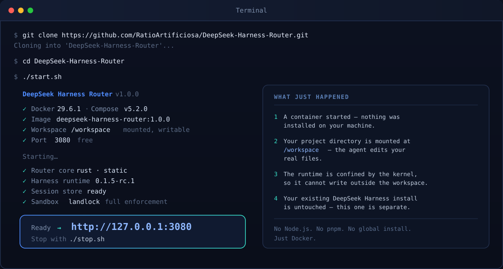
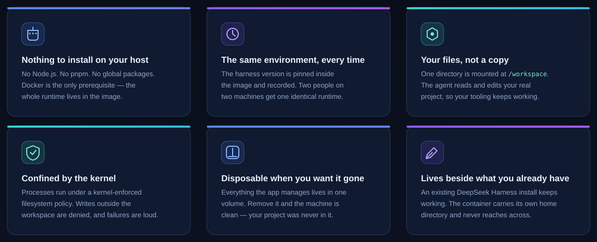
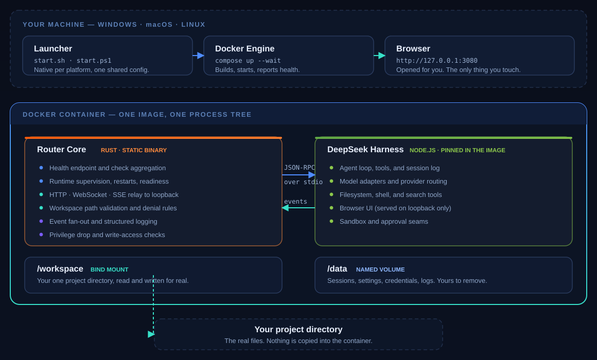
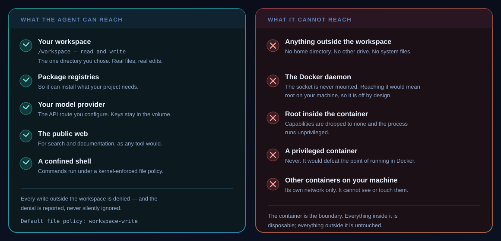

<div align="center">


<br>

**Run DeepSeek Harness in Docker. One command, one URL, your own files.**

A self-hosted workspace for the DeepSeek Harness agent — packaged so you can start
working in minutes, point it at a real project, and know exactly what it can touch.

[](LICENSE)
[](crates)
[](docker-compose.yml)
[](docs/dsh-compatibility.md)

<br>

[**Quick start**](#quick-start) · [**Why**](#why-this-exists) · [**Features**](#what-you-can-do) · [**Security**](#what-it-can-and-cannot-touch) · [**FAQ**](#questions-people-actually-ask)

</div>

---

## The whole thing, in one screen



Four commands. No Node.js on your machine, no global packages, nothing to
uninstall later. The agent is editing your real files by the time you read the
next paragraph.

---

## Why this exists

[DeepSeek Harness](https://github.com/deepseek-ai/deepseek-harness) is a powerful
open-source agent — it reads your code, runs commands, edits files, and works
through multi-step tasks on its own.

Getting it running well is the annoying part.

Install Node. Get the right version. Install a package manager. Run a command
that pulls a hundred dependencies. Hope nothing conflicts with the tools you
already have. Do it again on your other machine, and get a slightly different
result.

Then there is the question nobody answers clearly: **now that this thing can run
shell commands, what can it actually reach on my computer?**

DeepSeek Harness Router answers both.

It packages the harness into a container with one pinned, reproducible runtime.
You choose a single folder to share. That folder — and nothing else — is what the
agent sees. Everything else on your machine is outside the box it runs in, and
the box is enforced by your operating system's kernel, not by a polite request.

> **The result:** an agent you can hand real work to, because you know where its
> reach ends.

---

## What you get



### Nothing to install on your host

Docker is the only prerequisite. The complete runtime — the harness, its
dependencies, the web UI — lives inside the image. Your machine stays clean, and
"uninstall" is one command that removes one volume.

### A runtime that does not drift

The harness version is pinned inside the image and recorded in
[`docs/dsh-compatibility.md`](docs/dsh-compatibility.md). The harness is under
active development and warns that breaking changes are expected; pinning means a
release upstream cannot silently change what runs on your machine.

### The same environment on every machine

Windows, macOS, and Linux produce the same container from the same image. Two
people following the same three commands get byte-identical runtimes — which
means a bug one person can reproduce, another person can reproduce too.

### It works on your actual project

You pick a directory. It is mounted at `/workspace`. The agent reads and edits
those real files, so your editor, your git history, your test runner, and your
build tools all keep working exactly as they did before.

### It cannot wander off

The workspace is not a convention the agent is asked to respect — it is a mount
boundary backed by kernel-enforced filesystem policy. Writes outside it are
denied, and denials are reported rather than swallowed.

### It sits quietly beside what you already have

If you already run DeepSeek Harness on your machine, it keeps working. The
container carries its own home directory and its own storage. Nothing is shared,
nothing is overwritten, and nothing needs to be uninstalled to try this.

---

## What you can do

**Point it at a project and talk to it.**
Open the workspace, describe what you want, and watch the agent read files, run
commands, and make changes — streaming live, tool call by tool call.

**Let it work through something long.**
Multi-step tasks with a plan, background jobs, and delegated subagents for work
that is too big for one pass. It keeps track of what it is doing and tells you
where it got to.

**Review before you accept.**
When the agent wants to do something consequential, it asks. You see the exact
action and allow it once, or not at all. In unattended setups you can configure
it to refuse everything it would have asked about — deterministically.

**Choose your model.**
Bring a DeepSeek API key, or point it at any OpenAI-compatible or
Anthropic-compatible gateway. Keys are stored inside the container's own volume,
never in a file you might commit.

**Work from any of your machines.**
The same repository, the same one command, on Windows PowerShell, macOS
Terminal, or a Linux shell. Native launchers for each — no WSL, no Git Bash, no
Cygwin required.

**Keep your data yours.**
Sessions, settings, and credentials live in one named Docker volume you own and
can back up, inspect, or delete. There is no telemetry, no account, and no phone
home.

---

## Quick start

**Prerequisites:** Docker Desktop (Windows, macOS) or Docker Engine with Compose
v2 (Linux), and Git. That is the entire list.

<table>
<tr><th align="left">Windows (PowerShell)</th><th align="left">macOS / Linux</th></tr>
<tr><td>

```powershell
git clone https://github.com/RatioArtificiosa/DeepSeek-Harness-Router.git
cd DeepSeek-Harness-Router
.\start.ps1
```

</td><td>

```bash
git clone https://github.com/RatioArtificiosa/DeepSeek-Harness-Router.git
cd DeepSeek-Harness-Router
./start.sh
```

</td></tr>
</table>

The launcher checks Docker, verifies your workspace, picks a free port, starts
the container, waits until it is genuinely healthy, and opens the browser. If
something is wrong, it tells you what and how to fix it — then stops, rather
than leaving you with a half-started system.

**Useful flags**

```bash
./start.sh ~/projects/my-app     # choose the workspace up front
./start.sh --port 4000           # pick the port
./start.sh --no-open             # don't open a browser
./start.sh --doctor              # diagnose without changing anything
./stop.sh                        # stop, keep your sessions
```

> If port 3080 is already taken, the launcher says so, names what is holding it,
> and moves to the next free port. It never silently picks a random one.

---

## How it works



Three ideas do all the work.

**A thin launcher, a thick container.** `start.sh` and `start.ps1` only
orchestrate: check the environment, resolve the workspace, write configuration,
and hand off to Docker Compose. Both call the *same* Compose file, so there is
one definition of how the system runs — not three that drift apart.

**A Rust core that owns the boundary.** The parts this project is responsible for
— supervising the runtime, relaying the web interface, validating paths,
aggregating health — are a single static binary with no runtime dependencies. It
speaks to the harness over newline-delimited JSON-RPC on stdio, a documented
process boundary, so the agent runtime stays exactly as upstream ships it.

**The harness stays the harness.** We do not fork it, patch it, or vendor it. We
pin an exact version and run it. When upstream moves, the coupling is confined to
one crate — [`crates/router-dsh`](crates/router-dsh) — rather than smeared across
the codebase.

<details>
<summary><b>Where the pieces live</b></summary>

<br>

| Path | Responsibility |
|---|---|
| `crates/router-core` | Supervision, health, configuration, workspace validation |
| `crates/router-relay` | The HTTP, WebSocket, and SSE relay to the loopback runtime |
| `crates/router-dsh` | The only crate that knows about DeepSeek Harness |
| `crates/router-cli` | The single static binary and its subcommands |
| `docker/` | Dockerfiles, entrypoint, healthcheck |
| `docs/` | Architecture, security, permissions, troubleshooting |
| `PROPOSAL.md` | The specification this was built against |
| `CHECKLIST.md` | The execution plan — every line cites a section of the proposal |

</details>

---

## What it can and cannot touch



Most tools in this space ask you to trust a description. This one is built so the
boundary is structural.

| | |
|---|---|
| **The container is not privileged** | No `--privileged`, no capabilities retained, no host networking. |
| **The Docker socket is never mounted** | Socket access is equivalent to root on your machine. It is off, and the reason is written down. |
| **Exactly one host directory is shared** | The one you chose. No home directory, no other drives, no `/`. |
| **Writes outside the workspace are denied** | Enforced by the kernel through Landlock, and the denial is reported. |
| **Application state is separate from your code** | Everything generated goes to a Docker volume, never into your project. |
| **The service is local-only by default** | Published on `127.0.0.1`. Exposing it further is a deliberate, documented opt-in. |

### Honest about the limits

No security model is absolute, and pretending otherwise would be the least
useful thing this README could do. Specifically:

- The agent can read files **inside the container**, including the credential
  store it uses. Only give it keys you are willing to have there.
- Network access is not confined by the file policy. An agent can send data to a
  public URL, as any tool with internet access can.
- Whatever you put in the workspace, the agent can change. That is the point —
  and version control is still your safety net.

These are documented in full in [`docs/security.md`](docs/security.md).

---

## Platform support

Tested, not assumed.

| Platform | Status | How it is verified |
|---|---|---|
| **Linux** | Fully supported | Full container build, run, and end-to-end test in CI |
| **Windows** | Supported | Launcher and path handling tested natively in CI; full runtime verified manually |
| **macOS** | Supported | Launcher logic tested natively in CI; full runtime verified manually |

> Docker Desktop's runtime behaviour — virtualisation backend, file-sharing
> implementation, and host-side file ownership — cannot be reproduced on hosted
> CI runners. We say so rather than implying coverage we do not have. This table
> is checked against reality by CI, so it cannot drift into a marketing claim.

**Requirements:** Docker Desktop 4.x or Docker Engine 24+ with Compose v2 · 4 GB
RAM · Git.

---

## Questions people actually ask

<details>
<summary><b>Do I need Node.js or pnpm installed?</b></summary>

<br>

No. Node runs inside the container, where it is pinned. Your machine needs
Docker and Git, and nothing else.

</details>

<details>
<summary><b>Can I use this alongside an existing DeepSeek Harness install?</b></summary>

<br>

Yes, and it is a design goal rather than an afterthought. The container has its
own home directory inside its own volume. It does not read, write, or connect to
an installation on your host. You can run both at once.

</details>

<details>
<summary><b>What happens to my project files if I delete the container?</b></summary>

<br>

Nothing. Your project lives on your disk, mounted into the container while it
runs. Removing the container and its volume removes session history and settings
— not your code.

</details>

<details>
<summary><b>Where do my API keys go?</b></summary>

<br>

Into the container's own credential store, inside the Docker volume. They are
never written to a file in this repository, and the `.env` file does not accept
one by design.

</details>

<details>
<summary><b>Can I run more than one instance?</b></summary>

<br>

Yes. Set a different `COMPOSE_PROJECT_NAME` and `APP_PORT`, and the second
instance gets its own containers, volume, and network. Nothing collides.

</details>

<details>
<summary><b>Does it phone home?</b></summary>

<br>

No. There is no telemetry, no analytics, and no account. The only outbound
traffic is what the agent itself causes — your model provider, package
registries, and the pages it fetches.

</details>

<details>
<summary><b>Why is the core written in Rust?</b></summary>

<br>

Because the boundary we own — process supervision, streaming relay, path
validation — is I/O-bound work where a static binary with no runtime
dependencies is a genuine advantage. It also means the part handling host-derived
paths and process spawning has memory safety by construction.

The harness itself stays in Node, where upstream maintains it. We pin it rather
than rewrite it.

</details>

<details>
<summary><b>Is this an official DeepSeek project?</b></summary>

<br>

No. It is an independent, MIT-licensed packaging of the open-source DeepSeek
Harness. Credit for the harness belongs to DeepSeek AI and its contributors.

</details>

---

## Built on

**[DeepSeek Harness](https://github.com/deepseek-ai/deepseek-harness)** — the
open-source agent harness this packages. MIT licensed, under active development.

**[DeepSeek](https://deepseek.com)** — the models and the API.

**[Docker](https://www.docker.com)** — the isolation boundary that makes the
whole design possible.

And the Rust ecosystem: `tokio`, `axum`, `hyper`, `serde`, `clap`, `tracing`.

---

## Contributing

Issues and pull requests are welcome. Before changing anything:

1. Find the section of [`PROPOSAL.md`](PROPOSAL.md) that specifies it.
2. Find the checklist line in [`CHECKLIST.md`](CHECKLIST.md) that tracks it.
3. If either is missing or wrong, fix the document first, then the code.

Read [`AGENTS.md`](AGENTS.md) for the working rules — particularly the
constraints on host filesystems, Docker resources, and repository privacy.

---

## License

[MIT](LICENSE).

DeepSeek Harness itself is MIT licensed; see
[`docs/dsh-compatibility.md`](docs/dsh-compatibility.md) for the exact pinned
version and third-party notices.
