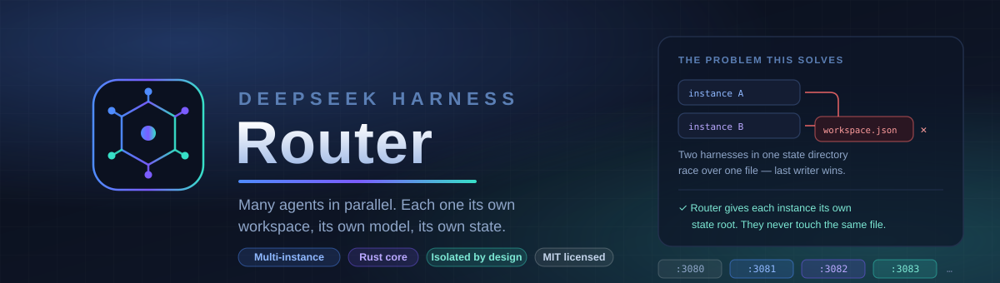

<div align="center">



<br>

**Run more than one DeepSeek Harness at once.**

A local control plane for the DeepSeek Harness agent — so you can work on
several projects in parallel, each with its own workspace and its own model,
without them interfering with each other.

[](LICENSE)
[](https://www.rust-lang.org)
[](docs/dsh-compatibility.md)
[](#-project-status)

<br>

[**Quick start**](#quick-start) · [**Why**](#why-this-exists) · [**What you get**](#what-you-get) · [**How it works**](#how-it-works) · [**FAQ**](#questions-people-actually-ask)

</div>

---

> ### Project status
>
> **This project is under active development and does not run yet.**
>
> The Rust core is written and tested; the multi-instance supervisor and the
> `router` command are being built now.
>
> Everything below describes what the finished system does — how it isolates
> instances, allocates ports, and keeps your existing install untouched.
>
> **Star the repository** to be notified when the first working release lands.

---

## The whole thing, in one screen

```text
$ router add rust-refactor --workspace ~/projects/rust
  ✓ workspace  ~/projects/rust
  ✓ port       3081
  ✓ model      deepseek-v4-pro
  ✓ state root ~/.deepseek-router/instances/rust-refactor/dsh
  → http://127.0.0.1:3081

$ router add py-service --workspace ~/services/py --model deepseek-v4-flash
  ✓ port       3082
  → http://127.0.0.1:3082

$ router list
  NAME            PORT   WORKSPACE          MODEL              STATE
  rust-refactor   3081   ~/projects/rust    deepseek-v4-pro    ready
  py-service      3082   ~/services/py      deepseek-v4-flash  ready
```

Two agents, two projects, two models, running at the same time. Each has its own
sessions and its own settings. Nothing is shared, so nothing can collide.

---

## Why this exists

[DeepSeek Harness](https://github.com/deepseek-ai/deepseek-harness) is a powerful
open-source agent — it reads your code, runs commands, edits files, and works
through multi-step tasks on its own.

You get one of it. That is fine until you have more than one thing going.

**You cannot run a second.** Start another and it either fights for the port or,
worse, silently shares state with the first. The harness keeps its settings, its
credentials, its workspace list and its session index in one directory, and its
own documentation is blunt about what happens next:

> *"No cross-process write locking — two processes writing the same unit can
> interleave replacements; writes to the same file use **last-completion wins**."*

So a second instance does not fail loudly. It quietly races the first over the
files that describe your workspaces and your configuration, and whatever is
written last wins.

**And you cannot use two models at once.** The default model is process-wide by
design — the harness documents it as *"one process-wide default."* For a second
model you need a second process, and a second process is exactly what causes the
problem above.

> **DeepSeek Harness Router is the missing layer:** it runs several harnesses side
> by side, gives each one its own isolated state, its own port, its own workspace
> and its own model, and gives you one place to see and manage them all.

---

## What you get

### Many projects, genuinely in parallel

Each instance gets its own state directory. Its settings, its credentials, its
workspace list and its sessions live apart from every other instance's. Two
instances never open the same file, which is what makes "in parallel" safe rather
than merely possible.

### A different model per instance

Model selection is process-wide, so the only way to run two models at once is two
processes. The Router makes that the normal way of working.

### A different workspace per instance

Point each instance at the project it belongs to. Its agent starts there, its
sessions group there, and its history stays separate from the others.

### Your existing install keeps working

The Router never touches your current harness. It does not read your `~/.dsh`,
does not change your settings, and does not restart your processes. It starts new
instances, on new ports, with new state.

### A control area

One command lists everything — port, workspace, model, state, uptime. A local
page shows the same at a glance, with start, stop, restart and open per instance.

### It tells you when something is off

Two instances pointed at the same folder is a quiet way to get two agents editing
one tree. The Router notices and says so. So does a port that got taken, or a
model route that does not exist.

---

## Quick start

**Prerequisite:** an installed DeepSeek Harness and a Rust toolchain to build the
router. Nothing else.

```sh
git clone https://github.com/RatioArtificiosa/DeepSeek-Harness-Router.git
cd DeepSeek-Harness-Router
cargo build --release

# one-time setup
./target/release/router init

# a project, a port, a model
./target/release/router add my-project --workspace ~/projects/my-project
```

Then:

```text
router list                          every instance and its state
router open my-project               open its UI
router stop my-project               stop it, leave the rest alone
router logs my-project -f            follow its output
router doctor                        check everything, change nothing
```

> **Ports start at 3081.** The harness default is 3080, and your existing install
> already has it. The Router leaves it alone and allocates upward from there.

---

## How it works

```text
                    ~/.deepseek-router/
                    ├── router.yaml            the registry
                    └── instances/
                        ├── rust-refactor/dsh/  ← its own DSH_HOME
                        │     settings.yaml, sessions/, workspace.json …
                        └── py-service/dsh/     ← its own DSH_HOME
                              settings.yaml, sessions/, workspace.json …

   router (Rust)
     ├── allocates a port per instance
     ├── spawns  dsh web --port 3081   with DSH_HOME=…/rust-refactor/dsh
     ├── spawns  dsh web --port 3082   with DSH_HOME=…/py-service/dsh
     └── watches both, and reports what they are doing
```

Three things make it work.

**One environment variable does the isolation.** The harness resolves all its
user data from `$DSH_HOME`. Give each instance a different value and their state
is separate by construction — not by convention, and not by hoping.

**One process per instance.** The harness's model default is process-wide, so
separate models require separate processes. That is not a design preference; it
is the only way to satisfy the requirement. The upside is real crash isolation:
one instance falling over does not touch the others.

**The Router supervises, and stays out of the way.** It starts, watches and
stops harnesses. It does not proxy them, does not replace their UI, and does not
sit between you and your agent once they are running.

<details>
<summary><b>Where the pieces live</b></summary>

<br>

| Path | Responsibility |
|---|---|
| `crates/router-core` | Errors, configuration, health, workspace path validation |
| `crates/router-relay` | A streaming HTTP proxy, used by the control page |
| `crates/router-dsh` | The harness adapter: supervision and readiness detection |
| `crates/router-cli` | The `router` binary |
| `docs/` | Security notes, permissions, troubleshooting |

</details>

---

### Your existing install keeps working

The Router never touches your current harness. It does not read your `~/.dsh`,
does not change your settings, and does not restart your processes. It starts new
instances, on new ports, with new state. Your daily driver on 3080 is untouched.

### A control area

One command lists everything — port, workspace, model, state, uptime. A local
page shows the same at a glance, with start, stop, restart and open per instance.

### It tells you when something is off

Two instances pointed at the same folder is a quiet way to get two agents editing
one tree. The Router notices and says so. So does a port that got taken, or a
model route that does not exist.

### Nothing phones home

No telemetry, no account, no analytics. The Router talks to your machine's
harnesses and to nothing else.

---

## Platform support

| Platform | Status | Notes |
|---|---|---|
| **Windows** | Primary target | Built and run on the owner's machine |
| **macOS** | Supported | Same code paths; process and path handling are platform-tested |
| **Linux** | Supported | Same code paths; process and path handling are platform-tested |

**Requirements:** an installed DeepSeek Harness, and Rust to build the router.
The Router adds no runtime of its own beyond the harness it supervises.

---

## Questions people actually ask

<details>
<summary><b>Does this replace DeepSeek Harness?</b></summary>

<br>

No. It runs it. The Router starts, watches and stops harness processes; the
harness remains the thing you actually talk to. Its UI is the UI.

</details>

<details>
<summary><b>Can I use this alongside my existing install?</b></summary>

<br>

Yes, and that is the point. Your existing install keeps its own state in `~/.dsh`
and the Router never reads or writes there. The Router's instances get their own
state directories. They do not see each other.

</details>

<details>
<summary><b>Why do ports start at 3081 instead of 3080?</b></summary>

<br>

3080 is the harness default, and your existing install probably has it. The
Router leaves that alone and allocates upward from 3081.

</details>

<details>
<summary><b>Why one process per instance instead of many workspaces in one?</b></summary>

<br>

Because the model default is process-wide. The harness documents it as "one
process-wide default," so running two models at once requires two processes. The
same is true of credentials and settings, which are single files. Separate
processes give each instance its own everything — and as a bonus, a crash in one
does not touch the others.

</details>

<details>
<summary><b>What happens if two instances point at the same folder?</b></summary>

<br>

The Router warns you. Two agents editing one tree at the same time is a real
hazard, and you should know before it happens rather than after.

</details>

<details>
<summary><b>Do instances share my API key?</b></summary>

<br>

Only if you ask them to. By default each instance has its own credentials file,
so you can use different keys for different projects. If you would rather set one
key once, an instance can symlink to your existing credentials instead.

</details>

<details>
<summary><b>What happens to my files if I delete an instance?</b></summary>

<br>

Nothing. `router rm` unregisters the instance and leaves your project folder
completely alone. The Router never deletes a directory you pointed it at.

</details>

<details>
<summary><b>Does it phone home?</b></summary>

<br>

No. There is no telemetry, no analytics, and no account. The only outbound traffic
is what the harness itself causes.

</details>

<details>
<summary><b>Do I need Docker?</b></summary>

<br>

Not to use it. Docker is how this project is developed — a clean room, so that
building and testing never touches a working DeepSeek Harness installation. The
Router itself runs natively.

</details>

<details>
<summary><b>Why is it written in Rust?</b></summary>

<br>

Because the work is process supervision and concurrency: spawning, watching,
restarting and stopping several children, and reporting their state without
blocking. That is what a static binary with a real async runtime is good at.

</details>

---

## Built on

**[DeepSeek Harness](https://github.com/deepseek-ai/deepseek-harness)** — the
open-source agent harness this runs. MIT licensed, under active development.

**[DeepSeek](https://deepseek.com)** — the models and the API.

And the Rust ecosystem: `tokio`, `axum`, `hyper`, `serde`, `clap`, `tracing`.

Docker appears nowhere in the runtime path. It is used only to develop this
project, so that building and testing never touches a working installation.

---

## Contributing

Issues and pull requests are welcome.

Read [`AGENTS.md`](AGENTS.md) first — it carries the working rules, in particular
the constraints that protect a running DeepSeek Harness installation and the
repository's privacy requirements.

Every source file is documented, every public item is typed, and `cargo clippy`
runs with `-D warnings`. A change that leaves a warning is a change that is not
finished.

---

## License

[MIT](LICENSE).

DeepSeek Harness itself is MIT licensed; see
[`docs/dsh-compatibility.md`](docs/dsh-compatibility.md) for the exact pinned
version and third-party notices.
